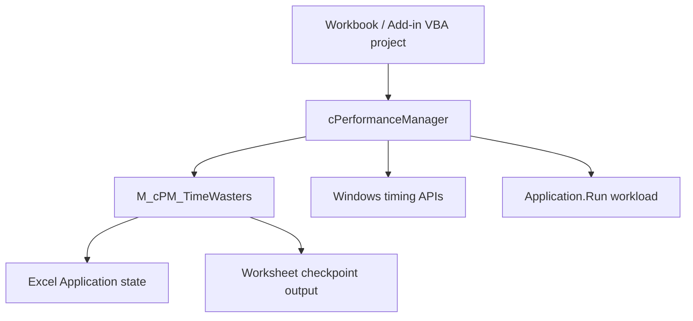

<div align="center">

# 📦 Installation and Upgrade Guide

### Installing, integrating, validating, upgrading, troubleshooting, and removing VBA-PERFORMANCE_MANAGER

[](#-requirements)
[](#-deployment-model)
[](#-office-bitness)
[](#-embedded-source-installation)
[](#-developer-regression-validation)

<br>

**Two-file runtime · Source-first deployment · QPC default · Shared Excel-state ownership · Optional regression harness · Release workbook for evaluation**

<br>

[Requirements](#-requirements)
&nbsp;·&nbsp;
[Deployment](#-deployment-model)
&nbsp;·&nbsp;
[Install source](#-embedded-source-installation)
&nbsp;·&nbsp;
[Validate](#-validation)
&nbsp;·&nbsp;
[Upgrade](#-upgrade-guide)
&nbsp;·&nbsp;
[Troubleshoot](#-troubleshooting)
&nbsp;·&nbsp;
[Remove](#-removing-the-component)

</div>

---

> [!IMPORTANT]
> **The primary deployment model is source-first.**
>
> Import the exported VBA source into the workbook or add-in that needs the
> component. The tagged source is the authoritative implementation.
>
> The macro-enabled workbook published with GitHub Releases is a convenience
> artifact for evaluation, demonstration, and package-level validation. It is
> not a different implementation and it is not the authoritative source tree.

> [!IMPORTANT]
> For the current v1.3.x runtime and the v1.4.0 development line, the production
> package consists of **two required source files**:
>
> ```text
> src/modules/M_cPM_TIMEWASTERS.bas
> src/classes/cPerformanceManager.cls
> ```
>
> Import the module **before** the class.
>
> Future major releases may split internal responsibilities into additional
> required modules. Always use the `INSTALLATION.md` shipped with the tag you are
> installing instead of assuming the two-file contract will exist forever.

> [!NOTE]
> No administrator rights are normally required to import VBA source manually.
> Organization policy can still restrict macros, VBA project editing, trusted
> locations, or downloaded macro-enabled files.

---

## 🧭 Requirements

| Requirement | Detail |
|---|---|
| 🖥️ Host | Microsoft Excel desktop for **Windows** |
| ⚙️ Office bitness | Source contains VBA7 / Win64 branches for 32-bit and 64-bit Office |
| 📄 Host project | Macro-enabled workbook (`.xlsm` / `.xlsb`) or Excel add-in (`.xlam`) containing a VBA project |
| 📥 Source installer | None — import exported VBA components |
| 🔗 External runtime | None |
| 🧱 COM reference | None required |
| 📚 Third-party DLL | None bundled or required |
| 🪟 Windows APIs | Uses Windows **system** APIs from `kernel32` and `winmm` for API-backed timing |
| 📖 Dictionary support | Late-bound `Scripting.Dictionary`; no Microsoft Scripting Runtime reference required |
| 🔐 Macro policy | The host must be allowed to run VBA under the user's organization policy |

VBA-PERFORMANCE_MANAGER is designed for Windows desktop Excel.

Methods 2–5 are backed by Windows APIs. The project does not claim Excel for
macOS or Excel for the web as supported deployment targets.

### Macro security

Do not weaken Excel macro security globally to use this component.

Use the organization's approved deployment mechanism, for example:

```text
reviewed source in an approved workbook
approved Trusted Location
digitally signed workbook/add-in
explicitly approved macro-enabled file
```

If Windows marks a downloaded `.xlsm` as originating from the Internet, the file
Properties dialog may show an **Unblock** option. Use it only when the file is
trusted and organizational policy permits it.

For the project's security and trust model, see:

[SECURITY.md](SECURITY.md)

---

# 🎯 Deployment model

The project currently supports two practical ways to consume it.

| Deployment | Best for | Admin rights | Travels with workbook | Authoritative implementation |
|---|---|:---:|:---:|:---:|
| **Embedded source** | Production workbooks, reviewed solutions, development | No | ✅ | ✅ |
| **Release `.xlsm`** | Evaluation, demonstration, release validation | No | Self-contained demo | ❌ |

There is currently **no official Performance Manager `.xlam` distribution**.

You may embed the source in your own `.xlam`, but that is a host application you
build and maintain, not a separately supported packaged distribution from this
repository.

### Recommended choice

Use **embedded source** when:

- the component is part of a production workbook;
- the workbook must remain self-contained;
- source must be reviewed or version-controlled;
- deployment occurs on managed desktops;
- you need only the runtime and not the demo/test infrastructure.

Use the **release workbook** when:

- evaluating the component;
- learning the API;
- inspecting the demo;
- validating the exact binary asset published with a release.

---

# 📦 Production source package

## Current required runtime files

| Import order | Repository path | VBE component | Responsibility |
|---:|---|---|---|
| 1 | `src/modules/M_cPM_TIMEWASTERS.bas` | `M_cPM_TimeWasters` | Shared Excel Application-state ownership and checkpoint worksheet output |
| 2 | `src/classes/cPerformanceManager.cls` | `cPerformanceManager` | Public timing, measurement, statistics, checkpoint, pause, and execution-control facade |

> [!WARNING]
> Import `M_cPM_TIMEWASTERS.bas` **first**.
>
> `cPerformanceManager` directly calls support procedures such as
> `PM_TW_NewInstanceKey`, `PM_TW_BeginSession`, and `PM_TW_EndSession`.
> The class alone is not a complete compilable installation.

### Why the source filename and VBE component name differ in case

The repository file is:

```text
M_cPM_TIMEWASTERS.bas
```

The exported module declares:

```text
M_cPM_TimeWasters
```

That is expected.

Do not rename the component merely to make filesystem casing and the VBE display
name identical.

---

## 🧪 Optional development / validation source

| Repository path | Required for production? | Purpose |
|---|:---:|---|
| `test/M_cPM_Test.bas` | No | Regression harness |
| `demo/M_DEMO_BUILDER.bas` | No | Worksheet/status-bar helpers required by the current interactive regression harness |
| `demo/M_cPM_DEMO.bas` | No | Demo construction / presentation |
| `demo/M_cPM_USAGE_EXAMPLES.bas` | No | Curated user-facing examples |

> [!IMPORTANT]
> The current `M_cPM_Test.bas` depends on `M_DEMO_BUILDER`.
>
> For a clean regression host, import:
>
> ```text
> src/modules/M_cPM_TIMEWASTERS.bas
> src/classes/cPerformanceManager.cls
> demo/M_DEMO_BUILDER.bas
> test/M_cPM_Test.bas
> ```
>
> before compiling and running the suite.

`M_cPM_DEMO.bas` and `M_cPM_USAGE_EXAMPLES.bas` are not required merely to run
the standard regression suite.

---

# 🔗 Runtime architecture



The class is the supported object-oriented facade.

`M_cPM_TimeWasters` is an internal support module and is declared
`Option Private Module`, so its project-visible procedures do not appear as an
ordinary user-runnable macro surface.

---

# 🚀 Embedded source installation

This is the recommended production deployment.

## 1. Prepare the destination VBA project

Use a macro-enabled host such as:

```text
.xlsm
.xlsb
.xlam
```

Before changing the project:

1. save the host file;
2. make a recoverable backup;
3. identify whether an older Performance Manager copy is already present;
4. close unrelated workbooks if you plan to validate process-wide Excel state.

If upgrading an existing installation, use the [Upgrade guide](#-upgrade-guide)
rather than importing duplicate components.

---

## 2. Open the VBA Editor

Press:

```text
Alt + F11
```

In Project Explorer, select the destination VBA project.

---

## 3. Import the support module

Use:

```text
File → Import File...
```

and import:

```text
src/modules/M_cPM_TIMEWASTERS.bas
```

Project Explorer should contain:

```text
Modules
└─ M_cPM_TimeWasters
```

---

## 4. Import the class

Import:

```text
src/classes/cPerformanceManager.cls
```

Project Explorer should contain:

```text
Class Modules
└─ cPerformanceManager
```

Do not manually alter exported class metadata such as `MultiUse`, instancing, or
predeclared-ID attributes.

---

## 5. Compile the project

Run:

```text
Debug → Compile VBAProject
```

Do not skip this step.

An imported component that does not compile is not a valid installation.

### Expected production component set

For the current runtime:

```text
M_cPM_TimeWasters
cPerformanceManager
```

If compilation reports:

```text
Sub or Function not defined
Ambiguous name detected
Expected: end of statement
User-defined type not defined
```

go to [Troubleshooting](#-troubleshooting).

---

## 6. Perform a basic QPC smoke test

Create a normal standard module in the host and run:

```vb
Option Explicit

Public Sub cPM_InstallSmoke_Timing()

    Dim cPM As cPerformanceManager

    Set cPM = New cPerformanceManager

    cPM.StartTimer 5       'QueryPerformanceCounter
        DoEvents

    Debug.Print "Elapsed seconds: "; cPM.ElapsedSeconds()

    cPM.ResetEnvironment
    Set cPM = Nothing

End Sub
```

Expected behavior:

```text
a finite non-negative elapsed value
no error
```

For ordinary use, method 5 / QPC is the recommended default backend.

`ResetEnvironment` is included deliberately: it releases environment ownership
held by that instance, including timer-resolution ownership and any active
time-waster scope.

---

## 7. Verify formatted timing

A minimal presentation smoke test:

```vb
Public Sub cPM_InstallSmoke_Formatted()

    Dim cPM As cPerformanceManager

    Set cPM = New cPerformanceManager

    cPM.StartTimer 5
        DoEvents

    Debug.Print cPM.ElapsedTime

    cPM.ResetEnvironment
    Set cPM = Nothing

End Sub
```

`ElapsedSeconds` is the lower-overhead numeric primitive.

`ElapsedTime` is presentation-oriented.

For benchmarking, prefer collecting numeric samples first and formatting only
after measurement.

---

## 8. Verify shared Excel-state suppression

Run state-management tests only in a controlled workbook.

Example:

```vb
Public Sub cPM_InstallSmoke_TimeWasters()

    Dim cPM As cPerformanceManager

    Set cPM = New cPerformanceManager

    Debug.Print "Before:", _
                Application.ScreenUpdating, _
                Application.EnableEvents, _
                Application.DisplayAlerts, _
                Application.Calculation

    cPM.TW_Turn_OFF Except:=TW_Enum.EnableEvents Or TW_Enum.Calculation

    Debug.Print "During:", _
                Application.ScreenUpdating, _
                Application.EnableEvents, _
                Application.DisplayAlerts, _
                Application.Calculation

    cPM.TW_Turn_ON

    Debug.Print "After:", _
                Application.ScreenUpdating, _
                Application.EnableEvents, _
                Application.DisplayAlerts, _
                Application.Calculation

    cPM.ResetEnvironment
    Set cPM = Nothing

End Sub
```

The exact values depend on the starting Excel state and the exemption mask.

The invariant to verify is:

```text
requested non-exempt settings are suppressed
+
exempt settings remain untouched
+
the original baseline is restored when the final scope ends
```

### Application.Calculation caveat

`Application.Calculation` has an explicit stable-host invariant.

Calculation control requires the open-workbook set to remain stable for the life
of the shared suppression scope.

If the requirement cannot be honored, the component may exempt Calculation in
non-strict use and report that through:

```text
TW_CalculationExempted
```

Do not interpret that as silent success.

---

## 9. Benchmark a real procedure

`MeasureProcedure` dispatches by name through `Application.Run`.

The target must therefore be a **Public procedure in a standard module**.

Example target:

```vb
Public Sub cPM_InstallSmoke_Workload()

    Dim i As Long
    Dim x As Double

    For i = 1 To 10000
        x = x + Sqr(i)
    Next i

End Sub
```

Measurement:

```vb
Public Sub cPM_InstallSmoke_Measurement()

    Dim cPM As cPerformanceManager
    Dim Samples() As Double
    Dim Failed As Long
    Dim LastFailure As cPM_ReadStatus

    Set cPM = New cPerformanceManager

    Samples = cPM.MeasureProcedure( _
                    "cPM_InstallSmoke_Workload", _
                    20, _
                    3, _
                    5, _
                    Failed, _
                    LastFailure)

    Debug.Print cPM.Stats_Text(Samples, "Installation smoke test")
    Debug.Print "Failed reads: "; Failed
    Debug.Print "Last failure status: "; LastFailure

    cPM.ResetEnvironment
    Set cPM = Nothing

End Sub
```

Interpret the result as a **distribution**, not as one magic timing number.

The installation is behaving normally when:

```text
a non-empty sample vector is returned
the values are finite and non-negative
failure evidence is explicit
statistics are produced without contract errors
```

Do not treat a single minimum or mean as a general performance guarantee.

---

## 10. Optional matched-baseline check

If you want to estimate `Application.Run` dispatch overhead, provide a reachable
empty procedure:

```vb
Public Sub cPM_InstallSmoke_Empty()

End Sub
```

Then:

```vb
Dim Work() As Double
Dim Base() As Double

Work = cPM.MeasureProcedure("cPM_InstallSmoke_Workload", 20, 3)
Base = cPM.MeasureBaseline("cPM_InstallSmoke_Empty", 20, 3)

Debug.Print "Work median: "; cPM.Stats_Median(Work)
Debug.Print "Base median: "; cPM.Stats_Median(Base)
Debug.Print "Net median:  "; _
            cPM.Stats_Median(Work) - cPM.Stats_Median(Base)
```

Use `MeasureBaseline` for a dispatch-matched baseline.

`MeasureOverhead_Samples` measures the timer/class cycle and does **not** traverse
the same `Application.Run` path.

---

# ✅ Validation

Installation validation has three levels:

```text
consumer smoke validation
developer regression validation
release-asset validation
```

---

## ✅ Consumer smoke validation

For an ordinary production source install, validate at least:

```text
[ ] Debug → Compile VBAProject passes
[ ] QPC StartTimer / ElapsedSeconds works
[ ] ResetEnvironment completes
[ ] TW suppression restores the baseline in a controlled test
[ ] MeasureProcedure can call a controlled Public standard-module target, if used
[ ] Statistics produce finite, meaningful output, if used
```

A consumer does not need the full regression harness merely to use the class.

---

## 🧪 Developer regression validation

Import:

```text
src/modules/M_cPM_TIMEWASTERS.bas
src/classes/cPerformanceManager.cls
demo/M_DEMO_BUILDER.bas
test/M_cPM_Test.bas
```

Then:

```text
Debug → Compile VBAProject
```

Run:

```vb
Run_cPerformanceManager_RegressionSuite
```

The current interactive harness:

- builds/rebuilds a dedicated regression worksheet;
- records case/assertion/failure counters;
- writes durable worksheet evidence;
- reports progress through the Excel status bar;
- exercises timing, statistics, checkpoints, error/fallback behavior, and shared
  Excel Application-state management.

### Passing condition

The non-negotiable result is:

```text
Failures = 0
```

Also record:

```text
commit / tag
Cases
Assertions
Failures
Excel version/build
Office bitness
```

Do **not** hard-code an old case/assertion count as the permanent definition of
success. Legitimate new tests change those counts.

For reference, published v1.3.0 evidence was:

```text
72 cases
511 assertions
0 failures
Excel Microsoft 365 64-bit
```

That record certifies that release/environment, not every future branch.

### Current automation boundary

The repository currently has hosted **static** source checks.

They do not execute Excel or VBA.

Until the headless Excel gate tracked in the repository is implemented, real
Excel regression execution remains a separate certification step.

---

## 📦 Release-workbook validation

The GitHub Release may contain a macro-enabled convenience workbook.

Use the **exact asset name shown on the Release page**; do not assume the name
from another version.

For v1.3.0, the published workbook is:

```text
PERFORMANCE.MANAGER.xlsm
```

A Release workbook should be treated as executable Office content.

Before relying on it:

1. obtain it from the official GitHub Release;
2. confirm the release tag;
3. compare its SHA-256 with the published release/manifest evidence;
4. satisfy the organization's macro policy;
5. run a controlled smoke test on the actual downloaded binary.

The workbook digest establishes **file identity**.

It does not, by itself, prove an automated source-to-workbook build.

Tagged exported source remains authoritative.

---

# 🧭 Office bitness

The source contains explicit VBA7 / Win64 conditional compilation for Office
32-bit and 64-bit.

That means:

```text
source support
≠
execution certification
```

A release is execution-certified only on bitnesses actually run.

The published v1.3.0 release records a 64-bit Excel run. It does not claim real
32-bit execution certification.

For controlled deployment on 32-bit Office:

- compile and run the regression suite on real 32-bit Excel where practical;
- record the exact Excel build and bitness;
- do not infer execution success merely from 64-bit results or source inspection.

The 32-bit path is especially relevant to:

```text
GetTickCount declaration binding
32-bit rollover behavior
conditional branch selection
Win32 API return semantics
```

---

# 🛡️ Strict and non-strict policy

`StrictMode` controls how invalid runtime conditions are handled.

Broadly:

```text
strict mode
    fail fast with a named error

non-strict mode
    use the documented fallback/neutral behavior
    and expose status/evidence
```

Do not use non-strict mode as permission to ignore diagnostics.

Where measurement validity matters, inspect:

```text
ActiveMethodID
LastReadStatus
FailedReadsOut
LastFailureStatusOut
```

as applicable.

A numeric zero alone is not sufficient evidence that a read succeeded.

---

# 🧹 Environment recovery

The component can own process-wide Excel state and, for method 3, multimedia
timer-resolution state.

Use the least destructive recovery that fits the problem.

## Normal instance cleanup

```vb
cPM.ResetEnvironment
```

This is the preferred per-instance cleanup.

## End this instance's TW scope normally

```vb
cPM.TW_Turn_ON
```

## Emergency shared TW cleanup

If a hard VBA `End`, project reset, or interrupted development run has left Excel
state suppressed and ordinary instance ownership is no longer available:

```vb
PM_TW_EndAllSessions
```

This is a recovery helper, not the normal lifecycle.

## Safest process reset

If Excel Application state or timer-resolution ownership is uncertain:

```text
save work
close all Excel windows
confirm EXCEL.EXE exits
restart Excel
```

A clean Excel process is safer than guessing which process-global state survived
an abnormal VBA termination.

---

# 🔁 Upgrade guide

## Before upgrading

```text
save work
make a backup
record the currently installed version
finish or cancel active benchmark work
clean up active cPerformanceManager instances where possible
```

If there is any doubt about shared Excel state, close all Excel windows before
replacing source.

---

## ⬆️ Upgrade an embedded installation

Replace the **complete production source package together**.

For the current v1.3.x / v1.4.0 layout:

```text
M_cPM_TIMEWASTERS.bas
cPerformanceManager.cls
```

Recommended sequence:

1. save and back up the host;
2. call `ResetEnvironment` on live instances you control;
3. close Excel completely if process-wide state is uncertain;
4. remove/replace the old module and class;
5. import the new support module first;
6. import the new class;
7. run `Debug → Compile VBAProject`;
8. update optional test/demo modules if you use them;
9. rerun the relevant smoke/regression validation;
10. review `CHANGELOG.md` for behavioral changes.

Do not mix:

```text
new class
old support module
```

or:

```text
old class
new support module
```

even if a partial combination happens to compile.

The implementation and regression assumptions evolve together.

---

## ⬆️ Upgrade the regression harness

If the host carries development/test code, replace:

```text
test/M_cPM_Test.bas
demo/M_DEMO_BUILDER.bas
```

with the versions matching the production source being validated.

Compile again before running the suite.

The current harness has an explicit dependency on `M_DEMO_BUILDER`.

---

## ⚠️ Future module splits

The current installation contract is two runtime files.

The repository roadmap includes architectural work that may move native timing,
measurement, statistics, or reporting responsibilities into dedicated modules.

When upgrading to a future major release:

```text
do not assume the old two-file import list
```

Use the `INSTALLATION.md` and source inventory shipped with that release.

Public class method compatibility and the number of physical files required to
compile are separate concerns.

---

# 🧯 Troubleshooting

| Symptom | Most likely cause | Action |
|---|---|---|
| `Sub or Function not defined` after importing the class | Support module missing | Import `M_cPM_TIMEWASTERS.bas` first, then compile |
| `Ambiguous name detected` | Duplicate old/new component | Remove duplicate module/class and import one coherent version |
| Class imports but project will not compile | Mixed source versions or incomplete package | Replace both production files from the same tag/commit |
| `MeasureProcedure` cannot find the target | Target is Private, in a class, in `Option Private Module`, or misnamed | Use a `Public Sub` in a normal standard module |
| Measurement unexpectedly uses another backend | Non-strict start fallback may have occurred | Inspect `ActiveMethodID` and failure/status evidence |
| A timing call returns `0` unexpectedly | Could be a real zero-like duration or non-strict invalid read | Inspect `LastReadStatus` |
| Repeated measurement returns fewer valid samples than requested | Failed reads were excluded | Inspect failure count/status; do not silently change the denominator |
| `ERR_CPM_MEASURE_NO_VALID_SAMPLES` | No measured iteration produced a valid sample | Diagnose worker read/fallback evidence and environment |
| `Stats_CoefficientOfVariation` raises on all-zero data | CV is undefined when the timing mean is non-positive | Inspect the sample vector/read validity rather than forcing a numeric CV |
| Excel remains visibly suppressed after interrupted VBA | Hard `End` / reset bypassed cleanup | Run `PM_TW_EndAllSessions` or restart Excel |
| Calculation was not suppressed | Stable-host requirement unavailable/exempted | Inspect `TW_CalculationExempted` and workbook lifecycle |
| Method 3 leaves timing behavior uncertain after a crash/reset | Timer-resolution cleanup may not have completed | `ResetEnvironment` if ownership remains; otherwise restart Excel |
| Regression module does not compile in a clean host | `M_DEMO_BUILDER` missing | Import `demo/M_DEMO_BUILDER.bas` |
| Release workbook hash does not match | Wrong/tampered/different asset | Do not run it as the certified artifact; obtain the official asset again |

---

## ❌ `Sub or Function not defined`

The minimum runtime is:

```text
M_cPM_TimeWasters
cPerformanceManager
```

The support module must be present because the class directly references it.

Compile after import:

```text
Debug → Compile VBAProject
```

---

## ❌ `Ambiguous name detected`

A duplicate component is normally present.

Common causes:

```text
old M_cPM_TimeWasters left in the project
second cPerformanceManager class under the same VB_Name
experimental copy imported without removing the prior one
```

Remove duplicates and import one coherent source set.

---

## ⚠️ Measurement target not found

`MeasureProcedure` and `MeasureBaseline` use `Application.Run`.

The target must be reachable as:

```text
Public Sub
in a normal standard module
```

Do not place the target in:

```text
a class module
a Private procedure
an Option Private Module
```

if it must be dispatched through `Application.Run`.

An explicitly qualified target is executable input. Use procedure names
controlled by trusted host code; do not route arbitrary worksheet/file/network
values directly into the measurement API.

---

## ⚠️ Excel state remains suppressed

First try normal cleanup through the owning instance:

```vb
cPM.ResetEnvironment
```

If the instance is gone because of a hard project reset:

```vb
PM_TW_EndAllSessions
```

If you cannot establish what happened:

```text
restart Excel
```

Do not keep working in a production workbook while Application-wide state is
known to be uncertain.

---

# 🔐 Security and deployment hygiene

Before deployment:

- obtain source or release assets from the official repository/release;
- review source where required by organizational policy;
- keep Trust Center settings at approved levels;
- do not embed credentials, signing keys, client data, or secrets in test/demo
  workbooks;
- treat procedure names passed to `Application.Run` as executable trusted input;
- treat `.xlsm` release assets as executable Office content;
- verify published hashes where available;
- do not describe 32-bit or 64-bit execution as certified unless it was actually
  run on that bitness.

See:

[SECURITY.md](SECURITY.md)

---

# 📐 Repository line endings and binary handling

The root `.gitattributes` is authoritative for Git normalization.

Current repository policy includes:

```text
*.bas / *.cls / *.frm    CRLF in the working tree
Python / YAML / Markdown LF
Office files             binary / non-mergeable
```

Do not manually normalize exported VBA source to LF merely to make it resemble
other text files.

The VBE/Windows source contract is intentionally CRLF.

Generated `.xlsm` files are release artifacts and are excluded by repository
hygiene rules rather than treated as authoritative source.

---

# 🗑️ Removing the component

## Remove an embedded source installation

### 1. End active ownership

For each live instance you control:

```vb
cPM.ResetEnvironment
```

If shared TW state survived an abnormal project reset:

```vb
PM_TW_EndAllSessions
```

If state remains uncertain, close all Excel windows before editing/removing the
source.

### 2. Remove host calls

Delete or update any host procedures that instantiate or call
`cPerformanceManager`.

Also remove any benchmark targets/examples you added only for this component.

### 3. Remove VBA components

Remove:

```text
M_cPM_TimeWasters
cPerformanceManager
```

Remove optional test/demo modules if they are no longer needed.

### 4. Compile the remaining project

```text
Debug → Compile VBAProject
```

### Persisted state

VBA-PERFORMANCE_MANAGER does not maintain a user settings registry or installed
background service.

Removing the source therefore does not require a settings migration/uninstaller.

A full Excel restart is still recommended after removal if the prior session
ended abnormally.

---

## Remove the release demo workbook

Close it and delete the downloaded `.xlsm`.

The release workbook does not install a background service or Windows component.

---

# ✅ Final installation checklist

## Embedded source

```text
[ ] Macro-enabled host backed up
[ ] M_cPM_TIMEWASTERS.bas imported first
[ ] cPerformanceManager.cls imported second
[ ] Debug → Compile VBAProject passes
[ ] QPC timing smoke test passes
[ ] ResetEnvironment completes
[ ] Shared TW restore tested where the feature will be used
[ ] MeasureProcedure target reachability tested where the harness will be used
[ ] Failure/status evidence understood for non-strict operation
[ ] SECURITY.md reviewed where organizational controls require it
```

## Developer validation

```text
[ ] Production source imported from one tag/commit
[ ] M_DEMO_BUILDER.bas imported
[ ] M_cPM_Test.bas imported
[ ] Debug → Compile VBAProject passes
[ ] Run_cPerformanceManager_RegressionSuite executed
[ ] Failures = 0
[ ] Cases and assertions recorded
[ ] Excel version/build recorded
[ ] Office bitness recorded
[ ] Excel Application state clean after the run
```

## Release workbook

```text
[ ] Official GitHub Release asset obtained
[ ] Exact release tag identified
[ ] SHA-256 compared with published provenance where available
[ ] Macro/trust policy satisfied
[ ] Actual downloaded workbook smoke-tested in controlled Excel
[ ] Source/tag remains the authoritative implementation reference
```

---

<div align="center">

## 📌 Installation principle

**Import one coherent source set. Compile before use. Treat Excel state as process-wide. Validate the environment you actually deploy.**

</div>
