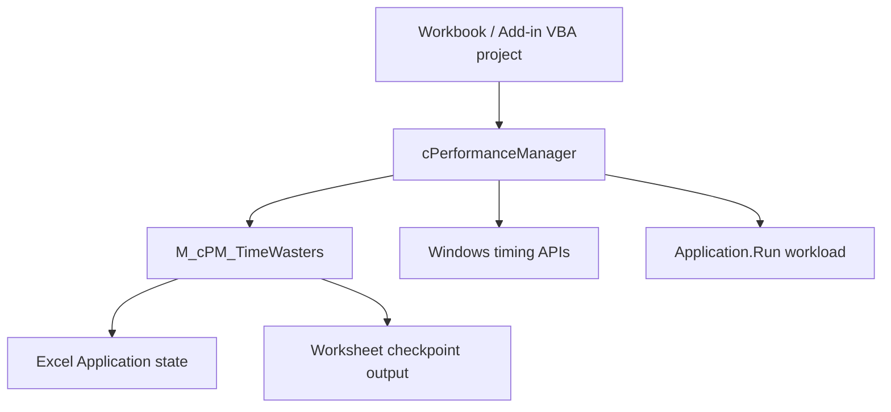

<div align="center">

# 📦 Installation and Upgrade Guide

### Installing, integrating, validating, upgrading, troubleshooting, and removing VBA-PERFORMANCE_MANAGER

[](#-requirements)
[](#-deployment-model)
[](#-office-bitness)
[](#-embedded-source-installation)
[](#-developer-regression-validation)

<br>

**Two-file runtime · Source-first deployment · QPC default · Shared Excel-state ownership · Optional regression harness · Release workbook for evaluation**

<br>

[Requirements](#-requirements)
&nbsp;·&nbsp;
[Deployment](#-deployment-model)
&nbsp;·&nbsp;
[Install source](#-embedded-source-installation)
&nbsp;·&nbsp;
[Validate](#-validation)
&nbsp;·&nbsp;
[Upgrade](#-upgrade-guide)
&nbsp;·&nbsp;
[Troubleshoot](#-troubleshooting)
&nbsp;·&nbsp;
[Remove](#-removing-the-component)

</div>

---

> [!IMPORTANT]
> **The primary deployment model is source-first.**
>
> Import the exported VBA source into the workbook or add-in that needs the
> component. The tagged source is the authoritative implementation.
>
> The macro-enabled workbook published with GitHub Releases is a convenience
> artifact for evaluation, demonstration, and package-level validation. It is
> not a different implementation and it is not the authoritative source tree.

> [!IMPORTANT]
> For the current v1.4.0 release, the production
> package consists of **two required source files**:
>
> ```text
> src/modules/M_cPM_TIMEWASTERS.bas
> src/classes/cPerformanceManager.cls
> ```
>
> Import the module **before** the class.
>
> Future major releases may split internal responsibilities into additional
> required modules. Always use the `INSTALLATION.md` shipped with the tag you are
> installing instead of assuming the two-file contract will exist forever.

> [!NOTE]
> No administrator rights are normally required to import VBA source manually.
> Organization policy can still restrict macros, VBA project editing, trusted
> locations, or downloaded macro-enabled files.

---

## 🧭 Requirements

| Requirement | Detail |
|---|---|
| 🖥️ Host | Microsoft Excel desktop for **Windows** |
| ⚙️ Office bitness | Source contains VBA7 / Win64 branches for 32-bit and 64-bit Office |
| 📄 Host project | Macro-enabled workbook (`.xlsm` / `.xlsb`) or Excel add-in (`.xlam`) containing a VBA project |
| 📥 Source installer | None — import exported VBA components |
| 🔗 External runtime | None |
| 🧱 COM reference | None required |
| 📚 Third-party DLL | None bundled or required |
| 🪟 Windows APIs | Uses Windows **system** APIs from `kernel32` and `winmm` for API-backed timing |
| 📖 Dictionary support | Late-bound `Scripting.Dictionary`; no Microsoft Scripting Runtime reference required |
| 🔐 Macro policy | The host must be allowed to run VBA under the user's organization policy |

VBA-PERFORMANCE_MANAGER is designed for Windows desktop Excel.

Methods 2–5 are backed by Windows APIs. The project does not claim Excel for
macOS or Excel for the web as supported deployment targets.

### Macro security

Do not weaken Excel macro security globally to use this component.

Use the organization's approved deployment mechanism, for example:

```text
reviewed source in an approved workbook
approved Trusted Location
digitally signed workbook/add-in
explicitly approved macro-enabled file
```

If Windows marks a downloaded `.xlsm` as originating from the Internet, the file
Properties dialog may show an **Unblock** option. Use it only when the file is
trusted and organizational policy permits it.

For the project's security and trust model, see:

[SECURITY.md](SECURITY.md)

---

# 🎯 Deployment model

The project currently supports two practical ways to consume it.

| Deployment | Best for | Admin rights | Travels with workbook | Authoritative implementation |
|---|---|:---:|:---:|:---:|
| **Embedded source** | Production workbooks, reviewed solutions, development | No | ✅ | ✅ |
| **Release `.xlsm`** | Evaluation, demonstration, release validation | No | Self-contained demo | ❌ |

There is currently **no official Performance Manager `.xlam` distribution**.

You may embed the source in your own `.xlam`, but that is a host application you
build and maintain, not a separately supported packaged distribution from this
repository.

### Recommended choice

Use **embedded source** when:

- the component is part of a production workbook;
- the workbook must remain self-contained;
- source must be reviewed or version-controlled;
- deployment occurs on managed desktops;
- you need only the runtime and not the demo/test infrastructure.

Use the **release workbook** when:

- evaluating the component;
- learning the API;
- inspecting the demo;
- validating the exact binary asset published with a release.

---

# 📦 Production source package

## Current required runtime files

| Import order | Repository path | VBE component | Responsibility |
|---:|---|---|---|
| 1 | `src/modules/M_cPM_TIMEWASTERS.bas` | `M_cPM_TimeWasters` | Shared Excel Application-state ownership and checkpoint worksheet output |
| 2 | `src/classes/cPerformanceManager.cls` | `cPerformanceManager` | Public timing, measurement, statistics, checkpoint, pause, and execution-control facade |

> [!WARNING]
> Import `M_cPM_TIMEWASTERS.bas` **first**.
>
> `cPerformanceManager` directly calls support procedures such as
> `PM_TW_NewInstanceKey`, `PM_TW_BeginSession`, and `PM_TW_EndSession`.
> The class alone is not a complete compilable installation.

### Why the source filename and VBE component name differ in case

The repository file is:

```text
M_cPM_TIMEWASTERS.bas
```

The exported module declares:

```text
M_cPM_TimeWasters
```

That is expected.

Do not rename the component merely to make filesystem casing and the VBE display
name identical.

---

## 🧪 Optional development / validation source

| Repository path | Required for production? | Purpose |
|---|:---:|---|
| `test/M_cPM_Test.bas` | No | Regression harness |
| `demo/M_DEMO_BUILDER.bas` | No | Worksheet/status-bar helpers required by the current interactive regression harness |
| `demo/M_cPM_DEMO.bas` | No | Demo construction / presentation |
| `demo/M_cPM_USAGE_EXAMPLES.bas` | No | Curated user-facing examples |

> [!IMPORTANT]
> The current `M_cPM_Test.bas` depends on `M_DEMO_BUILDER`.
>
> For a clean regression host, import:
>
> ```text
> src/modules/M_cPM_TIMEWASTERS.bas
> src/classes/cPerformanceManager.cls
> demo/M_DEMO_BUILDER.bas
> test/M_cPM_Test.bas
> ```
>
> before compiling and running the suite.

`M_cPM_DEMO.bas` and `M_cPM_USAGE_EXAMPLES.bas` are not required merely to run
the standard regression suite.

---

# 🔗 Runtime architecture



The class is the supported object-oriented facade.

`M_cPM_TimeWasters` is an internal support module and is declared
`Option Private Module`, so its project-visible procedures do not appear as an
ordinary user-runnable macro surface.

---

# 🚀 Embedded source installation

This is the recommended production deployment.

## 1. Prepare the destination VBA project

Use a macro-enabled host such as:

```text
.xlsm
.xlsb
.xlam
```

Before changing the project:

1. save the host file;
2. make a recoverable backup;
3. identify whether an older Performance Manager copy is already present;
4. close unrelated workbooks if you plan to validate process-wide Excel state.

If upgrading an existing installation, use the [Upgrade guide](#-upgrade-guide)
rather than importing duplicate components.

---

## 2. Open the VBA Editor

Press:

```text
Alt + F11
```

In Project Explorer, select the destination VBA project.

---

## 3. Import the support module

Use:

```text
File → Import File...
```

and import:

```text
src/modules/M_cPM_TIMEWASTERS.bas
```

Project Explorer should contain:

```text
Modules
└─ M_cPM_TimeWasters
```

---

## 4. Import the class

Import:

```text
src/classes/cPerformanceManager.cls
```

Project Explorer should contain:

```text
Class Modules
└─ cPerformanceManager
```

Do not manually alter exported class metadata such as `MultiUse`, instancing, or
predeclared-ID attributes.

---

## 5. Compile the project

Run:

```text
Debug → Compile VBAProject
```

Do not skip this step.

An imported component that does not compile is not a valid installation.

### Expected production component set

For the current runtime:

```text
M_cPM_TimeWasters
cPerformanceManager
```

If compilation reports:

```text
Sub or Function not defined
Ambiguous name detected
Expected: end of statement
User-defined type not defined
```

go to [Troubleshooting](#-troubleshooting).

---

## 6. Perform a basic QPC smoke test

Create a normal standard module in the host and run:

```vb
Option Explicit

Public Sub cPM_InstallSmoke_Timing()

    Dim cPM As cPerformanceManager

    Set cPM = New cPerformanceManager

    cPM.StartTimer 5       'QueryPerformanceCounter
        DoEvents

    Debug.Print "Elapsed seconds: "; cPM.ElapsedSeconds()

    cPM.ResetEnvironment
    Set cPM = Nothing

End Sub
```

Expected behavior:

```text
a finite non-negative elapsed value
no error
```

For ordinary use, method 5 / QPC is the recommended default backend.

`ResetEnvironment` is included deliberately: it releases environment ownership
held by that instance, including timer-resolution ownership and any active
time-waster scope.

---

## 7. Verify formatted timing

A minimal presentation smoke test:

```vb
Public Sub cPM_InstallSmoke_Formatted()

    Dim cPM As cPerformanceManager

    Set cPM = New cPerformanceManager

    cPM.StartTimer 5
        DoEvents

    Debug.Print cPM.ElapsedTime

    cPM.ResetEnvironment
    Set cPM = Nothing

End Sub
```

`ElapsedSeconds` is the lower-overhead numeric primitive.

`ElapsedTime` is presentation-oriented.

For benchmarking, prefer collecting numeric samples first and formatting only
after measurement.

---

## 8. Verify shared Excel-state suppression

Run state-management tests only in a controlled workbook.

Example:

```vb
Public Sub cPM_InstallSmoke_TimeWasters()

    Dim cPM As cPerformanceManager

    Set cPM = New cPerformanceManager

    Debug.Print "Before:", _
                Application.ScreenUpdating, _
                Application.EnableEvents, _
                Application.DisplayAlerts, _
                Application.Calculation

    cPM.TW_Turn_OFF Except:=TW_Enum.EnableEvents Or TW_Enum.Calculation

    Debug.Print "During:", _
                Application.ScreenUpdating, _
                Application.EnableEvents, _
                Application.DisplayAlerts, _
                Application.Calculation

    cPM.TW_Turn_ON

    Debug.Print "After:", _
                Application.ScreenUpdating, _
                Application.EnableEvents, _
                Application.DisplayAlerts, _
                Application.Calculation

    cPM.ResetEnvironment
    Set cPM = Nothing

End Sub
```

The exact values depend on the starting Excel state and the exemption mask.

The invariant to verify is:

```text
requested non-exempt settings are suppressed
+
exempt settings remain untouched
+
the original baseline is restored when the final scope ends
```

### Application.Calculation caveat

`Application.Calculation` has an explicit stable-host invariant.

Calculation control requires the open-workbook set to remain stable for the life
of the shared suppression scope.

If the requirement cannot be honored, the component may exempt Calculation in
non-strict use and report that through:

```text
TW_CalculationExempted
```

Do not interpret that as silent success.

---

## 9. Benchmark a real procedure

`MeasureProcedure` dispatches by name through `Application.Run`.

The target must therefore be a **Public procedure in a standard module**.

Example target:

```vb
Public Sub cPM_InstallSmoke_Workload()

    Dim i As Long
    Dim x As Double

    For i = 1 To 10000
        x = x + Sqr(i)
    Next i

End Sub
```

Measurement:

```vb
Public Sub cPM_InstallSmoke_Measurement()

    Dim cPM As cPerformanceManager
    Dim Samples() As Double
    Dim Failed As Long
    Dim LastFailure As cPM_ReadStatus

    Set cPM = New cPerformanceManager

    Samples = cPM.MeasureProcedure( _
                    "cPM_InstallSmoke_Workload", _
                    20, _
                    3, _
                    5, _
                    Failed, _
                    LastFailure)

    Debug.Print cPM.Stats_Text(Samples, "Installation smoke test")
    Debug.Print "Failed reads: "; Failed
    Debug.Print "Last failure status: "; LastFailure

    cPM.ResetEnvironment
    Set cPM = Nothing

End Sub
```

Interpret the result as a **distribution**, not as one magic timing number.

The installation is behaving normally when:

```text
a non-empty sample vector is returned
the values are finite and non-negative
failure evidence is explicit
statistics are produced without contract errors
```

Do not treat a single minimum or mean as a general performance guarantee.

---

## 10. Optional matched-baseline check

If you want to estimate `Application.Run` dispatch overhead, provide a reachable
empty procedure:

```vb
Public Sub cPM_InstallSmoke_Empty()

End Sub
```

Then:

```vb
Dim Work() As Double
Dim Base() As Double

Work = cPM.MeasureProcedure("cPM_InstallSmoke_Workload", 20, 3)
Base = cPM.MeasureBaseline("cPM_InstallSmoke_Empty", 20, 3)

Debug.Print "Work median: "; cPM.Stats_Median(Work)
Debug.Print "Base median: "; cPM.Stats_Median(Base)
Debug.Print "Net median:  "; _
            cPM.Stats_Median(Work) - cPM.Stats_Median(Base)
```

Use `MeasureBaseline` for a dispatch-matched baseline.

`MeasureOverhead_Samples` measures the timer/class cycle and does **not** traverse
the same `Application.Run` path.

---

# ✅ Validation

Installation validation has three levels:

```text
consumer smoke validation
developer regression validation
release-asset validation
```

---

## ✅ Consumer smoke validation

For an ordinary production source install, validate at least:

```text
[ ] Debug → Compile VBAProject passes
[ ] QPC StartTimer / ElapsedSeconds works
[ ] ResetEnvironment completes
[ ] TW suppression restores the baseline in a controlled test
[ ] MeasureProcedure can call a controlled Public standard-module target, if used
[ ] Statistics produce finite, meaningful output, if used
```

A consumer does not need the full regression harness merely to use the class.

---

## 🧪 Developer regression validation

Import:

```text
src/modules/M_cPM_TIMEWASTERS.bas
src/classes/cPerformanceManager.cls
demo/M_DEMO_BUILDER.bas
test/M_cPM_Test.bas
```

Then:

```text
Debug → Compile VBAProject
```

Run:

```vb
Run_cPerformanceManager_RegressionSuite
```

The current interactive harness:

- builds/rebuilds a dedicated regression worksheet;
- records case/assertion/failure counters;
- writes durable worksheet evidence;
- reports progress through the Excel status bar;
- exercises timing, statistics, checkpoints, error/fallback behavior, and shared
  Excel Application-state management.

### Passing condition

The non-negotiable result is:

```text
Failures = 0
```

Also record:

```text
commit / tag
Cases
Assertions
Failures
Excel version/build
Office bitness
```

Do **not** hard-code an old case/assertion count as the permanent definition of
success. Legitimate new tests change those counts.

For reference, published v1.3.0 evidence was:

```text
72 cases
511 assertions
0 failures
Excel Microsoft 365 64-bit
```

That record certifies that release/environment, not every future branch.

### Current automation boundary

The repository currently has hosted **static** source checks.

They do not execute Excel or VBA.

Until the he…15495 tokens truncated…k invariant |
| Regression module does not compile | Import `M_DEMO_BUILDER.bas` before `M_cPM_Test.bas` |
| State is uncertain after a hard `End` or VBA reset | Save work, close every Excel window, confirm `EXCEL.EXE` exits, restart Excel, and rerun validation in a controlled workbook |

For fuller procedures, see
**[INSTALLATION.md — Troubleshooting](INSTALLATION.md#-troubleshooting)**.

---

## 📚 Documentation

| Resource | Purpose |
|---|---|
| [README.md](README.md) | High-level contract, usage, architecture, assurance, and limitations |
| [INSTALLATION.md](INSTALLATION.md) | Source import, validation, upgrade, recovery, and removal |
| [CHANGELOG.md](CHANGELOG.md) | Released behavior and compatibility history |
| [SECURITY.md](SECURITY.md) | Security model, private reporting, trusted inputs, runner and release boundaries |
| [RELEASING.md](RELEASING.md) | Maintainer-only exact-SHA release procedure and evidence chain |
| [Regression suite](test/M_cPM_Test.bas) | Executable Excel/VBA behavioral verification |
| [Static linter](tools/vba_lint.py) | Machine-readable source consistency checks |
| [GitHub Releases](https://github.com/danielep71/VBA-PERFORMANCE_MANAGER/releases) | Published workbook and release manifest assets |
| [Wiki](https://github.com/danielep71/VBA-PERFORMANCE_MANAGER/wiki) | Extended API, timing, benchmarking, architecture, and testing guidance |

The Wiki is useful extended documentation, but branch source and root documents
are the immediate reference for changes made after its last reviewed baseline.

---

<a id="release-status"></a>

# 🧭 Release status

## v1.4.0 — latest tagged release

Published on **2026-08-31**, v1.4.0 delivered backend-homogeneous measurement,
complete failure/rejection evidence across all three measurement APIs, validated
legacy overhead calculation, and robust workbook-name qualification.

The release is bound to tag target `a5390b4c6ca56ebbd87eca121b5167ee5dc09963`
and certified on Microsoft 365 Excel 64-bit with **80 cases, 643 assertions and
0 failures**, plus **12/12** static checks. See [CHANGELOG.md](CHANGELOG.md) and
the [v1.4.0 Release](https://github.com/danielep71/VBA-PERFORMANCE_MANAGER/releases/tag/v1.4.0).

Real Office 32-bit execution remains unverified and is tracked in
[#29](https://github.com/danielep71/VBA-PERFORMANCE_MANAGER/issues/29); this is
an assurance limitation, not a claim that 32-bit source support was removed.

## v1.3.0 — previous tagged release

Published on **2026-08-16**, v1.3.0 focused on enforceable consistency, named
API values, failure observability, honest statistics, and release provenance.

Material additions and corrections included:

- hosted static source analysis with machine-readable output;
- named timer, pause, read-status, and error values;
- dispatch-matched `MeasureBaseline`;
- worker failure metadata on `MeasureProcedure`;
- exclusion of failed endpoint reads from retained vectors;
- finite, non-negative timing-vector validation;
- explicit undefined-CV behavior for non-positive means;
- deterministic workbook qualification for unqualified `Application.Run` names;
- release-source and asset provenance tooling.

See [CHANGELOG.md](CHANGELOG.md) for the complete released record and the
[v1.3.0 Release](https://github.com/danielep71/VBA-PERFORMANCE_MANAGER/releases/tag/v1.3.0)
for the published workbook and manifest.

## v1.4.1 — active development cycle

The v1.4.1 milestone hardens the v1.4.0 runtime, documentation and assurance
chain. Planned work includes:

- release-ledger and current-documentation reconciliation;
- fail-closed release-provenance generation and stronger static controls;
- bounded timing, statistics and shared-state corrections;
- a real-Excel executable gate and a rebuilt demonstration workbook;
- contributor-dependent real Office 32-bit evidence when a suitable host is
  available.

The official add-in artifact remains a v1.5.0 goal. A real Excel regression
gate needs a secured self-hosted Windows runner and is tracked in
[#11](https://github.com/danielep71/VBA-PERFORMANCE_MANAGER/issues/11).

---

## 🔐 Security and trust

This project executes VBA inside Excel, calls Windows system timing APIs,
controls process-wide Excel settings, and can dispatch trusted procedures
through `Application.Run`.

Before using it in a business-critical workbook:

- review the exact tagged source you intend to import;
- pass only trusted procedure names to measurement APIs;
- follow your organization's macro-signing and deployment policy;
- validate the exact Excel build and Office bitness used in production;
- verify release-asset SHA-256 values after download;
- understand the shared Application-state and timer-resolution boundaries;
- do not treat the component as a sandbox or authorization boundary.

Report suspected vulnerabilities privately. Do not publish exploit workbooks,
credentials, client files, or sensitive runner details in a public issue.

See **[SECURITY.md](SECURITY.md)** for the complete policy.

---

## 📌 Status

The latest tagged source is suitable for controlled Windows Excel/VBA
environments when the documented timing, bitness, `Application.Run`, and shared
Application-state boundaries are respected.

The repository deliberately separates:

```text
source consistency
≠
Excel execution
≠
Office-bitness certification
≠
release-workbook identity
≠
reproducible source-to-binary provenance
```

That distinction is part of the product contract, not a footnote.

---

## 👤 Author

**Daniele Penza**

[](https://github.com/danielep71)

## 📄 License

Licensed under the [MIT License](LICENSE).
