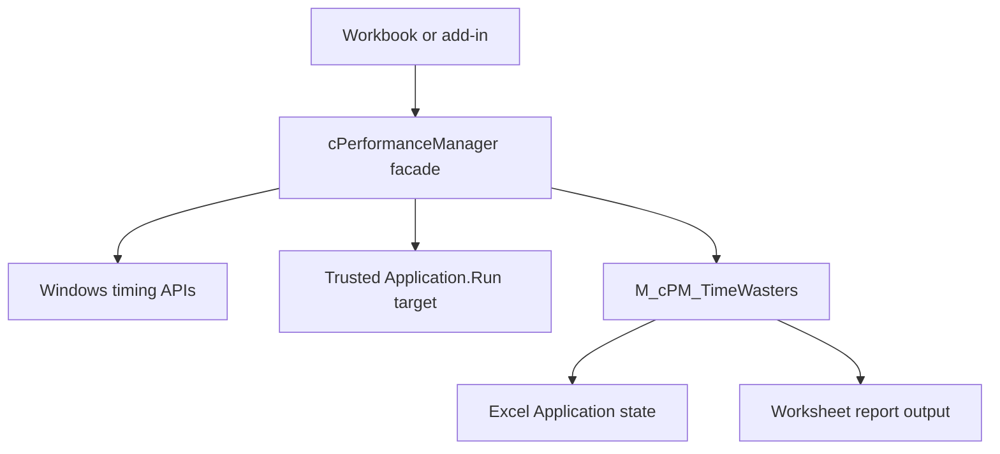

<div align="center">

# ⚙️ VBA Performance Manager

### Benchmark-grade timing, measurement, and Excel execution control for pure VBA

**Session-bound clocks · High-resolution QPC · Full sample vectors · Distribution-aware statistics · Structured checkpoints · Shared Application-state ownership**

<br>

[](#requirements)
[](#requirements)
[](#release-status)
[](#regression-testing)
[](#static-source-analysis)
[](LICENSE)

<br>

[](https://github.com/danielep71/VBA-PERFORMANCE_MANAGER/actions/workflows/static-checks.yml)
[](https://github.com/danielep71/VBA-PERFORMANCE_MANAGER/releases)
[](https://github.com/danielep71/VBA-PERFORMANCE_MANAGER/issues)
[](https://github.com/danielep71/VBA-PERFORMANCE_MANAGER/stargazers)

<br>

**Two-file runtime · No installer for source import · No admin rights normally required · No COM add-in · No third-party DLL · No external numerical runtime**

[Quick start](#quick-start)
&nbsp;·&nbsp;
[Timing backends](#timing-backends)
&nbsp;·&nbsp;
[Measurement](#measurement-and-statistics)
&nbsp;·&nbsp;
[Excel state](#excel-application-state)
&nbsp;·&nbsp;
[Public API](#public-api)
&nbsp;·&nbsp;
[Assurance](#regression-testing)
&nbsp;·&nbsp;
[Wiki](https://github.com/danielep71/VBA-PERFORMANCE_MANAGER/wiki)
&nbsp;·&nbsp;
[Releases](https://github.com/danielep71/VBA-PERFORMANCE_MANAGER/releases)

---

<p align="center">
  
</p>

---

</div>

> [!IMPORTANT]
> **The primary deployment model is source-first.** Import the exported VBA
> source into the workbook or add-in that needs the component. For the current
> `v1.3.x` runtime and `v1.4.0` development line, the production package is
> exactly two files, imported in the documented order.
>
> The macro-enabled workbook published with GitHub Releases is a convenience
> artifact for evaluation, demonstration, and package-level validation. The
> tagged source remains the authoritative implementation.

> [!NOTE]
> The latest tagged release is **v1.3.0**. The `release/v1.4.0` branch is an
> active development line; until it is released, its documentation and source
> must not be treated as v1.4.0 execution certification.

## ✨ What this project is

**VBA Performance Manager** is a reusable timing, benchmarking, and
execution-control component for Microsoft Excel VBA on Windows.

Its public facade, `cPerformanceManager`, provides:

- six timing backends behind one session-bound interface;
- high-resolution, monotonic `QueryPerformanceCounter` timing by default;
- numeric and human-readable elapsed-time reporting;
- repeated measurement with the complete retained per-run sample vector;
- dispatch-matched baselines and backend-overhead sampling;
- median, percentile, spread, and contamination diagnostics;
- structured checkpoints with delta and cumulative timing;
- shared, reference-counted control of expensive Excel Application settings;
- strict and non-strict failure policies with explicit timing-read status;
- diagnostics for QPC frequency, system tick interval, and observed overhead.

The component is intended for:

- benchmarking VBA procedures and comparing optimization strategies;
- instrumenting long-running workbook automation;
- controlling Excel state during calculation-heavy or write-heavy work;
- diagnosing timing backends and scheduler noise;
- teaching how Windows timing sources behave from VBA.

> **Positioning**
>
> This is a production-oriented VBA timing component with an explicitly
> documented operating domain. It emphasizes measurement integrity, observable
> failures, shared-state safety, and reviewable source. It is not a replacement
> for a compiled profiler and does not claim nanosecond measurement resolution.

---

## ⭐ Why use it

Inline `Timer()` calls are convenient, but they leave the caller responsible
for clock selection, rollover, session consistency, failure semantics,
benchmark repetition, statistics, and Excel-state cleanup.

| Capability | Inline `Timer()` | Typical small helper | VBA Performance Manager |
|---|:---:|:---:|:---:|
| Multiple timing backends | — | Sometimes | ✅ |
| Backend bound to the active session | — | — | ✅ |
| High-resolution monotonic QPC default | — | Sometimes | ✅ |
| Unsigned 32-bit counter conversion | — | Rarely | ✅ |
| One-wrap elapsed correction | — | Rarely | ✅ |
| Backwards-clock detection where meaningful | — | — | ✅ |
| Transactional session start | — | — | ✅ |
| Explicit multimedia timer-resolution request/release lifecycle | — | Rarely | ✅ |
| Repeated measurement returning every retained sample | — | Rarely | ✅ |
| Dispatch-matched baseline | — | — | ✅ |
| Median, percentile, and spread statistics | — | — | ✅ |
| Named checkpoints and structured reports | — | Rarely | ✅ |
| Overlapping instances share Excel-state ownership | — | — | ✅ |
| Strict/non-strict policy with explicit read status | — | — | ✅ |
| Named production error values | — | Rarely | ✅ |
| Regression harness and hosted static checks | — | Rarely | ✅ |

---

## 🎯 Core capabilities

| Area | Capability | Current behavior |
|---|---|---|
| Timing | Six selectable backends | Backend is bound by `StartTimer`; later reads validate against the session |
| Default clock | QPC | High-resolution and monotonic on supported Windows hosts |
| Measurement | Full retained vector | Warm-ups, repeated runs, isolated worker, failed endpoint reads excluded |
| Baseline | Dispatch-matched | `MeasureBaseline` uses the same `Application.Run` path as the workload |
| Statistics | Timing-vector analytics | Median, min/max, mean, P95/other percentiles, sample standard deviation, CV |
| Checkpoints | Structured workflow timing | Named delta and cumulative observations; array and text export |
| Excel state | Shared ownership | Screen updating, events, alerts, calculation, and cursor coordinated across instances |
| Diagnostics | Timing environment | QPC frequency, system tick interval, backend overhead, active method and read status |
| Failure policy | Strict by default | Raise on invalid measurement; optional non-strict fallback/zero with explicit status |
| Deployment | Source-first | Two required production files; no official `.xlam` distribution |
| Assurance | Static plus real Excel evidence | 12 hosted source checks; v1.3.0 manually certified with 72 cases / 511 assertions |

---

<p align="center">
  
</p>

---

<a id="quick-start"></a>

# ⚡ Quick start

## 1. Import the production source

Import these files in this order:

```text
src/modules/M_cPM_TIMEWASTERS.bas
src/classes/cPerformanceManager.cls
```

Then compile:

```text
VBA Editor → Debug → Compile VBAProject
```

> [!WARNING]
> Import `M_cPM_TIMEWASTERS.bas` **before** `cPerformanceManager.cls`. The class
> calls project-internal support procedures in that module and is not a complete
> installation by itself.

For step-by-step installation, validation, upgrade, troubleshooting, and
removal, see **[INSTALLATION.md](INSTALLATION.md)**.

## 2. Time a block of code

```vb
Dim cPM As cPerformanceManager
Dim ElapsedS As Double

Set cPM = New cPerformanceManager

cPM.StartTimer cPM_MethodQPC
    ' ... workload ...
ElapsedS = cPM.ElapsedSeconds

Debug.Print Format$(ElapsedS, "0.000000000") & " seconds"
Debug.Print cPM.ElapsedTime(ElapsedSecondsIn:=ElapsedS)

cPM.ResetEnvironment
Set cPM = Nothing
```

Supplying `ElapsedSecondsIn` formats the value already captured; it does not
take a second timing sample.

## 3. Benchmark a procedure with statistics

The target must be a `Public Sub` in a standard module:

```vb
Public Sub Benchmark_Target()

    ' ... workload ...

End Sub
```

Measure it:

```vb
Dim cPM As cPerformanceManager
Dim Samples() As Double
Dim FailedReads As Long
Dim LastFailure As cPM_ReadStatus

Set cPM = New cPerformanceManager

Samples = cPM.MeasureProcedure( _
              ProcedureName:="Benchmark_Target", _
              Iterations:=30, _
              WarmupIterations:=3, _
              iMethod:=cPM_MethodQPC, _
              FailedReadsOut:=FailedReads, _
              LastFailureStatusOut:=LastFailure)

Debug.Print cPM.Stats_Text(Samples, "Benchmark_Target")
Debug.Print "Failed reads: " & FailedReads

cPM.ResetEnvironment
Set cPM = Nothing
```

`StrictMode` defaults to `True`. Keep that default for release-quality
benchmarks unless the non-strict behavior and the v1.3.0 limitations described
below are explicitly acceptable.

## 4. Subtract a matched dispatch baseline

Add an empty `Public Sub` in a standard module:

```vb
Public Sub Benchmark_Empty()
End Sub
```

Then compare medians:

```vb
Dim Work() As Double
Dim Base() As Double
Dim NetMedian As Double

Work = cPM.MeasureProcedure("Benchmark_Target", 30, 3)
Base = cPM.MeasureBaseline("Benchmark_Empty", 30, 3)

NetMedian = cPM.Stats_Median(Work) - cPM.Stats_Median(Base)
Debug.Print "Net median: " & Format$(NetMedian, "0.000000000") & " seconds"
```

Use `MeasureBaseline`, not `MeasureOverhead_Samples`, when removing the cost of
the `Application.Run` harness.

## 5. Instrument a workflow with checkpoints

```vb
cPM.StartTimer cPM_MethodQPC, False, "Import run"

LoadSourceData
cPM.Checkpoint "Load"

TransformRecords
cPM.Checkpoint "Transform", "22 400 rows"

WriteResults
cPM.Checkpoint "Write back"

Debug.Print cPM.ReportAsText
```

Example output:

```text
CHECKPOINT REPORT | RunLabel=Import run
Seq | Checkpoint | DeltaSeconds | CumulativeSeconds | MethodName | Note
1 | Load | 1.204881200 | 1.204881200 | QPC |
2 | Transform | 3.771003400 | 4.975884600 | QPC | 22 400 rows
3 | Write back | 0.918224100 | 5.894108700 | QPC |
```

## 6. Control expensive Excel state

```vb
cPM.TW_Turn_OFF
    ' ... heavy workbook automation ...
cPM.TW_Turn_ON
```

Keep selected settings live by passing an exemption mask:

```vb
cPM.TW_Turn_OFF Except:=TW_Enum.EnableEvents Or TW_Enum.Calculation
```

In production code, call `ResetEnvironment` from the procedure's centralized
cleanup path so timer-resolution and Excel-state ownership are released after
both success and failure.

---

<a id="timing-backends"></a>

# ⏱️ Timing backends

Select a backend with the first argument to `StartTimer`. The default is
`cPM_MethodQPC` (`5`).

| ID | Enum value | Backend | Clock type | Important boundary |
|:-:|---|---|---|---|
| **1** | `cPM_MethodTimer` | VBA `Timer` | Wall-clock seconds since midnight | Midnight and a backward clock adjustment are indistinguishable |
| **2** | `cPM_MethodTickCount` | `GetTickCount` / `GetTickCount64` | Monotonic uptime counter | Win32 wraps after about 49.7 days; Win64 uses `GetTickCount64` |
| **3** | `cPM_MethodTimeGetTime` | `timeGetTime` | Monotonic multimedia timer | Requests 1 ms timer resolution while held; 32-bit counter wraps |
| **4** | `cPM_MethodSystemTime` | `timeGetSystemTime` / `TIME_MS` | Monotonic multimedia time | 32-bit counter wraps; returned format is validated |
| **5** | `cPM_MethodQPC` | `QueryPerformanceCounter` | High-resolution monotonic counter | **Default and recommended** |
| **6** | `cPM_MethodNow` | `Now() * 86400` | Wall clock | Diagnostic/compatibility path; subject to clock changes |

> [!TIP]
> Use QPC unless a target environment gives you a specific reason to select a
> different backend. Inspect `QPC_FrequencyPerSecond_Value` on that environment
> rather than inferring resolution from the formatted nanosecond field.

### Session binding

`StartTimer` resolves a requested backend and commits the new session only after
a valid start value has been captured. `ElapsedSeconds` then resolves against
the active session rather than silently reading an unrelated clock.

In strict mode, an invalid request or failed read raises. In non-strict mode,
the class may fall back to backend 2 during session start and records that
coercion as `cPM_ReadFallbackToMethod2`.

### Enum semantics

The named enums make call sites readable and improve IntelliSense:

```vb
cPM.StartTimer cPM_MethodQPC
cPM.Pause 0.25, cPM_PauseSleep
```

VBA enum parameters nevertheless use `Long` semantics. Separate timer and pause
enums document intent; they do **not** make equal numeric values compile-time
non-interchangeable.

### Rollover handling

On Win32, backends 2–4 expose 32-bit millisecond counters through signed VBA
`Long` values. `UInt32ToDouble` reinterprets the bit pattern as an unsigned
quantity, and `RolloverSeconds` supplies the appropriate wrap period.

The implementation corrects at most one wrap. It cannot recover a session that
spans more than one complete counter period.

---

<a id="measurement-and-statistics"></a>

# 📊 Measurement and statistics

> [!IMPORTANT]
> **Lead with the median and inspect the minimum and tail. Do not report the
> mean alone.** Timing distributions are commonly right-skewed: scheduler
> preemption or background work can move the mean materially while leaving the
> median much more stable.

## Measurement primitives

| Member | Returns | Purpose |
|---|---|---|
| `MeasureProcedure` | `Double()` | Repeatedly runs a trusted named `Public Sub` through `Application.Run`; returns each retained measured sample |
| `MeasureBaseline` | `Double()` | Runs an empty procedure through the same dispatch path for matched-baseline subtraction |
| `MeasureOverhead_Samples` | `Double()` | Samples the near-empty backend timing cycle without `Application.Run` |
| `OverheadMeasurement_Seconds` | `Double` | Legacy arithmetic-mean overhead helper; see the v1.3.0 boundary below |

Measurement uses an isolated `cPerformanceManager` worker so the caller's
active session, checkpoint rows, cached elapsed value, and run label are not
disturbed.

### Failed endpoint reads

In non-strict mode, an invalid endpoint read returns zero. Storing that zero
would make the failure appear to be the fastest observation, so
`MeasureProcedure` excludes it from the returned vector.

Consequences:

| Observation | Meaning |
|---|---|
| `Stats_Count(Samples) < Iterations` | One or more measured endpoint reads were excluded |
| `FailedReadsOut` | Failed reads across warm-up and measured iterations |
| `LastFailureStatusOut` | Most recent failed-read status from `MeasureProcedure` |
| No valid measured endpoint | Raises `ERR_CPM_MEASURE_NO_VALID_SAMPLES` |

In v1.3.0, `MeasureBaseline` returns the delegated vector but exposes neither
failure metadata output, and `MeasureOverhead_Samples` exposes none either.
Both are corrected on the v1.4.0 development line; see the note below.

> [!NOTE]
> **Fixed on the v1.4.0 development line for `MeasureBaseline`**
> ([#27](https://github.com/danielep71/VBA-PERFORMANCE_MANAGER/issues/27)), which forwards `FailedReadsOut`,
> `LastFailureStatusOut` and a new `RejectedSamplesOut` from its delegated run.
> A measured cycle whose requested backend fell back is now rejected rather than
> retained and counted separately ([#23](https://github.com/danielep71/VBA-PERFORMANCE_MANAGER/issues/23)), so the count rule above
> becomes:
>
> ```text
> Iterations = Stats_Count(vector) + measured endpoint failures + RejectedSamplesOut
> ```
>
> Both counts are `-1` until the run reaches a publication point, so a negative
> count means no evidence was published and `Err` carries the diagnosis.
>
> **`MeasureOverhead_Samples` is fixed on the same line** ([#28](https://github.com/danielep71/VBA-PERFORMANCE_MANAGER/issues/28)),
> exposing all three outputs directly and rejecting a cycle whose requested
> backend fell back, so an overhead figure can no longer describe a different
> clock than the one asked for. The count equation applies with cycles in place
> of iterations.

### v1.3.0 non-strict backend-homogeneity boundary

> [!CAUTION]
> In v1.3.0, a failed non-strict `StartTimer` can fall back to backend 2. A
> later successful endpoint read resets the worker's read status to OK, so the
> current harness can retain that observation in a vector requested for another
> backend.
>
> Therefore, **v1.3.0 does not prove that every retained non-strict sample
> vector is backend-homogeneous**. Keep `StrictMode=True` for benchmark evidence
> that must not tolerate fallback, or validate the resolved backend in your own
> controlled path.
>
> **Fixed on the v1.4.0 development line** ([#23](https://github.com/danielep71/VBA-PERFORMANCE_MANAGER/issues/23)). The start
> transaction is captured immediately after `StartTimer`, before any endpoint
> read can reset it, and a cycle that fell back is rejected rather than
> retained.

### `Application.Run` contract

The measured target must be a `Public Sub` in a standard module.
`Application.Run` cannot reach:

- `Private` procedures;
- class methods;
- procedures in a module declared `Option Private Module`.

An unqualified name is qualified to the workbook hosting the component, rather
than resolved against whichever workbook happens to be active.

> [!WARNING]
> `ProcedureName` is executable input. Pass a literal or a name controlled by
> trusted code. Do not pass a procedure name read from a worksheet, external
> file, or other untrusted source.

`Application.Run` adds dispatch cost to each measurement. That cost varies by
Excel build, bitness, host load, and project structure. Measure an empty target
through `MeasureBaseline` on the same host and compare medians.

## Statistics contract

All statistics accept a one-dimensional `Double()` vector of finite,
non-negative timing observations. A negative or non-finite value is rejected at
the shared validation gate, with the offending index identified.

| Member | Result |
|---|---|
| `Stats_Count` | Observation count; `0` for an uninitialized array |
| `Stats_Min` / `Stats_Max` | Smallest and largest observation |
| `Stats_Mean` | Arithmetic mean |
| `Stats_Median` | Median |
| `Stats_Percentile` | Nearest-rank percentile; the returned value was observed |
| `Stats_StdDev` | Sample standard deviation with `N - 1` divisor |
| `Stats_CoefficientOfVariation` | Sample standard deviation divided by a strictly positive mean |
| `Stats_IsContaminated` | Heuristic: `True` when CV exceeds the threshold, default `0.25` |
| `Stats_Text` | Multiline summary with explicit quality warning |

For a zero-mean non-negative vector, `Stats_CoefficientOfVariation` is
undefined and raises `ERR_CPM_STATS_UNDEFINED_CV`. `Stats_IsContaminated`
fails safe by returning `True`; `Stats_Text` prints that sample validity could
not be established.

### Reading a benchmark

| Signal | Interpretation |
|---|---|
| Median | Primary comparison statistic |
| Minimum | Best observed run or observed near-empty floor; not a hardware-resolution guarantee |
| P95 versus median | Tail sensitivity and interruption evidence |
| CV below `0.05` | Commonly stable, but still host- and workload-dependent |
| CV from `0.05` to `0.25` | Material spread; compare medians and inspect the tail |
| CV above `0.25` | Heuristically contaminated; rerun under cleaner conditions |

These statistics are descriptive, not inferential. A contamination flag is a
reason to inspect or repeat a run, not mathematical proof that a result is
wrong.

---

<a id="excel-application-state"></a>

# 🧹 Excel Application state

`ScreenUpdating`, `EnableEvents`, `DisplayAlerts`, `Calculation`, and `Cursor`
belong to the Excel Application process, not to one workbook or one class
instance.

`cPerformanceManager` therefore delegates ownership to the shared
`M_cPM_TimeWasters` module:

1. the first active session captures the original Application baseline;
2. every manager instance registers its own disable mask;
3. the effective mask is the union of all active requests;
4. removing one instance leaves settings required by other instances suppressed;
5. the last session restores the captured baseline once.

| Flag | `TW_Enum` value | Suppressed value |
|---|---|---|
| Screen updating | `ScreenUpdating` | `False` |
| Event handling | `EnableEvents` | `False` |
| Alert dialogs | `DisplayAlerts` | `False` |
| Recalculation | `Calculation` | `xlCalculationManual` |
| Mouse cursor | `Cursor` | `xlWait` |

### Calculation invariant

`Application.Calculation` is the most delicate flag because Excel can reject or
constrain calculation-mode changes depending on workbook state.

The component distinguishes:

```text
known captured baseline
≠
unknown baseline
≠
xlCalculationAutomatic
```

The documented invariant is that the open-workbook set remains stable while
Calculation suppression is active. If Calculation control cannot be honored,
`TW_CalculationExempted` exposes that outcome rather than inventing a baseline.

### Cleanup contract

`ResetEnvironment` is the primary explicit cleanup call. `Class_Terminate` is a
best-effort fallback.

A hard VBA `End` statement clears module/class state without running normal
termination logic and can leave Excel visibly suppressed. When no legitimate
Performance Manager session should remain, recover with:

```vb
PM_TW_EndAllSessions
```

Use that recovery procedure deliberately: it ends every shared suppression
session in the VBA project, not merely one instance.

---

<a id="public-api"></a>

# 🧩 Public API

The supported consumer facade is `cPerformanceManager`.

The v1.3.0 class exposes **44 unique public members**: 25 Subs/Functions and 19
properties. The `StrictMode` Get/Let pair is one property, not two members.

<details open>
<summary><strong>⏱️ Core timing</strong></summary>

<br>

| Member | Description |
|---|---|
| `StartTimer([Method], [AlignToNextTick], [RunLabel])` | Starts a session and binds the resolved backend |
| `ElapsedSeconds([Method])` | Returns numeric elapsed seconds and updates the valid-read cache |
| `ElapsedTime([Method], [ElapsedSecondsIn])` | Measures and formats, or formats a supplied elapsed value without re-reading |
| `T1` / `T2` / `ET` | Raw start, raw end, and last valid cached elapsed value |
| `ActiveMethodID` / `HasActiveSession` | Active session state |
| `MethodName(Index)` | Human-readable backend label |

</details>

<details>
<summary><strong>📊 Measurement and statistics</strong></summary>

<br>

| Member | Description |
|---|---|
| `MeasureProcedure` | Repeated measurement of a trusted named procedure |
| `MeasureBaseline` | Dispatch-matched empty-procedure baseline |
| `MeasureOverhead_Samples` | Per-cycle backend-overhead vector |
| `Stats_Count` / `Stats_Min` / `Stats_Max` / `Stats_Mean` | Count, extremes, and arithmetic mean |
| `Stats_Median` / `Stats_Percentile` | Robust center and nearest-rank percentile |
| `Stats_StdDev` / `Stats_CoefficientOfVariation` | Sample spread |
| `Stats_IsContaminated` / `Stats_Text` | Quality heuristic and formatted summary |

</details>

<details>
<summary><strong>🧱 Checkpoints and reporting</strong></summary>

<br>

| Member | Description |
|---|---|
| `Checkpoint(Name, [Note])` | Captures one named checkpoint |
| `CheckpointCount` | Number captured in the active run |
| `SetRunLabel(Label)` / `RunLabel` | Sets or reads the current run label |
| `ClearCheckpoints` | Clears checkpoint state without ending the timer session |
| `ReportAsArray` | Returns a two-dimensional report with a header row |
| `ReportAsText` | Returns a readable multiline report |

</details>

<details>
<summary><strong>🔎 Diagnostics and failure state</strong></summary>

<br>

| Member | Description |
|---|---|
| `StrictMode` | Get/Let the error policy; default `True` |
| `LastReadStatus` | Outcome of this instance's most recent timing read |
| `OverheadMeasurement_Seconds` | Legacy mean near-empty overhead helper |
| `OverheadMeasurement_Text` | Formats a measured or supplied mean overhead |
| `QPC_FrequencyPerSecond` / `QPC_FrequencyPerSecond_Value` | QPC frequency as text and number |
| `QPC_Get_SystemTickInterval` / `Get_SystemTickInterval` | QPC and system tick diagnostics |

</details>

<details>
<summary><strong>🧭 Execution control and environment</strong></summary>

<br>

| Member | Description |
|---|---|
| `Pause(Seconds, [Method])` | Four pause strategies; requests are capped at 3,600 seconds |
| `TW_Turn_OFF([Except])` / `TW_Turn_ON` | Shared Application-state suppression |
| `TW_IsActive` / `TW_ActiveSessionCount` | This-instance and shared-session state |
| `TW_CalculationExempted` | Whether Calculation suppression could not be honored |
| `ResetEnvironment` | Releases timer resolution and this instance's TW ownership |

</details>

## Named enums and errors

| Enum | Values | Purpose |
|---|---:|---|
| `TW_Enum` | 6 | Bitmask values for Application-state exemptions |
| `cPM_TimerMethod` | 7 | Session sentinel plus six timing backends |
| `cPM_PauseMethod` | 4 | Pause strategy names |
| `cPM_ReadStatus` | 6 | Timing-read and fallback outcomes |
| `cPM_Error` | 24 | Named class error values |
| `cPM_TWError` | 6 | Named shared-state/reporting error values |

The production source therefore centralizes **30 named error values**. No bare
`vbObjectError + N` offsets appear in the shipped class or support module.

The enum names are an API readability contract. They do not override VBA's
underlying `Long` calling semantics.

## Internal module surface

`M_cPM_TimeWasters` is declared `Option Private Module`. Its `Public`
procedures are project-visible so the class and test/report infrastructure can
call them, but they are not a second supported cross-project consumer facade.

This distinction matters: a stable public class can remain source-compatible
even if a future release changes the physical set of internal modules that must
be imported. Use the source inventory in the installation guide shipped with
the tag being installed.

---

# 🛡️ Failure contract

## Strict mode

`StrictMode` defaults to `True`.

| Condition | Strict mode | Non-strict mode |
|---|---|---|
| Invalid `StartTimer` method | Raises | Falls back to QPC |
| QPC unavailable or unreadable at start | Raises | Attempts backend 2 before committing |
| Elapsed read before `StartTimer` | Raises | Returns `0` |
| Requested elapsed method differs from session | Raises | Uses the session backend |
| Timing source moves backwards after correction | Raises | Returns `0`; status is invalid |
| QPC or system-time endpoint read fails | Raises | Returns `0`; cache remains unchanged |
| Tick alignment exceeds its spin guard | Raises | Returns the current timestamp path |

`StartTimer` is transactional: a strict-mode failure does not replace a
previously valid session with a partial one.

## `LastReadStatus`

A numeric zero is not self-describing. Check the status when using non-strict
mode.

| Value | Meaning |
|---|---|
| `cPM_ReadOK` | A valid read completed |
| `cPM_ReadQpcFailed` | `QueryPerformanceCounter` failed |
| `cPM_ReadSystemTimeFailed` | `timeGetSystemTime` failed |
| `cPM_ReadSystemTimeFormatInvalid` | `timeGetSystemTime` returned an unexpected format |
| `cPM_ReadFallbackToMethod2` | Requested start backend failed; backend 2 was bound |
| `cPM_ReadElapsedInvalid` | Corrected elapsed value was still negative |

`LastReadStatus` describes the current instance's own most recent read. The
`MeasureProcedure` worker is released before its vector is returned, so its
endpoint-failure evidence is returned through `FailedReadsOut` and
`LastFailureStatusOut` instead.

Because `LastReadStatus` is per-operation and reset by each read, a start
fallback is gone as soon as `ElapsedSeconds` runs. `ActiveMethodID` is the
durable indicator: compare it against the backend you requested. On the v1.4.0
development line the harness does exactly that, and reports rejections through
`RejectedSamplesOut` ([#23](https://github.com/danielep71/VBA-PERFORMANCE_MANAGER/issues/23)).

---

<a id="architecture"></a>

# 🏗️ Architecture



| Component | Responsibility |
|---|---|
| `cPerformanceManager.cls` | Public facade: timing, measurement, statistics, checkpoints, pauses, diagnostics, and per-instance state |
| `M_cPM_TIMEWASTERS.bas` | Shared Excel Application-state ownership and project-internal worksheet report support |
| `M_cPM_Test.bas` | Interactive regression harness |
| `M_DEMO_BUILDER.bas` | Worksheet/status-bar helpers required by the current regression runner |
| `M_cPM_DEMO.bas` | Demo workbook construction and presentation |
| `M_cPM_USAGE_EXAMPLES.bas` | Curated consumer examples and benchmark targets |
| `vba_lint.py` | Hosted static source-consistency checks |
| `release_provenance.py` | Tag/source/asset hashing and release-evidence manifest |

The class remains the supported facade. The shared module owns process-wide
state because class-local ownership cannot coordinate overlapping instances.

---

<a id="regression-testing"></a>

# ✅ Regression testing

Import the optional regression dependencies:

```text
src/modules/M_cPM_TIMEWASTERS.bas
src/classes/cPerformanceManager.cls
demo/M_DEMO_BUILDER.bas
test/M_cPM_Test.bas
```

Compile, then run:

```vb
Run_cPerformanceManager_RegressionSuite
```

The current interactive harness writes detailed case/assertion evidence to a
dedicated worksheet and summarizes the run in the Immediate Window.

## Latest tagged execution evidence

| Evidence | v1.3.0 result |
|---|---|
| Tag target | [`cbc7ccd8b9ea4988ad325b0dd4019d423c640798`](https://github.com/danielep71/VBA-PERFORMANCE_MANAGER/commit/cbc7ccd8b9ea4988ad325b0dd4019d423c640798) |
| Certified | 2026-08-16 |
| Excel | Microsoft 365 MSO Version 2606, Build 16.0.20131.20152 |
| Office bitness | **64-bit** |
| Regression | **72 cases · 511 assertions · 0 failures** |
| Release workbook | `PERFORMANCE.MANAGER.xlsm` |
| Workbook SHA-256 | `05cb9d79986144d0498d599ccf070447b5fe8720ee23a5c81bf68a99a5aa66a0` |
| Manifest SHA-256 | `56c3a1996184e65b541a958619e199b7000ee9a9b92e2266ed0c886a7d81310f` |

The suite covers, among other areas:

- all six timing backends across start, elapsed, aligned-start, and formatting paths;
- strict/non-strict validation and injected native-read failures;
- unsigned 32-bit conversion boundaries and backend rollover constants;
- checkpoint growth, cache preservation, delta/cumulative semantics, and exports;
- overlapping TW scopes, termination cleanup, and 75 instance create/destroy cycles;
- Calculation baseline validity, exemptions, overlapping scopes, and no synthetic baseline;
- known-vector statistics, order independence, domain validation, and CV policy;
- measurement harness, workbook qualification, dispatch baseline, and failed-read exclusion.

> [!IMPORTANT]
> A regression pass certifies the Excel build and Office bitness that actually
> ran it. The v1.3.0 evidence above is **not** Office 32-bit execution evidence.

---

<a id="static-source-analysis"></a>

# 🔍 Static source analysis

The hosted workflow runs:

```bash
python3 tools/vba_lint.py --json vba-lint-results.json
```

on every push and pull request. It publishes the machine-readable result even
when a check fails.

The current linter performs **12 checks**:

1. no merge-conflict markers;
2. balanced procedure blocks;
3. balanced control blocks;
4. no reserved words used as identifiers;
5. error sources name the correct module;
6. no bare error numbers in shipped production source;
7. no undefined local callees;
8. every test is defined and called;
9. `TotalSteps` matches the executed case count;
10. version stamps agree;
11. native APIs have a single call site;
12. released CHANGELOG sections remain frozen against their tags.

> [!CAUTION]
> Static source analysis does **not** establish VBE import success, VBA
> compilation, Excel object-model behavior, Windows API runtime behavior,
> Office-bitness behavior, regression execution, or workbook packaging
> correctness. A real Excel execution gate is tracked in
> [#11](https://github.com/danielep71/VBA-PERFORMANCE_MANAGER/issues/11).

---

## 🧪 Demo workbook

<p align="center">
  
</p>

The macro-enabled demo workbook is distributed from
[GitHub Releases](https://github.com/danielep71/VBA-PERFORMANCE_MANAGER/releases)
rather than maintained as an opaque binary in the source tree.

It is useful for:

- exploring the six timing backends;
- running the regression suite in Excel;
- viewing checkpoint and statistics output;
- testing TW state suppression and recovery;
- validating the actual workbook asset published with a release.

The release workbook is not a deterministic source-to-binary build product.
Its SHA-256 proves the identity of the downloaded file, not how it was assembled.

---

## 📦 Repository structure

```text
VBA-PERFORMANCE_MANAGER/
├─ .github/
│  ├─ ISSUE_TEMPLATE/
│  ├─ pull_request_template.md
│  └─ workflows/
│     └─ static-checks.yml
├─ demo/
│  ├─ M_DEMO_BUILDER.bas
│  ├─ M_cPM_DEMO.bas
│  └─ M_cPM_USAGE_EXAMPLES.bas
├─ images/
├─ src/
│  ├─ classes/
│  │  └─ cPerformanceManager.cls
│  └─ modules/
│     └─ M_cPM_TIMEWASTERS.bas
├─ test/
│  └─ M_cPM_Test.bas
├─ tools/
│  ├─ release_provenance.py
│  └─ vba_lint.py
├─ CHANGELOG.md
├─ CODE_OF_CONDUCT.md
├─ INSTALLATION.md
├─ LICENSE
├─ README.md
├─ RELEASING.md
└─ SECURITY.md
```

Exported VBA source uses CRLF in the repository policy; cross-platform
documentation, workflows, and Python tooling use LF. Office binaries are
treated as binary artifacts.

---

<a id="requirements"></a>

# 💻 Requirements

| Requirement | Detail |
|---|---|
| Host | Microsoft Excel desktop for **Windows** |
| VBA project | Macro-enabled workbook (`.xlsm` / `.xlsb`) or add-in (`.xlam`) |
| Office bitness | Source contains VBA7 / Win64 branches for 32-bit and 64-bit Office |
| References | None required; `Scripting.Dictionary` is late-bound |
| Third-party runtime | None |
| Windows APIs | Uses OS-provided `kernel32` and `winmm` timing APIs |
| Macro policy | VBA execution and source import must be permitted by the host organization |

The repository does not currently define a formal minimum supported Office/VBA
version. That contract is tracked in
[#34](https://github.com/danielep71/VBA-PERFORMANCE_MANAGER/issues/34).

There is no official Performance Manager `.xlam` distribution. You may embed
the source in your own add-in, but that host is built and maintained by you.

---

## ⚠️ Known limitations and boundaries

### Platform and bitness

- The supported host is Windows desktop Excel. Backends 2–5 use Windows APIs.
- The source contains 32-/64-bit conditional branches, but v1.3.0 was executed
  and certified only on 64-bit Office.
- Shared unsigned arithmetic tests reduce the untested 32-bit surface; they do
  not replace a real 32-bit Excel run. v1.4.0 certification is tracked in
  [#29](https://github.com/danielep71/VBA-PERFORMANCE_MANAGER/issues/29).

### Timing and measurement

- Backend 1 cannot distinguish midnight rollover from a backward wall-clock
  adjustment; both appear as a negative raw delta and receive one-day correction.
- Rollover correction handles one wrap only.
- v1.3.0 does not enforce backend-homogeneous vectors after non-strict start
  fallback. Fixed on the v1.4.0 development line ([#23](https://github.com/danielep71/VBA-PERFORMANCE_MANAGER/issues/23)).
- `OverheadMeasurement_Seconds` is the legacy mean-only path and can include a
  non-strict failed read as zero while retaining the original denominator
  ([#24](https://github.com/danielep71/VBA-PERFORMANCE_MANAGER/issues/24)). Prefer
  `MeasureOverhead_Samples` with strict mode for current benchmark work.
- v1.3.0 does not escape apostrophes when qualifying a workbook name such as
  `O'Brien.xlsm`. Fixed on the v1.4.0 development line ([#25](https://github.com/danielep71/VBA-PERFORMANCE_MANAGER/issues/25)).
- v1.3.0 exposes no harness failure evidence from `MeasureBaseline` or
  `MeasureOverhead_Samples`. Both are fixed on the v1.4.0 development line
  ([#27](https://github.com/danielep71/VBA-PERFORMANCE_MANAGER/issues/27), [#28](https://github.com/danielep71/VBA-PERFORMANCE_MANAGER/issues/28)), which also makes
  overhead vectors backend-homogeneous.
- `ElapsedTime` formats ordinary durations beyond 24 hours, but its current
  `Long`-based decomposition is not safe for every large finite `Double`
  ([#30](https://github.com/danielep71/VBA-PERFORMANCE_MANAGER/issues/30)).
- Statistics are intended for practical timing vectors; arithmetic hardening
  for extreme but formally in-domain values remains tracked in
  [#32](https://github.com/danielep71/VBA-PERFORMANCE_MANAGER/issues/32).

### Excel and Windows state

- `Application.Run` dispatch cost is part of each `MeasureProcedure` sample.
- `Application.Run` targets are trusted executable input, not data.
- `timeBeginPeriod(1)` affects timer resolution beyond this class while the
  request is held. `ResetEnvironment` balances the request during normal cleanup.
- A failed aligned method-3 start can leave a successful `timeBeginPeriod(1)`
  request owned until later cleanup rather than rolling it back immediately
  ([#31](https://github.com/danielep71/VBA-PERFORMANCE_MANAGER/issues/31)).
- A hard VBA `End` bypasses `Class_Terminate`.
- Calculation suppression assumes a stable open-workbook set for the lifetime
  of the shared scope.
- `Pause` methods 3 and 4 omit their coarse wait for short requests where that
  wait could overshoot the target.
- The nanosecond group in `ElapsedTime` is formatting precision, not a claim of
  nanosecond clock resolution.

### Assurance and release trust

- Hosted CI currently performs static source analysis only; it does not run Excel.
- The v1.3.0 tag and tagged commit are unsigned.
- The release workbook is manually assembled; no deterministic source-to-workbook build exists.
- Published hashes establish file identity, not cryptographic authorship or reproducible build provenance.
- GitHub Release assets are technically mutable; stronger signing, attestation,
  and immutability controls are tracked in
  [#43](https://github.com/danielep71/VBA-PERFORMANCE_MANAGER/issues/43).

---

## 🆘 Recovery and troubleshooting

| Symptom | Recommended action |
|---|---|
| Excel remains suppressed after an error | Run the owning instance's cleanup path; if no valid shared session remains, call `PM_TW_EndAllSessions`; restart Excel if the captured baseline was lost or ownership is uncertain |
| A non-strict elapsed call returns `0` | Inspect `LastReadStatus`; do not assume a genuine zero-duration result |
| QPC fails in strict mode | Preserve the error/status evidence; select another backend only as an explicit policy decision |
| `Stats_Count` is below requested iterations | Inspect `FailedReadsOut`, `RejectedSamplesOut` and `LastFailureStatusOut`. A rejection means the requested backend could not start on this host; a failed read means the clock is unreliable |
| A measurement call raised and the counts read `-1` | That is the not-published sentinel: the run ended before any cycle was classified, so no evidence exists. Read `Err.Number` and `Err.Description` instead |
| A session reports `cPM_ReadOK` but timings look wrong | `LastReadStatus` describes the most recent read and is reset by each one, so a start fallback is gone once `ElapsedSeconds` runs. Compare `ActiveMethodID` against the backend you requested |
| `MeasureProcedure` cannot find a target | Confirm it is a `Public Sub` in a standard module and that the workbook qualification is correct |
| Workbook name contains an apostrophe | On v1.3.0, pass an explicitly escaped qualified target such as `'O''Brien.xlsm'!ProcedureName`. Handled automatically from v1.4.0 |
| Calculation was not suppressed | Check `TW_CalculationExempted` and the stable-open-workbook invariant |
| Regression module does not compile | Import `M_DEMO_BUILDER.bas` before `M_cPM_Test.bas` |
| State is uncertain after a hard `End` or VBA reset | Save work, close every Excel window, confirm `EXCEL.EXE` exits, restart Excel, and rerun validation in a controlled workbook |

For fuller procedures, see
**[INSTALLATION.md — Troubleshooting](INSTALLATION.md#-troubleshooting)**.

---

## 📚 Documentation

| Resource | Purpose |
|---|---|
| [README.md](README.md) | High-level contract, usage, architecture, assurance, and limitations |
| [INSTALLATION.md](INSTALLATION.md) | Source import, validation, upgrade, recovery, and removal |
| [CHANGELOG.md](CHANGELOG.md) | Released behavior and compatibility history |
| [SECURITY.md](SECURITY.md) | Security model, private reporting, trusted inputs, runner and release boundaries |
| [RELEASING.md](RELEASING.md) | Maintainer-only exact-SHA release procedure and evidence chain |
| [Regression suite](test/M_cPM_Test.bas) | Executable Excel/VBA behavioral verification |
| [Static linter](tools/vba_lint.py) | Machine-readable source consistency checks |
| [GitHub Releases](https://github.com/danielep71/VBA-PERFORMANCE_MANAGER/releases) | Published workbook and release manifest assets |
| [Wiki](https://github.com/danielep71/VBA-PERFORMANCE_MANAGER/wiki) | Extended API, timing, benchmarking, architecture, and testing guidance |

The Wiki is useful extended documentation, but branch source and root documents
are the immediate reference for changes made after its last reviewed baseline.

---

<a id="release-status"></a>

# 🧭 Release status

## v1.3.0 — latest tagged release

Published on **2026-08-16**, v1.3.0 focused on enforceable consistency, named
API values, failure observability, honest statistics, and release provenance.

Material additions and corrections included:

- hosted static source analysis with machine-readable output;
- named timer, pause, read-status, and error values;
- dispatch-matched `MeasureBaseline`;
- worker failure metadata on `MeasureProcedure`;
- exclusion of failed endpoint reads from retained vectors;
- finite, non-negative timing-vector validation;
- explicit undefined-CV behavior for non-positive means;
- deterministic workbook qualification for unqualified `Application.Run` names;
- release-source and asset provenance tooling.

See [CHANGELOG.md](CHANGELOG.md) for the complete released record and the
[v1.3.0 Release](https://github.com/danielep71/VBA-PERFORMANCE_MANAGER/releases/tag/v1.3.0)
for the published workbook and manifest.

## v1.4.0 — active development cycle

The v1.4.0 milestone is **Measurement integrity and executable assurance**.
Its release scope includes:

- enforcing backend-homogeneous measurement vectors;
- routing legacy overhead measurement through the validated sample path;
- escaping apostrophes in workbook-qualified `Application.Run` targets;
- correcting enum documentation to reflect VBA `Long` semantics;
- completing baseline/overhead failure evidence;
- adding a real Excel regression gate with machine-readable, SHA-bound results;
- obtaining real Office 32-bit execution evidence if 32-bit remains supported.

On this pre-release branch, the production source version stamps remain
`1.3.0` until the release procedure deliberately advances them. The items above
are release scope, not claims that v1.4.0 behavior has already shipped.

---

## 🔐 Security and trust

This project executes VBA inside Excel, calls Windows system timing APIs,
controls process-wide Excel settings, and can dispatch trusted procedures
through `Application.Run`.

Before using it in a business-critical workbook:

- review the exact tagged source you intend to import;
- pass only trusted procedure names to measurement APIs;
- follow your organization's macro-signing and deployment policy;
- validate the exact Excel build and Office bitness used in production;
- verify release-asset SHA-256 values after download;
- understand the shared Application-state and timer-resolution boundaries;
- do not treat the component as a sandbox or authorization boundary.

Report suspected vulnerabilities privately. Do not publish exploit workbooks,
credentials, client files, or sensitive runner details in a public issue.

See **[SECURITY.md](SECURITY.md)** for the complete policy.

---

## 📌 Status

The latest tagged source is suitable for controlled Windows Excel/VBA
environments when the documented timing, bitness, `Application.Run`, and shared
Application-state boundaries are respected.

The repository deliberately separates:

```text
source consistency
≠
Excel execution
≠
Office-bitness certification
≠
release-workbook identity
≠
reproducible source-to-binary provenance
```

That distinction is part of the product contract, not a footnote.

---

## 👤 Author

**Daniele Penza**

[](https://github.com/danielep71)

## 📄 License

Licensed under the [MIT License](LICENSE).
