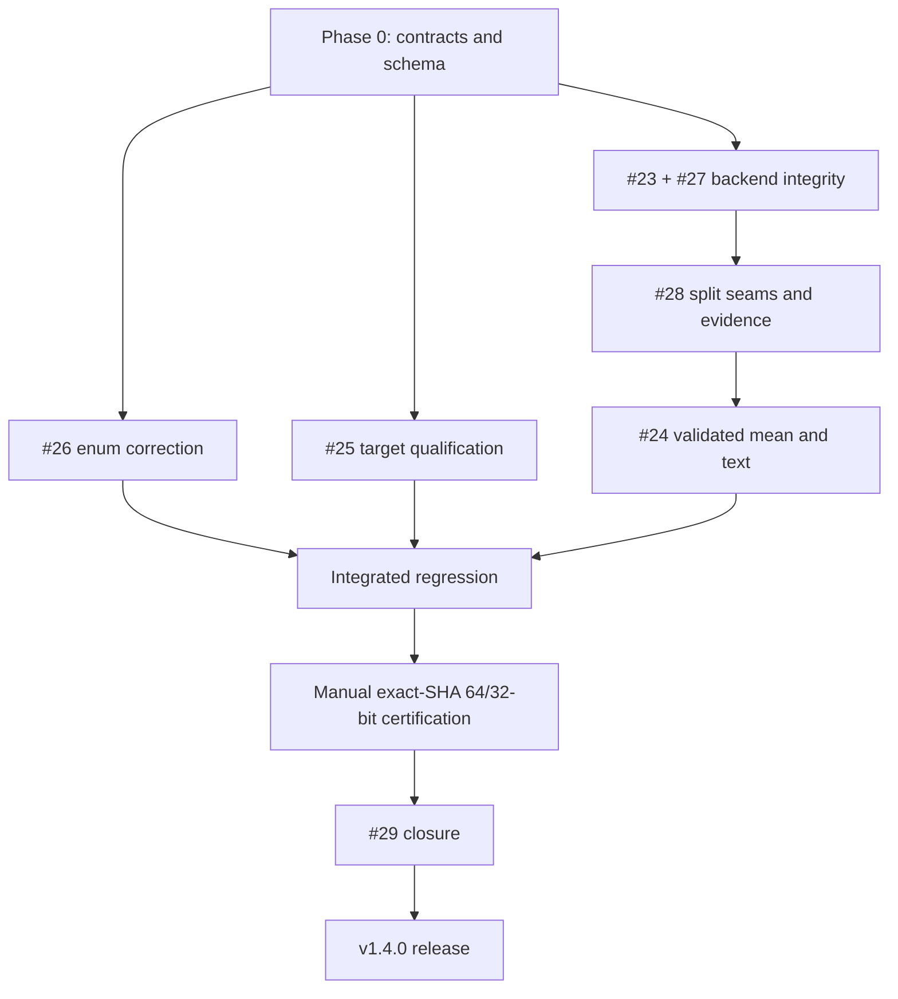

# v1.4.0 Implementation and Release Plan

> **REVISION 6 — 27 August 2026**
>
> **Supersedes:** Revision 5.
>
> **Revision 6 correction:** `baseline-64bit.json` is explicitly classified as
> a working Phase 0 baseline rather than a certification artifact. Its unknown
> completion time is omitted instead of represented by a sentinel, preserving
> the frozen certification schema's ISO-8601 timestamp contract. All Revision
> 5 baseline, warm-up and worker-raise decisions remain unchanged.
>
> **Scope remains:** #11 is deferred to v1.4.1. #29 remains in v1.4.0 and
> closes from controlled manual exact-SHA 32-bit evidence using the Phase 0 JSON
> schema.

> **Status:** Phase 0 complete — implementation may begin
>
> **Release theme:** Measurement integrity and real Office 32-bit certification
>
> **Governing principle:** ship the correctness fixes without making v1.4.0
> dependent on a new self-hosted Excel automation project.

## Document control

| Field | Value |
|---|---|
| Repository | [danielep71/VBA-PERFORMANCE_MANAGER](https://github.com/danielep71/VBA-PERFORMANCE_MANAGER) |
| Release branch | `release/v1.4.0` |
| Latest published release | `v1.3.0` |
| Live issue snapshot | `2026-08-27T18:49:00Z` |
| v1.4.0 milestone | GitHub milestone `#3` |
| Open v1.4.0 issues | **7**: #23–#29 |
| Explicitly deferred | #11 → v1.4.1 milestone `#4` |
| Phase 0 candidate | `2cc0336a7b7f3d91e16230609ff602a4ac4ab5fb` · `release/v1.4.0` · clean |
| Phase 0 static baseline | 12 checks · 0 failures · passed |
| Phase 0 Excel baseline | Microsoft 365 MSO Version 2607 Build 16.0.20228.20188 · 64-bit · 72 cases · 511 assertions · 0 failures |

## Revised milestone objective

Deliver measurement results that are homogeneous, diagnosable and honest:

- reject observations obtained from a backend other than the one requested;
- expose failure/fallback evidence consistently across workload, baseline and overhead APIs;
- route the legacy overhead mean through the validated sample path;
- harden workbook-qualified `Application.Run` targets;
- correct the enum type-safety contract without rewriting released history;
- certify the final release candidate in real 32-bit and 64-bit Excel using the same machine-readable evidence schema.

The headless Excel regression gate is not part of this milestone. Exact-SHA Excel certification remains mandatory, but v1.4.0 may perform it through the controlled manual procedure already supported by the repository.

### Recommended GitHub milestone description

> Measurement integrity and release certification. Enforce homogeneous
> requested-backend sample vectors, route legacy overhead measurement through
> the validated sample path, harden macro target qualification, expose complete
> baseline/overhead failure evidence, correct the VBA enum type-safety contract,
> and publish exact-SHA 32-bit and 64-bit Excel execution evidence. Headless
> Excel automation is tracked separately in #11 for v1.4.1.

## Scope decisions

| Decision | Resolution |
|---|---|
| [#11](https://github.com/danielep71/VBA-PERFORMANCE_MANAGER/issues/11) | **Moved to v1.4.1.** It will automate the evidence contract established manually in v1.4.0. |
| [#29](https://github.com/danielep71/VBA-PERFORMANCE_MANAGER/issues/29) | **Remains in v1.4.0.** A controlled manual 32-bit run with complete machine-readable evidence can close it. |
| Evidence schema | Frozen in Phase 0 independently of #11. |
| #23/#24 compatibility | Explicit behavioral corrections; document old and new behavior prominently in `[Unreleased]`. |
| All-rejected fallback | Keep `ERR_CPM_MEASURE_NO_VALID_SAMPLES`, populate outputs before raising, preserve `cPM_ReadFallbackToMethod2`, and use accurate backend-mismatch text. |
| Text helper | `OverheadMeasurement_Text` renders the expected no-valid-sample condition as `undefined (...)`; unexpected errors still propagate. |
| Fault injection | Split into `Test_ForceWorkerStartReadFailures` and `Test_ForceWorkerEndpointReadFailures`. |
| Baseline metadata | Implement #27 in the same change as #23 by forwarding optional outputs through the existing delegation. |
| Enum correction | Record the already-correct README wording now; finish class comment, example and wiki verification under #26. |
| Changelog discipline | Every behavior/API commit adds or finalizes its own `[Unreleased]` entry. The final docs commit reconciles links and wording only. |
| Worker-raise evidence | If the worker raises before harness classification, `Err.Number` / `Err.Description` are authoritative. Optional outputs become evidence only after the harness observes and classifies the cycle. |
| Rejection output | Add trailing optional `RejectedSamplesOut` to repeated-measurement APIs. It counts measured backend-fallback/mismatch rejections only. |
| Failure output | `FailedReadsOut` counts native read failures only and preserves its existing inclusion of warm-up read failures. |
| Warm-up policy | Deliberate asymmetry: keep warm-up native failures in `FailedReadsOut` for compatibility/reliability evidence; exclude warm-up fallback from `RejectedSamplesOut` because every measured iteration starts and validates a new timer session. |
| Count semantics | `Iterations = Stats_Count(ReturnedVector) + measured native failures + RejectedSamplesOut`. |

## Non-goals

- Provisioning a persistent or ephemeral self-hosted Excel runner.
- Automating `AccessVBOM`, interactive-session recovery, watchdogs or orphaned `EXCEL.EXE` cleanup.
- The v1.5.0 regression-suite/module split in #41.
- The v1.4.1 runtime hardening issues #30–#36.
- The v1.5.0 architecture and release-trust issues #37–#43.

## Release definition of done

- [ ] All seven v1.4.0 issues satisfy every acceptance criterion and are closed with evidence.
- [ ] No retained sample can belong to a backend other than the requested backend.
- [ ] Workload, baseline and overhead vectors expose separate, coherent rejection and native-failure evidence.
- [ ] Non-strict all-failed/all-rejected outputs are assigned before the aggregate error is raised.
- [ ] Documentation and tests define the worker-raise evidence boundary by whether the harness classified the cycle; default outputs after an early raise are not treated as success.
- [ ] `RejectedSamplesOut` is appended after the existing `FailedReadsOut` and `LastFailureStatusOut` optional parameters on `MeasureProcedure`, `MeasureBaseline` and `MeasureOverhead_Samples`, preserving positional and named existing calls.
- [ ] Every behavior/API commit contains its own `[Unreleased]` entry; final documentation work does not reconstruct change history.
- [ ] Legacy numeric overhead uses valid retained samples only.
- [ ] `OverheadMeasurement_Text` renders only the expected no-valid-sample condition as undefined.
- [ ] Workbook names with embedded apostrophes resolve through `Application.Run`.
- [ ] Current source/docs state the real VBA `Long` enum semantics; v1.3.0 history is untouched.
- [ ] Integrated regression passes in real 64-bit Excel against the final SHA.
- [ ] Integrated regression passes in real 32-bit Excel against the same final SHA.
- [ ] Both runs emit the frozen machine-readable result schema.
- [ ] Static checks, workbook, tag, manifest and release evidence all bind to the exact final `main` SHA.

## Open-issue register

| Order | Issue | Labels | Dependency |
|---:|---|---|---|
| 1 | [#26](https://github.com/danielep71/VBA-PERFORMANCE_MANAGER/issues/26) — Correct enum type-safety claims to reflect VBA Long semantics | `bug` `documentation` `P2` `api` | Independent; partly completed |
| 2 | [#25](https://github.com/danielep71/VBA-PERFORMANCE_MANAGER/issues/25) — Escape apostrophes in workbook-qualified Application.Run targets | `bug` `P2` `measurement` | Independent |
| 3 | [#23](https://github.com/danielep71/VBA-PERFORMANCE_MANAGER/issues/23) — Prevent backend fallback from mixing measurement sample vectors | `bug` `P2` `measurement` `testing` | Locks the retained-sample contract |
| 3 | [#27](https://github.com/danielep71/VBA-PERFORMANCE_MANAGER/issues/27) — Expose failure metadata from MeasureBaseline | `enhancement` `P3` `measurement` `api` | Same change as #23 |
| 4 | [#28](https://github.com/danielep71/VBA-PERFORMANCE_MANAGER/issues/28) — Align MeasureOverhead_Samples fault injection and failure reporting | `bug` `P3` `measurement` `testing` | #23 contract and split seams |
| 5 | [#24](https://github.com/danielep71/VBA-PERFORMANCE_MANAGER/issues/24) — Route OverheadMeasurement_Seconds through the validated sample path | `bug` `P2` `measurement` | #23 and #28 |
| 6 | [#29](https://github.com/danielep71/VBA-PERFORMANCE_MANAGER/issues/29) — Publish Office 32-bit execution certification | `enhancement` `release` `P2` `testing` | Final exact-SHA candidate; not #11 |

## Dependency map



## Phase 0 — Lock contracts and establish the baseline — complete

### 0.1 Freeze the execution-result schema

Use the following schema for both controlled manual certifications:

```json
{
  "commit_sha": "<40-character SHA>",
  "run_state": "completed",
  "excel_version_build": "<exact Microsoft Excel version/build>",
  "office_bitness": "32-bit",
  "cases": 0,
  "assertions": 0,
  "failures": 0,
  "cleanup_state": "completed",
  "timestamp_utc": "<ISO-8601>"
}
```

Rules:

- `commit_sha` identifies the exact source imported into the validation workbook.
- `run_state` must be explicit; a missing terminal state is failure.
- `office_bitness` is one exact value per artifact.
- `failures` must be zero.
- `cleanup_state` records that the controlled workbook/run completed cleanly; it does not pretend manual cleanup is automated.
- Retain separate 32-bit and 64-bit JSON artifacts.

### 0.2 Lock the measurement error contract

- A sample is retained only when start status is acceptable, `ActiveMethodID` equals the requested resolved backend, and the endpoint succeeds.
- Non-strict fallback observations are rejected rather than mixed.
- Strict mode remains fail-fast.
- When no valid requested-backend sample remains, raise `ERR_CPM_MEASURE_NO_VALID_SAMPLES`.
- Populate optional count/status outputs before raising.
- `FailedReadsOut` counts native read failures only; it may include warm-up read failures under the existing contract.
- `RejectedSamplesOut` counts measured start-fallback/backend-mismatch rejections only; it excludes warm-up.
- `LastFailureStatusOut` records the most recent observed failure or rejection status.
- Preserve `cPM_ReadFallbackToMethod2` as the cause for all-fallback rejection.
- Error text must distinguish wrong-backend rejection from a read that produced no value.

Append `Optional ByRef RejectedSamplesOut As Long` after the existing
`FailedReadsOut` and `LastFailureStatusOut` optional parameters on
`MeasureProcedure`. #27 and #28 apply the same three-output contract to
`MeasureBaseline` and `MeasureOverhead_Samples`. Existing positional and named
calls remain valid because no existing parameter moves.

#### Warm-up policy

The asymmetry is deliberate:

- preserve v1.3.0 behavior in which `FailedReadsOut` includes native warm-up
  read failures; a failed warm-up read is evidence that the host cannot be
  measured reliably;
- do not extend backend-rejection counting to warm-up. A warm-up fallback
  determines no returned observation because every measured iteration starts
  a new timer session and independently validates its requested/resolved
  backend;
- therefore `RejectedSamplesOut` counts measured rejections only.

State this rationale in procedure headers, README/wiki guidance and tests so a
future maintainer does not mistake the intentional asymmetry for missing
instrumentation.

#### Worker-raise evidence boundary

The boundary is defined by control flow, not by mode. The isolated worker may
raise inside `StartTimer` or `ElapsedSeconds` before the harness observes and
classifies the cycle. On that path:

- `Err.Number` and `Err.Description` are authoritative;
- `FailedReadsOut`, `RejectedSamplesOut` and `LastFailureStatusOut` are not
  evidence because the harness never obtained values to assign;
- default outputs such as `0`, `0` and `cPM_ReadOK` after the early raise must
  not be interpreted as “nothing failed or was rejected”;
- `Err_Handler` must not manufacture evidence that did not exist when the
  worker raised.

After the harness has observed and classified the relevant cycle, all three
optional outputs are meaningful on a normal return or an aggregate
all-rejected/all-failed raise after assignment. Strict timing faults normally
take the early worker-raise path, but the contract is condition-based rather
than mode-based.

State this boundary in procedure headers, README/wiki guidance and regressions.

### 0.3 Lock the split test seams

```text
Test_ForceWorkerStartReadFailures
Test_ForceWorkerEndpointReadFailures
```

- Start seam: arm before `StartTimer`.
- Endpoint seam: arm after workload and before `ElapsedSeconds`.
- For overhead sampling: endpoint seam is armed after `StartTimer` and before `ElapsedSeconds`.
- Both target measured cycles, not warm-up.
- Both support the applicable QPC and method-4 system-time low-level failure paths.
- Both self-clear after successful and raised-error paths.

### 0.4 Record the compatibility decision

v1.4.0 is a minor release containing deliberate behavioral corrections:

- callers may receive fewer samples because wrong-backend observations are rejected;
- calls that previously returned a misleading vector or mean may now raise when no valid requested-backend sample exists;
- the text formatter degrades for that expected measurement-validity condition.

Keep the explicit **PLANNED BEHAVIORAL CORRECTION** block in `[Unreleased]` until the code lands, then remove only the word `PLANNED` and the sentence stating that implementation is pending.

The minor-version classification follows the v1.3.0 coefficient-of-variation
precedent: correcting a result that was wrong is not equivalent to breaking a
contract that was right, provided the behavioral correction is explicit.

### 0.5 Lock commit-atomic changelog discipline

Do not reconstruct behavior history in a final synchronization pass.

| Behavior/API commit | Required same-commit `[Unreleased]` entry |
|---|---|
| #26 enum semantics | Finalize the current `Changed` correction when remaining source/wiki/example work lands |
| #25 target qualification | `Fixed`: apostrophe-containing workbook names now resolve |
| #23 + #27 backend/baseline | Behavioral correction for rejected fallback samples **and a separate `Added` entry** naming `MeasureProcedure.RejectedSamplesOut` plus baseline `FailedReadsOut`, `LastFailureStatusOut` and trailing `RejectedSamplesOut` |
| #28 overhead evidence | Separate `Added` entry naming `MeasureOverhead_Samples` `FailedReadsOut`, `LastFailureStatusOut` and trailing `RejectedSamplesOut`; mention split deterministic seams where useful |
| #24 legacy overhead | Behavioral correction for validated means and the text helper's explicit undefined result |

The final `docs(release)` commit may reconcile links, terminology and evidence
references only. It must not be the first place a behavior/API change appears.

### 0.6 Baseline — complete

The static and Excel baseline surfaces bind to the same clean branch candidate:

| Evidence | Recorded value |
|---|---|
| Commit | `2cc0336a7b7f3d91e16230609ff602a4ac4ab5fb` |
| Branch | `release/v1.4.0` |
| Worktree | `dirty: false` |
| Host | Windows 11 build 26200 |
| Static artifact | `vba-lint-results.json` |
| Static result | `checks_run: 12` · `failures: 0` · `passed: true` |
| Static generated | `2026-08-27T17:31:29+00:00` |
| Excel artifact | `baseline-64bit.json` |
| Excel version/build | Microsoft 365 MSO Version 2607 Build 16.0.20228.20188 |
| Office bitness | 64-bit |
| Regression result | 72 cases · 511 assertions · 0 failures |
| Excel baseline timestamp | Omitted — exact suite completion time was not captured; the working baseline must not contain an estimate or a non-date sentinel |

- [x] Run `python tools/vba_lint.py --json vba-lint-results.json`.
- [x] Import the same candidate source into the controlled 64-bit workbook.
- [x] Compile and run `Run_cPerformanceManager_RegressionSuite`.
- [x] Record branch SHA, host/build, bitness, counts, failures and completion state.
- [x] Confirm static and Excel artifacts bind to the same SHA.

`baseline-64bit.json` is a working Phase 0 baseline, not certification evidence
under #29. It records the frozen schema's applicable fields on a best-effort
basis. Because the exact finish time was not captured, omit `timestamp_utc`
entirely; do not insert prose into the typed field and do not backfill a
plausible estimate. The later static-artifact time is only an upper bound and
must not be substituted for an observed Excel completion time.

Final release-candidate 32-bit and 64-bit certifications remain strict: every
field in the frozen schema is mandatory and `timestamp_utc` must contain the
real observed ISO-8601 UTC timestamp.

The two JSON files must be retained together in the release evidence folder.
They were not available in the current workspace during plan preparation,
so this plan records the supplied metadata but does not claim a filesystem
move that could not be performed. Reattach or copy both files before the next
candidate evidence step.

**Exit gate:** complete. Schema, seams, behavioral contract and exact-SHA baseline evidence are fixed before production code changes.

## Phase 1 — [#26](https://github.com/danielep71/VBA-PERFORMANCE_MANAGER/issues/26): Correct enum type-safety claims to reflect VBA Long semantics

1. Preserve the corrected README wording.
2. Replace the stale class comment claiming compile-time non-interchangeability.
3. Verify/correct the wiki.
4. Add a practical regression/documentation example showing that overlapping enum values have `Long` semantics.
5. Preserve enum names and numeric values.
6. Finalize the current `[Unreleased]` correction in this same commit; do not edit the frozen v1.3.0 section.
7. Run the released-changelog immutability check.

**Exit gate:** current source and documentation are accurate without changing the public numeric contract or released history.

## Phase 2 — [#25](https://github.com/danielep71/VBA-PERFORMANCE_MANAGER/issues/25): Escape apostrophes in workbook-qualified Application.Run targets

1. Escape embedded workbook-name apostrophes with doubled apostrophes before quoting.
2. Preserve explicitly qualified targets containing `!` unchanged.
3. Make the leading/trailing procedure-name whitespace policy explicit.
4. Test ordinary, spaced, apostrophe-containing, combined and pre-qualified targets.
5. Execute a real `Application.Run` case from a workbook whose name contains an apostrophe.
6. Add the `[Unreleased]` `Fixed` entry in the same commit.

**Exit gate:** both workload and baseline delegation resolve the hardened target correctly and the fix is already recorded in `[Unreleased]`.

## Phase 3 — [#23](https://github.com/danielep71/VBA-PERFORMANCE_MANAGER/issues/23) and [#27](https://github.com/danielep71/VBA-PERFORMANCE_MANAGER/issues/27): requested-backend integrity and baseline evidence

### Start transaction

1. Capture start status immediately after `StartTimer`.
2. Capture/compare requested method and `ActiveMethodID` before running the workload.
3. Reject a non-strict fallback cycle from the requested-backend vector.
4. Preserve strict fail-fast behavior.

### Workload and baseline evidence

1. Keep `FailedReadsOut` limited to native read failures, including its existing warm-up-failure behavior.
2. Add trailing optional `RejectedSamplesOut` for measured start-fallback/backend-mismatch rejections only.
3. Preserve the last relevant failure/fallback status in `LastFailureStatusOut`.
4. Populate all three outputs before aggregate all-rejected/all-failed raises after harness classification.
5. Forward `FailedReadsOut`, `LastFailureStatusOut` and trailing optional `RejectedSamplesOut` through `MeasureBaseline` in the same change.
6. Never overwrite the caller object's direct-read `LastReadStatus`.
7. Document the condition-based worker-raise evidence boundary.
8. Document the deliberate warm-up asymmetry: native warm-up failures remain evidence, while warm-up fallback cannot determine any measured sample's backend.
9. In the same commit, finalize the #23 behavioral-correction entry and add a separate `Added` entry naming `MeasureProcedure.RejectedSamplesOut` and #27's three optional public outputs.

### Tests

- normal requested-backend start;
- QPC start fallback;
- method-4 start fallback;
- **strict-mode forced start failure**, proving fail-fast behavior and `Err.Number` as the authoritative early worker-raise evidence;
- default optional outputs after that early worker raise are not interpreted as successful-run evidence;
- successful endpoint after non-strict fallback, proving the earlier start status is not erased;
- partial endpoint failure: `FailedReadsOut > 0`, `RejectedSamplesOut = 0`;
- partial fallback rejection: `RejectedSamplesOut > 0`, `FailedReadsOut = 0`;
- mixed failure/rejection: both counters reflect only their own class;
- all-fallback rejection: `RejectedSamplesOut = Iterations`, `FailedReadsOut = 0`, fallback last status;
- warm-up fallback followed by valid measured sessions: no rejection is counted, and every retained sample still proves the requested backend;
- clean, partial, fallback-rejected and all-failed baselines;
- workload/baseline vectors shown homogeneous and comparable.

**Exit gate:** every returned workload and baseline vector is requested-backend homogeneous and every rejected cycle is observable.

## Phase 4 — [#28](https://github.com/danielep71/VBA-PERFORMANCE_MANAGER/issues/28): Align MeasureOverhead_Samples fault injection and failure reporting

1. Replace or retain the old ambiguous worker seam only as a documented compatibility alias.
2. Implement the locked start-read and endpoint-read seams.
3. Use backend-appropriate low-level injection for QPC and method 4.
4. Apply the seams consistently to `MeasureProcedure`, delegated `MeasureBaseline` and `MeasureOverhead_Samples`.
5. Preserve existing `FailedReadsOut` / `LastFailureStatusOut` order and append trailing optional `RejectedSamplesOut`.
6. Populate outputs and clear test state before raised errors.
7. Test clean, partial, total, fallback, deliberate warm-up-rejection exclusion and error-path self-clearing.
8. Add a distinct `[Unreleased]` `Added` entry for the new overhead optional outputs in this same commit.
9. Update both repeated-measurement API contracts with the count equation below.

```text
requested measured iterations
  = retained samples
  + measured endpoint failures
  + measured start-fallback/backend-mismatch rejections
```

Consequences:

- `Stats_Count(ReturnedVector)` is the retained measured-sample count;
- `RejectedSamplesOut` is the measured start-fallback/backend-mismatch rejection count and excludes warm-up;
- that exclusion is intentional because each measured iteration starts and validates a new timer session, so warm-up fallback determines no returned observation;
- measured native failures equal `Iterations - Stats_Count(ReturnedVector) - RejectedSamplesOut`;
- `FailedReadsOut` counts native read failures only and preserves the existing inclusion of warm-up read failures;
- because warm-up failures are included, `FailedReadsOut` can exceed the measured native-failure shortfall;
- `LastFailureStatusOut` is the most recent relevant worker failure/rejection status.

Replace the v1.3.0 `MeasureProcedure` wording that equated shortfall only with
measured failures.

**Exit gate:** start and endpoint paths are deterministic and self-clearing; both APIs expose the same explicit count semantics; and the new API is already recorded in `[Unreleased]`.

## Phase 5 — [#24](https://github.com/danielep71/VBA-PERFORMANCE_MANAGER/issues/24): Route OverheadMeasurement_Seconds through the validated sample path

### Numeric helper

1. Remove the independent accumulation loop.
2. Route through `MeasureOverhead_Samples` plus `Stats_Mean`, or the identical shared primitive.
3. Use the retained-sample count as the denominator.
4. Reject fallback observations and failed endpoint reads.
5. Raise `ERR_CPM_MEASURE_NO_VALID_SAMPLES` when no valid sample remains.

### Text helper

1. Catch only `ERR_CPM_MEASURE_NO_VALID_SAMPLES`.
2. Render an explicit `undefined (...)` diagnostic with requested backend and relevant status.
3. Do not invent a numeric value.
4. Continue to propagate invalid arguments and unexpected errors.
5. Add or finalize the explicit `[Unreleased]` behavioral-correction entry in this same commit.

### Tests

- healthy numeric and text output;
- partial endpoint failure;
- start fallback;
- total endpoint failure;
- total fallback rejection;
- accurate status-aware error text;
- graceful text degradation;
- unexpected-error propagation.

**Exit gate:** legacy numeric overhead follows the authoritative vector rules and the text surface remains diagnostic rather than disruptive.

## Phase 6 — Integrated regression and documentation

### Regression matrix

| Area | Minimum evidence |
|---|---|
| Qualification | String matrix plus real apostrophe-named workbook dispatch |
| Homogeneity | Requested method, captured start status, active method and endpoint status for retained/rejected cycles |
| Workload | Clean; partial endpoint failure; partial fallback; mixed failure/rejection; all fallback; all failure; warm-up fallback exclusion; strict forced-start early worker raise with `Err.Number` evidence |
| Baseline | Clean, partial native failure, partial rejection, all fallback, all failure and paired subtraction with separate counters |
| Overhead vector | Clean, partial/total native failure, partial/total rejection, mixed evidence, start/endpoint seam separation and cleanup |
| Legacy mean/text | Valid mean, retained denominator, numeric raise, undefined text and unexpected-error propagation |
| Enum semantics | Correct-role values and an overlapping wrong-role numeric value accepted under VBA `Long` semantics |

Update `TotalSteps`, test wiring and deterministic case/assertion totals in the same commits as their tests.

### Current-contract documentation

Update together:

- class procedure headers and enum comments;
- README measurement validity, worker-raise evidence boundary, baseline subtraction, text-helper, separate-count equation and compatibility guidance;
- wiki measurement, benchmarking, API, testing and release pages;
- already-present `[Unreleased]` entries, checked only for link/wording consistency rather than reconstructed;
- `RELEASING.md` manual JSON evidence procedure and recurring 32-bit cadence;
- `INSTALLATION.md` only if the required import package changes.

Only after feature work is complete, synchronize 1.4.0 stamps in the class, companion module, test harness and README.

## Phase 7 — Exact-SHA certification and release

### 7.1 Pre-merge

1. Reconcile the live milestone; every open item is complete, moved or explicitly removed.
2. Run local static checks.
3. Push `release/v1.4.0` and verify the hosted static workflow.
4. Review the complete PR diff and acceptance evidence.
5. Merge the release branch into `main`.

### 7.2 Record the release candidate

1. Fetch/pull `main` and require a clean worktree.
2. Record the full 40-character `git rev-parse HEAD` value.
3. Treat any subsequent source/documentation edit as a new candidate.
4. Verify the hosted static artifact's commit equals the recorded SHA.

If any source, documentation or packaged artifact changes after evidence was
recorded, the prior candidate and every artifact bound to it are superseded.
Repeat every affected exact-SHA static, 64-bit Excel, 32-bit Excel, workbook and
provenance gate against the new SHA. **Never reuse superseded evidence**, even
for an apparently harmless one-line documentation correction.

### 7.3 Controlled manual 64-bit certification

1. Import exact candidate source into the controlled workbook.
2. `Debug → Compile VBAProject`.
3. Run the full regression suite.
4. Require zero failures.
5. Produce the frozen JSON artifact with `office_bitness = 64-bit`.

### 7.4 Controlled manual 32-bit certification

1. Repeat against the same exact SHA in real 32-bit Excel.
2. Prove the Win32 backend-2 branch executes.
3. Execute signed-to-unsigned and rollover boundary regressions.
4. Require zero failures.
5. Produce the frozen JSON artifact with `office_bitness = 32-bit`.
6. Close #29 only after this evidence exists.

### 7.5 Workbook, tag and provenance

1. Assemble `PERFORMANCE.MANAGER.xlsm` from the exact candidate source.
2. Compile, run the applicable validation, save, close, reopen and smoke-test the final file.
3. Create and push annotated lowercase tag `v1.4.0` on the recorded SHA.
4. Verify the tag independently re-resolves to that SHA.
5. Generate provenance after the tag exists:

```text
python tools/release_provenance.py --version 1.4.0 --tag v1.4.0 --asset <final-workbook> --out release-manifest.json --excel <exact-build> --bitness 64-bit --cases <N> --assertions <N> --failures 0
```

6. Retain the separate 32-bit JSON artifact because the current manifest records one bitness per invocation.
7. Attach workbook, manifest and both execution-result artifacts.
8. Publish only claims supported by the actual runs.

### 7.6 Post-publication

1. Re-resolve the tag.
2. Download the published workbook and compare SHA-256.
3. Reopen and smoke-test the downloaded asset.
4. Verify README, changelog, installation and wiki links.
5. Close the seven issues with direct evidence references.
6. Close the milestone.
7. Remove the merged release branch only after published evidence is verified.

## Suggested commit sequence

| Commit subject | Scope |
|---|---|
| `docs(api): correct VBA enum semantics` | #26 class comment, example, README/wiki verification; finalize its current `Changed` entry in the same commit |
| `fix(measurement): harden workbook-qualified targets` | #25 code, real dispatch regressions and same-commit `Fixed` entry |
| `fix(measurement): enforce requested-backend integrity` | #23 + #27 start validation, early worker-raise evidence test, baseline `FailedReadsOut`/`LastFailureStatusOut` plus trailing `RejectedSamplesOut`, same-commit behavioral correction and distinct `Added` entry |
| `test(measurement): split worker fault injection` | #28 start/endpoint seams, overhead three-output evidence, separate count semantics, cleanup tests and same-commit `Added` entry |
| `fix(measurement): validate overhead means and text` | #24 authoritative path, numeric raise, undefined text and same-commit behavioral-correction entry |
| `docs(release): reconcile v1.4.0 links and evidence wording` | README/wiki/releasing/install links, terminology and evidence references only; no first-time behavior entries |
| `chore(release): prepare v1.4.0` | Final version stamps and release metadata after behavior is complete |

## Issue-closure evidence

| Issue | Minimum closure evidence |
|---|---|
| [#23](https://github.com/danielep71/VBA-PERFORMANCE_MANAGER/issues/23) | QPC/method-4 fallback, strict forced-start early worker raise with `Err.Number` evidence, homogeneous vectors, separate failure/rejection counters, accurate message and same-commit changelog entry |
| [#24](https://github.com/danielep71/VBA-PERFORMANCE_MANAGER/issues/24) | Shared-path review plus endpoint/fallback/no-valid regressions and graceful text result |
| [#25](https://github.com/danielep71/VBA-PERFORMANCE_MANAGER/issues/25) | Real apostrophe-named workbook dispatch, qualification matrix and same-commit `Fixed` entry |
| [#26](https://github.com/danielep71/VBA-PERFORMANCE_MANAGER/issues/26) | Correct source/docs, practical boundary example and green released-history check |
| [#27](https://github.com/danielep71/VBA-PERFORMANCE_MANAGER/issues/27) | Forwarded three-output evidence, worker-raise boundary, clean/partial/fallback/all-failed baseline regressions and distinct same-commit `Added` entry |
| [#28](https://github.com/danielep71/VBA-PERFORMANCE_MANAGER/issues/28) | Separate seams, three overhead outputs, separate count semantics, worker-raise boundary, cleanup proof and distinct same-commit `Added` entry |
| [#29](https://github.com/danielep71/VBA-PERFORMANCE_MANAGER/issues/29) | Completed exact-SHA real 32-bit JSON artifact with zero failures and explicit Win32 path coverage |

## No-go conditions

- Any retained observation whose active backend differs from the requested backend.
- Any all-rejected path that raises before returning count/status evidence.
- Any text formatter that hides an unexpected runtime error.
- Fault-injection state that survives a success or error path.
- Missing or incomplete 32-bit certification while 32-bit remains supported.
- Excel evidence tied to a branch name rather than the exact final SHA.
- Any reuse of static, Excel, workbook or provenance evidence after its candidate SHA was superseded.
- A workbook assembled from stale embedded source.
- A tag, manifest or asset hash that does not agree with the recorded release commit.

## Deferred work

### [#11](https://github.com/danielep71/VBA-PERFORMANCE_MANAGER/issues/11) — Add a headless Excel regression gate

`#11` is assigned to v1.4.1. It will automate the exact-source import, VBE compile, regression execution, timeout, cleanup and artifact publication contract. It is not a v1.4.0 dependency and #29 does not wait for it.

## Appendix A — Complete live v1.4.0 issue titles and bodies

> The text below is reproduced from GitHub after the milestone/body revisions.
> GitHub remains authoritative if an issue changes after the snapshot.

### #23 — Prevent backend fallback from mixing measurement sample vectors

- **URL:** https://github.com/danielep71/VBA-PERFORMANCE_MANAGER/issues/23
- **State:** open
- **Milestone:** v1.4.0 (GitHub milestone #3)
- **Labels:** `bug` `P2` `measurement` `testing`
- **Last updated:** `2026-08-27T18:48:58Z`

<details>
<summary><strong>Complete current GitHub issue body</strong></summary>

## Summary

The v1.3.0 measurement harness excludes failed endpoint reads, but it does not inspect the outcome immediately after `StartTimer`.

In non-strict mode, a transient QPC or method-4 start failure can bind method 2 and set `LastReadStatus = cPM_ReadFallbackToMethod2`. The workload then runs, `ElapsedSeconds` succeeds on method 2 and resets the status to `cPM_ReadOK`, so the sample is retained as if it used the requested backend.

The result can be a nominally homogeneous benchmark vector containing observations from different clocks.

## Affected APIs

- `MeasureProcedure`
- `MeasureBaseline`
- `MeasureOverhead_Samples`
- any legacy helper that delegates to the same worker timing path

## Behavioral correction and compatibility impact

This is a deliberate behavioral correction, not a behavior-preserving implementation detail.

In v1.3.0, a non-strict call requesting QPC or method 4 could return method-2 observations after a start fallback. After this correction, those observations are rejected from the requested-backend vector. Callers may therefore receive a shorter vector or, when every measured cycle is rejected, `ERR_CPM_MEASURE_NO_VALID_SAMPLES`.

The current `[Unreleased]` changelog must contain an explicit **BEHAVIORAL CORRECTION** notice describing the old result, the new result and the reason mixed-backend samples are invalid.

## Required behavior

The harness must validate the start transaction before accepting an observation:

```text
requested method
start status
ActiveMethodID / resolved method
endpoint status
```

A fallback observation must not enter a vector for the requested backend. When the harness observes the fallback and continues, reject the measured sample, increment `RejectedSamplesOut`, leave `FailedReadsOut` unchanged, and preserve the fallback in `LastFailureStatusOut`. A worker raise remains fail-fast.

## Public output contract

Append `Optional ByRef RejectedSamplesOut As Long` after the existing `FailedReadsOut` and `LastFailureStatusOut` optional parameters on `MeasureProcedure`. This preserves existing positional and named calls. The new output counts measured start-fallback/backend-mismatch rejections only and excludes warm-up.

#27 forwards the same evidence contract through `MeasureBaseline`; #28 applies it to `MeasureOverhead_Samples`.

## Warm-up policy

The counter asymmetry is intentional:

- `FailedReadsOut` preserves the v1.3.0 contract and includes native warm-up read failures; such a failure is evidence that the host cannot be measured reliably.
- Do not extend backend-rejection counting to warm-up. A warm-up fallback determines no returned observation because every measured iteration starts a new timer session and independently validates its requested/resolved backend.
- Therefore `RejectedSamplesOut` counts measured start-fallback/backend-mismatch rejections only.

Document this rationale so the asymmetry is not later mistaken for an instrumentation defect.

## Fault-injection design

Testing the start transaction and testing the endpoint read require separate seams:

```text
Test_ForceWorkerStartReadFailures
Test_ForceWorkerEndpointReadFailures
```

- The start seam is armed on the isolated worker **before** `StartTimer`.
- The endpoint seam is armed after the workload, immediately **before** `ElapsedSeconds`.
- Both target measured cycles deterministically rather than being consumed by warm-up.
- Injection must be backend-aware: QPC and method-4 system-time start paths must be coverable through their appropriate low-level seams.
- Counters/flags must self-clear after success and error paths.

## All-rejected contract

Keep `ERR_CPM_MEASURE_NO_VALID_SAMPLES` as the aggregate error when no requested-backend sample survives.

Before raising:

- assign `FailedReadsOut` to the number of native read failures observed by the harness;
- assign `RejectedSamplesOut` to the number of measured samples rejected for start fallback/backend mismatch;
- assign `LastFailureStatusOut = cPM_ReadFallbackToMethod2` when fallback rejection is the last cause;
- clear the relevant injection counters;
- use a status-aware message that says samples were obtained on the wrong backend and rejected, rather than claiming that no read produced a value.

The caller instance's own direct-read `LastReadStatus` must remain untouched.

## Worker-raise evidence boundary

The boundary is defined by control flow, not by mode. If the isolated worker raises from `StartTimer` or `ElapsedSeconds` before the harness observes and classifies the cycle, the harness has no count/status evidence to publish.

Therefore:

- `Err.Number` and `Err.Description` are authoritative whenever the worker raises before harness classification;
- `FailedReadsOut`, `RejectedSamplesOut` and `LastFailureStatusOut` are meaningful after the harness has observed/classified the relevant cycle—on a normal return or on an aggregate all-rejected/all-failed raise after outputs are populated;
- default outputs such as `0`, `0` and `cPM_ReadOK` after an early worker raise must not be interpreted as evidence that nothing failed or was rejected;
- strict timing faults normally take the early worker-raise path, but the rule is condition-based rather than mode-based;
- procedure headers, README/wiki guidance and regressions must state this boundary explicitly.

Do not manufacture harness evidence in `Err_Handler` when the worker raised before that evidence existed.

## Acceptance criteria

- [ ] Start status is captured immediately after `StartTimer`, before the workload can erase it
- [ ] `ActiveMethodID` is checked against the expected backend for every retained sample
- [ ] `cPM_ReadFallbackToMethod2` never enters a requested-backend vector
- [ ] Endpoint-read failure handling remains unchanged or stronger
- [ ] Strict-mode behavior remains fail-fast
- [ ] `FailedReadsOut` counts native read failures only
- [ ] `MeasureProcedure` appends trailing optional `RejectedSamplesOut` after its existing optional outputs without breaking existing calls
- [ ] `RejectedSamplesOut` counts measured backend-fallback/mismatch rejections only
- [ ] Warm-up fallback is intentionally excluded because each measured iteration restarts and independently validates the timer session
- [ ] Documentation distinguishes the deliberate warm-up asymmetry from an instrumentation omission
- [ ] Non-strict fallback rejection increments `RejectedSamplesOut` without incrementing `FailedReadsOut`
- [ ] Start and endpoint fault-injection seams are separate and deterministically target measured cycles
- [ ] QPC and method-4 start-fallback paths are covered
- [ ] A strict-mode forced start failure proves fail-fast behavior with `Err.Number` as the authoritative early worker-raise evidence
- [ ] Regression proves default optional outputs after an early worker raise are not treated as successful-run evidence
- [ ] All-rejected outputs are populated before `ERR_CPM_MEASURE_NO_VALID_SAMPLES` is raised
- [ ] All-rejected fallback message identifies backend mismatch accurately
- [ ] Regression proves every returned vector is backend-homogeneous
- [ ] #27 baseline output forwarding lands in the same implementation change
- [ ] README/wiki measurement guidance documents the policy and compatibility impact
- [ ] The explicit `[Unreleased]` behavioral-correction entry and an `Added` entry naming the new `RejectedSamplesOut` API land in the same commit as the #23/#27 behavior change

## Review origin

Independent v1.3.0 review finding `VPM130-P2-01`.

</details>

### #24 — Route OverheadMeasurement_Seconds through the validated sample path

- **URL:** https://github.com/danielep71/VBA-PERFORMANCE_MANAGER/issues/24
- **State:** open
- **Milestone:** v1.4.0 (GitHub milestone #3)
- **Labels:** `bug` `P2` `measurement`
- **Last updated:** `2026-08-27T17:19:01Z`

<details>
<summary><strong>Complete current GitHub issue body</strong></summary>

## Summary

`OverheadMeasurement_Seconds` still implements its own timing loop and blindly accumulates `ElapsedSeconds()` into a total.

In non-strict mode this means:

- a failed endpoint read contributes an ordinary zero and lowers the mean;
- a start fallback can mix method-2 observations into a requested-backend average;
- the denominator remains the requested iteration count rather than the number of valid observations.

This duplicates measurement logic that is already handled more safely by `MeasureOverhead_Samples`.

## Behavioral correction and compatibility impact

This is a deliberate behavioral correction.

In v1.3.0, `OverheadMeasurement_Seconds` always returned a `Double`, even when failed reads had entered the total as zero or the requested backend had fallen back. In v1.4.0, the numeric helper reports only a mean of valid requested-backend samples. If no valid sample remains, it raises `ERR_CPM_MEASURE_NO_VALID_SAMPLES`.

The current `[Unreleased]` changelog must state this explicitly, including the possibility that a call which previously returned a misleading number can now raise.

## Required numeric behavior

Make the sample-vector path authoritative. Implement the numeric helper as a wrapper around:

```text
MeasureOverhead_Samples
Stats_Mean
```

or an equivalent shared internal primitive with identical validity rules.

The public numeric signature remains unchanged.

## Text formatter behavior

`OverheadMeasurement_Text` is presentation-oriented and should degrade gracefully for the expected no-valid-sample condition, following the precedent established by `Stats_Text`.

It must:

- catch only `ERR_CPM_MEASURE_NO_VALID_SAMPLES`;
- return an explicit `undefined (...)` diagnostic that includes the requested backend and relevant last failure/fallback status;
- not fabricate a numeric value;
- continue to propagate invalid arguments, programming errors and unexpected runtime failures.

## All-rejected contract

If every cycle is rejected because the requested backend fell back:

- the numeric helper raises `ERR_CPM_MEASURE_NO_VALID_SAMPLES`;
- the error message identifies fallback/backend mismatch rather than saying no read produced a value;
- `LastFailureStatusOut` from the authoritative sample path carries `cPM_ReadFallbackToMethod2`;
- the text helper renders the condition instead of raising.

## Acceptance criteria

- [ ] No failed read can enter the reported mean as zero
- [ ] No fallback backend can enter the reported mean
- [ ] Mean denominator reflects valid retained observations
- [ ] A no-valid-sample numeric run raises `ERR_CPM_MEASURE_NO_VALID_SAMPLES`
- [ ] All-rejected fallback error text identifies the backend mismatch accurately
- [ ] Existing numeric and text public signatures remain compatible
- [ ] Regression covers non-strict endpoint failure
- [ ] Regression covers start fallback after #23 lands
- [ ] Regression covers partial retention and total rejection
- [ ] `OverheadMeasurement_Text` returns an explicit undefined diagnostic for the expected no-valid-sample condition
- [ ] `OverheadMeasurement_Text` still propagates unexpected errors
- [ ] Documentation identifies `MeasureOverhead_Samples` as the authoritative path
- [ ] The explicit `[Unreleased]` behavioral-correction entry is added or finalized in the same commit as the numeric/text behavior change

## Review origin

Independent v1.3.0 review finding `VPM130-P2-02`.

</details>

### #25 — Escape apostrophes in workbook-qualified Application.Run targets

- **URL:** https://github.com/danielep71/VBA-PERFORMANCE_MANAGER/issues/25
- **State:** open
- **Milestone:** v1.4.0 (GitHub milestone #3)
- **Labels:** `bug` `P2` `measurement`
- **Last updated:** `2026-08-27T17:19:02Z`

<details>
<summary><strong>Complete current GitHub issue body</strong></summary>

## Summary

`Measure_QualifyProcedureName` currently builds an unqualified target as:

```vb
"'" & ThisWorkbook.Name & "'!" & ProcedureName
```

This works for spaces but fails when the workbook name itself contains an apostrophe. For example, `O'Brien.xlsm` must be escaped as:

```text
'O''Brien.xlsm'!ProcedureName
```

## Required fix

Escape embedded apostrophes before constructing the quoted workbook target, for example with `Replace$(ThisWorkbook.Name, "'", "''")`.

## Changelog discipline

The user-visible qualification fix must add a `Fixed` entry under current `[Unreleased]` in the same commit as the implementation and regressions. Do not reconstruct the entry during final release preparation.

## Acceptance criteria

- [ ] Workbook names containing spaces still resolve
- [ ] Workbook names containing apostrophes resolve correctly
- [ ] Existing explicitly qualified names containing `!` are preserved unchanged
- [ ] Leading/trailing whitespace policy for procedure names is explicit and tested
- [ ] Regression covers ordinary, spaced, apostrophe-containing, and explicitly qualified targets
- [ ] README/wiki examples remain valid
- [ ] The `[Unreleased]` `Fixed` entry lands in the same commit as the fix

## Review origin

Independent v1.3.0 review finding `VPM130-P2-04`.

</details>

### #26 — Correct enum type-safety claims to reflect VBA Long semantics

- **URL:** https://github.com/danielep71/VBA-PERFORMANCE_MANAGER/issues/26
- **State:** open
- **Milestone:** v1.4.0 (GitHub milestone #3)
- **Labels:** `bug` `documentation` `P2` `api`
- **Last updated:** `2026-08-27T17:19:03Z`

<details>
<summary><strong>Complete current GitHub issue body</strong></summary>

## Summary

The v1.3.0 source/documentation introduced separate `cPM_TimerMethod` and `cPM_PauseMethod` enums and described them as making timer and pause values non-interchangeable at compile time.

That guarantee is not valid in VBA. Enum members and enum-typed parameters have `Long` semantics, so a constant from one enum can be passed to a parameter declared as another enum when the numeric value is accepted.

Because both enums contain overlapping values 1–4 with different meanings, the wording overstates the protection provided by the API.

## Current branch state

The `release/v1.4.0` README already contains the corrected `Long`-semantics wording. The class comment beside `cPM_PauseMethod` still claims compile-time non-interchangeability, and the current `[Unreleased]` changelog does not yet record the correction.

Complete those remaining surfaces now rather than reconstructing the correction during release preparation.

## Required behavior

Keep the enums for readability, IntelliSense and named values, but document the real contract accurately. Do not claim compile-time role separation unless a future API design creates an actual type boundary.

## Historical-release constraint

The v1.3.0 CHANGELOG section is released history and the static linter enforces released-section immutability relative to the tag. Do **not** rewrite that frozen historical section to make the original release note look as if it had never contained the overclaim.

Record the correction in current source comments, README/wiki and the current `[Unreleased]`/errata context. The historical statement may be referenced as superseded, but its tagged release record must remain unchanged.

## Acceptance criteria

- [ ] Remove/correct compile-time non-interchangeability claims in current class comments
- [ ] Preserve the already-correct README wording
- [ ] Verify/correct wiki wording
- [ ] Finalize the existing current `[Unreleased]` correction in the same commit as the remaining class/wiki/example work
- [ ] State explicitly that VBA enum values/parameters have `Long` semantics
- [ ] Preserve existing enum numeric values and backwards compatibility
- [ ] Document that wrong-role enum constants with overlapping numeric values cannot be compiler-detected
- [ ] If runtime guards are introduced, state exactly which mistakes they can and cannot detect
- [ ] Add a regression/documentation example demonstrating the practical boundary
- [ ] Released v1.3.0 CHANGELOG content remains immutable and passes the static history check

## Review origin

Independent v1.3.0 review finding `VPM130-P2-03`.

</details>

### #27 — Expose failure metadata from MeasureBaseline

- **URL:** https://github.com/danielep71/VBA-PERFORMANCE_MANAGER/issues/27
- **State:** open
- **Milestone:** v1.4.0 (GitHub milestone #3)
- **Labels:** `enhancement` `P3` `measurement` `api`
- **Last updated:** `2026-08-27T18:48:59Z`

<details>
<summary><strong>Complete current GitHub issue body</strong></summary>

## Summary

`MeasureBaseline` correctly uses the same `Application.Run` dispatch path as `MeasureProcedure`, but it currently returns only the `Double()` baseline vector.

That means callers cannot directly obtain separate failure and rejection counts or the last failure/rejection status for the baseline run.

A matched baseline is only trustworthy when its own read validity is visible.

## Required behavior

Extend `MeasureBaseline` backwards-compatibly with trailing optional `ByRef` outputs matching the harness evidence exposed by `MeasureProcedure`:

```text
FailedReadsOut
LastFailureStatusOut
RejectedSamplesOut
```

Forward them directly through the existing delegation. `FailedReadsOut` counts native read failures and preserves the existing inclusion of warm-up failures. `RejectedSamplesOut` counts measured samples rejected for start fallback/backend mismatch and excludes warm-up fallback because each measured iteration restarts and independently validates the timer session.

Do not overwrite the caller instance's own direct-read `LastReadStatus` merely to report worker outcomes.

## Implementation sequencing with #23

This issue should land in the same implementation change as #23.

`MeasureBaseline` already delegates to `MeasureProcedure`; forwarding the optional outputs is small, and implementing it beside the backend-homogeneity contract prevents the workload and matched-baseline APIs from temporarily exposing different evidence.

After #23, every retained sample must satisfy the requested-backend invariant. `MeasureBaseline` does **not** need a separate public resolved-backend output if that invariant is sufficient to establish comparability.

## Changelog discipline

The three new optional public outputs are an `Added` entry, separate from the #23 behavioral-correction entry even though both changes land in the same commit.

That commit must update current `[Unreleased]` with both:

- the #23 behavioral correction under the appropriate changed/fixed heading;
- an `Added` entry naming `FailedReadsOut`, `RejectedSamplesOut` and `LastFailureStatusOut` on `MeasureBaseline`, including their evidence boundary.

Do not defer either entry to final documentation synchronization.

## Worker-raise evidence boundary

`MeasureBaseline` inherits the condition-based boundary from `MeasureProcedure`.

If the worker raises before the harness observes and classifies the cycle, `Err.Number` / `Err.Description` are authoritative and default optional outputs are not evidence. Once the harness has classified the relevant cycle, `FailedReadsOut`, `RejectedSamplesOut` and `LastFailureStatusOut` are meaningful on a normal return or an aggregate all-rejected/all-failed raise after the outputs are populated. Strict timing faults normally take the early worker-raise path, but the rule is not defined by mode.

## Raised-error evidence

When every baseline cycle is rejected or fails, populate the optional outputs before propagating `ERR_CPM_MEASURE_NO_VALID_SAMPLES`.

For an all-fallback rejection, `LastFailureStatusOut` must remain `cPM_ReadFallbackToMethod2`, and the message must identify backend mismatch accurately.

## Acceptance criteria

- [ ] Existing calls to `MeasureBaseline` continue to work unchanged
- [ ] Caller can obtain the native read-failure count for the baseline run
- [ ] Caller can separately obtain the measured backend-rejection count through `RejectedSamplesOut`
- [ ] Caller can obtain the last failure/fallback status relevant to the baseline harness
- [ ] Optional outputs are forwarded directly through the existing delegation
- [ ] Caller instance's own direct-read `LastReadStatus` is not silently overwritten
- [ ] Baseline and workload retained vectors obey the same backend-homogeneity invariant
- [ ] Native failures increment `FailedReadsOut`; measured fallback/mismatch rejections increment `RejectedSamplesOut`; neither counter conflates the other condition
- [ ] Documentation explains why `FailedReadsOut` includes warm-up failures while `RejectedSamplesOut` excludes warm-up fallback
- [ ] All-failed baseline populates outputs before raising
- [ ] All-fallback baseline preserves `cPM_ReadFallbackToMethod2` and uses accurate error text
- [ ] Regression covers clean, partially failed, fallback-rejected and all-failed baseline runs
- [ ] README/wiki baseline-subtraction guidance shows how to inspect validity before subtracting medians
- [ ] Documentation defines the worker-raise boundary by whether the harness classified the cycle and does not overclaim default optional outputs
- [ ] A distinct `[Unreleased]` `Added` entry for the new optional outputs lands in the same commit
- [ ] Implementation, regressions and both changelog entries land with #23

## Review origin

Independent v1.3.0 review residual measurement finding.

</details>

### #28 — Align MeasureOverhead_Samples fault injection and failure reporting

- **URL:** https://github.com/danielep71/VBA-PERFORMANCE_MANAGER/issues/28
- **State:** open
- **Milestone:** v1.4.0 (GitHub milestone #3)
- **Labels:** `bug` `P3` `measurement` `testing`
- **Last updated:** `2026-08-27T18:49:00Z`

<details>
<summary><strong>Complete current GitHub issue body</strong></summary>

## Summary

`Test_ForceWorkerReadFailures` is documented as affecting both `MeasureProcedure` and `MeasureOverhead_Samples`, but in v1.3.0 the worker-failure counter is consumed only by `MeasureProcedure`.

The existing implementation also arms `Test_ForceNextQPCReadFailure` after `Application.Run`, so it can affect only the endpoint read and only when the active backend is QPC. It cannot exercise the start-fallback path required by #23.

## Required fault-injection design

Replace the ambiguous harness seam with two explicit measured-cycle seams:

```text
Test_ForceWorkerStartReadFailures
Test_ForceWorkerEndpointReadFailures
```

### Start-read seam

- Arm the isolated worker before `StartTimer`.
- Target measured cycles, not warm-up.
- Support the QPC and method-4 system-time failure paths through the appropriate existing low-level seams.
- Make start fallback and requested/active backend mismatch deterministic.

### Endpoint-read seam

- Arm the isolated worker after the workload and immediately before `ElapsedSeconds`.
- For `MeasureOverhead_Samples`, arm it after `StartTimer` and before `ElapsedSeconds`.
- Target measured cycles, not warm-up.
- Preserve deterministic endpoint-failure coverage.

Both counters/flags must self-clear after successful completion and every raised-error path. Test-only naming and comments must describe the exact timing and backend limitations.

## Failure/rejection evidence

Extend `MeasureOverhead_Samples` backwards-compatibly with optional outputs equivalent to:

```text
FailedReadsOut
LastFailureStatusOut
RejectedSamplesOut
```

or one clearly documented equivalent result contract.

`FailedReadsOut` counts native read failures only. `RejectedSamplesOut` counts measured samples rejected because the start resolved to a fallback/mismatched backend. `LastFailureStatusOut` records the most recent relevant failure or rejection status. Do not overwrite the caller instance's direct-read `LastReadStatus`.

When all cycles fail or are rejected, populate outputs and clear the injection counters before raising `ERR_CPM_MEASURE_NO_VALID_SAMPLES`.

## Count semantics

Update the contract for both `MeasureProcedure` and `MeasureOverhead_Samples`:

```text
requested measured iterations
  = retained samples
  + measured endpoint failures
  + measured start-fallback/backend-mismatch rejections
```

Consequences:

- `Stats_Count(ReturnedVector)` is the retained measured-sample count;
- `RejectedSamplesOut` is the measured start-fallback/backend-mismatch rejection count and excludes warm-up;
- that exclusion is intentional: a warm-up fallback determines no returned observation because each measured iteration starts and validates a new timer session;
- measured native failures equal `Iterations - Stats_Count(ReturnedVector) - RejectedSamplesOut`;
- `FailedReadsOut` counts native read failures only and preserves the existing inclusion of warm-up read failures;
- because warm-up failures are included, `FailedReadsOut` can exceed the measured native-failure shortfall;
- `LastFailureStatusOut` reports the most recent relevant worker failure/rejection status.

README, wiki and procedure headers must update the v1.3.0 wording that described the shortfall only as the measured-failure count.

## Worker-raise evidence boundary

The boundary depends on whether the harness observed and classified the cycle. If the worker raises first, `Err.Number` / `Err.Description` are authoritative and default optional outputs are not evidence. After harness classification, `FailedReadsOut`, `RejectedSamplesOut` and `LastFailureStatusOut` are meaningful on a normal return or an aggregate raise after outputs are populated. Strict timing faults normally take the early worker-raise path, but the rule is condition-based.

## Changelog discipline

The three new optional public outputs on `MeasureOverhead_Samples` require a distinct `Added` entry under current `[Unreleased]`. Add it in the same commit as the API, seams and regressions; do not defer it to release-time synchronization.

## Acceptance criteria

- [ ] Ambiguous `Test_ForceWorkerReadFailures` behavior is replaced or retained only as a clearly documented compatibility alias
- [ ] Separate start-read and endpoint-read seams exist with the locked names above
- [ ] Start injection occurs before `StartTimer`
- [ ] Endpoint injection occurs immediately before `ElapsedSeconds`
- [ ] QPC and method-4 start-fallback paths can be targeted deterministically
- [ ] Forced failures affect measured cycles rather than being consumed by warm-up
- [ ] `MeasureProcedure`, `MeasureBaseline` and `MeasureOverhead_Samples` use the applicable seams consistently
- [ ] Failed/rejected cycles are excluded rather than stored as zero
- [ ] `MeasureOverhead_Samples` exposes `FailedReadsOut`, `LastFailureStatusOut` and trailing optional `RejectedSamplesOut` outputs without breaking existing calls
- [ ] Native failures and measured backend rejections are counted separately
- [ ] Documentation explains the intentional warm-up asymmetry and why warm-up fallback is not counted as a rejected measured sample
- [ ] Caller instance's own direct-read `LastReadStatus` is not silently overwritten
- [ ] Clean, partial-failure, total-failure and fallback-rejection regressions pass
- [ ] All-failed/all-rejected outputs are populated before raising
- [ ] Fault-injection flags/counters self-clear after both success and error paths
- [ ] Documentation states how returned sample count, requested iterations and failure/fallback counts relate for both repeated-measurement APIs
- [ ] Documentation defines the worker-raise boundary by whether the harness classified the cycle; early worker raises use `Err.Number`, not default optional outputs
- [ ] A distinct `[Unreleased]` `Added` entry for the overhead optional outputs lands in the same commit

## Review origin

Independent v1.3.0 review finding `VPM130-P3-01`.

</details>

### #29 — Publish Office 32-bit execution certification

- **URL:** https://github.com/danielep71/VBA-PERFORMANCE_MANAGER/issues/29
- **State:** open
- **Milestone:** v1.4.0 (GitHub milestone #3)
- **Labels:** `enhancement` `release` `P2` `testing`
- **Last updated:** `2026-08-27T16:56:35Z`

<details>
<summary><strong>Complete current GitHub issue body</strong></summary>

## Summary

The source supports Office 32-bit through `VBA7` / `Win64` conditional compilation and shares critical signed-to-unsigned tick conversion through `UInt32ToDouble`, but the published execution evidence through v1.3.0 is 64-bit only.

The remaining 32-bit-specific surface is materially smaller than before, but it is not zero: declaration binding, API return behavior, conditional branch selection and rollover constants still require real execution evidence.

## v1.4.0 commitment

This issue remains assigned to the **v1.4.0 milestone**. If Office 32-bit remains a supported runtime for v1.4.0, publish real 32-bit execution evidence for the exact v1.4.0 release candidate.

If a credible 32-bit Excel environment cannot be provisioned, make the decision explicit rather than implying certification:

- keep/move this issue open to a later milestone with a stated reason; or
- change the supported-platform policy under #34 and document the compatibility impact.

Do not infer 32-bit certification from 64-bit tests or source inspection.

## Independence from #11

#29 does **not** depend on the headless Excel automation in #11.

v1.4.0 freezes a standalone machine-readable execution-result schema during release planning. A controlled manual run in real 32-bit desktop Excel may close this issue when:

1. the exact release-candidate source is imported into the validation workbook;
2. the VBA project compiles;
3. the full regression suite completes;
4. the result is exported or transcribed into the frozen deterministic schema;
5. the evidence is retained with the release record.

#11, now planned for v1.4.1, will automate the same contract later.

## Certification artifact

Record at minimum:

```json
{
  "commit_sha": "<40-character SHA>",
  "run_state": "completed",
  "excel_version_build": "<exact value>",
  "office_bitness": "32-bit",
  "cases": 0,
  "assertions": 0,
  "failures": 0,
  "cleanup_state": "completed",
  "timestamp_utc": "<ISO-8601>"
}
```

The artifact may be produced by a manual certification procedure, but it must be complete, machine-readable and tied to the exact source SHA. A partial run or missing terminal state is not certification.

## Acceptance criteria

- [ ] Frozen v1.4.0 machine-readable result schema is documented independently of #11
- [ ] Full regression suite executes on real Office 32-bit Excel against the exact release-candidate source
- [ ] Exact source import and VBA compile are recorded
- [ ] Controlled manual execution is acceptable; headless automation is not required
- [ ] Run completes normally with `failures = 0`
- [ ] Artifact records exact Excel build, 32-bit Office, SHA, cases, assertions, failures and completion/cleanup state
- [ ] Backend-2 Win32 branch is actually executed
- [ ] Relevant signed-to-unsigned / rollover boundary regressions execute under the 32-bit build
- [ ] Separate 32-bit and 64-bit evidence is retained
- [ ] Release notes/manifest state exactly which bitnesses were execution-certified
- [ ] `RELEASING.md` defines the recurring 32-bit certification cadence and manual evidence procedure
- [ ] If 32-bit cannot be certified for v1.4.0, the issue remains open/moves milestone or #34 explicitly changes support; it is not marked complete on inference alone

## Review origin

Independent v1.3.0 automated-assurance finding and platform-evidence gap.

</details>

## Appendix B — Refresh checkpoints

Refresh the live issue snapshot:

1. before implementation begins;
2. before the release PR is approved;
3. after the final SHA is recorded;
4. immediately before publication.

Reconcile issue numbers, bodies, milestone assignments, acceptance criteria and
evidence links. Do not publish against a stale plan.
