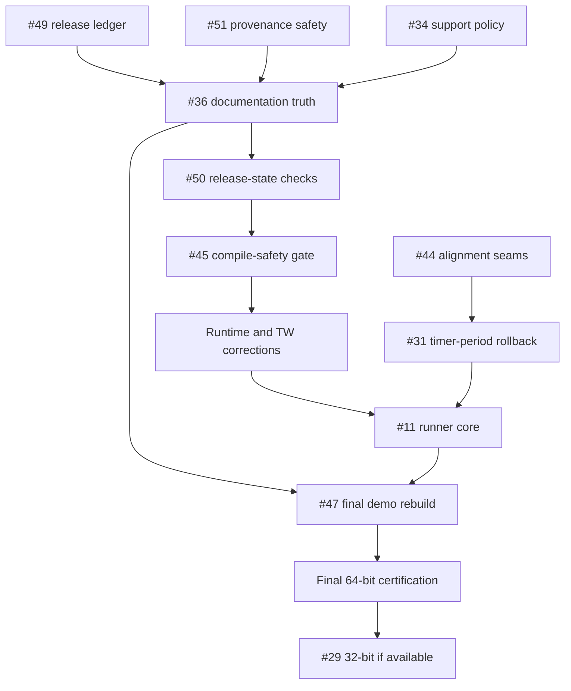

# v1.4.1 Implementation Plan

> **REVISION 3 — 31 August 2026**
>
> **Status:** Active planning baseline.
>
> **Source baseline:** `1b5e8db22dde48d68cf57332d59a06d146cf57bb`
> on `main`.
>
> **Predecessor:** v1.4.0 is published at
> `a5390b4c6ca56ebbd87eca121b5167ee5dc09963`. Its final plan is archived
> under `docs/releases/v1.4.0/` and is not updated for ordinary v1.4.1 work.
>
> **Planning rule:** every v1.4.1 issue creation, closure, reopening, title,
> body, label, assignment or milestone change must update this plan in the same
> task.

## Milestone objective

Harden the released v1.4.0 runtime and assurance chain without starting the
v1.5.0 module-extraction program:

- add compile-safety controls before further VBA changes;
- repair the v1.4.0 release ledger without rewriting its tag;
- make release-provenance generation fail closed before it emits artifacts;
- reconcile current repository/wiki release truth before enforcing it;
- correct bounded timing, statistics and TW edge cases;
- make defensive alignment and Application-state paths deterministic to test;
- establish a real-Excel executable gate;
- reconcile remaining live source/repository contradictions;
- rebuild the official demo workbook as a credible current product surface;
- retain the 32-bit evidence gap honestly when no real host is available.

v1.4.1 is a patch release. Public call shapes and supported behavior remain
compatible except where a documented defect correction necessarily changes an
invalid or misleading result. The v1.5.0 architecture and official add-in
artifact remain out of scope.

## Document control

| Field | Value |
|---|---|
| Repository | [danielep71/VBA-PERFORMANCE_MANAGER](https://github.com/danielep71/VBA-PERFORMANCE_MANAGER) |
| Milestone | v1.4.1 · GitHub milestone `#4` |
| Active issues | **16**: #11, #29–#36, #44–#47, #49–#51 |
| Open portfolio distribution | **24 total** · v1.4.1: **16** · v1.5.0: **8** |
| Assignment | All 16 assigned to `danielep71` |
| Current static gate | 12 checks; #50 adds release-state controls and #45 adds two compile-safety checks |
| Published regression baseline | v1.4.0 · 80 cases · 643 assertions · 0 failures |
| Published Excel host | Microsoft 365 Excel 64-bit Version 2607 Build 16.0.20228.20188 |
| Exact published tag | `v1.4.0` → `a5390b4c6ca56ebbd87eca121b5167ee5dc09963` |
| Deferred architecture | #37–#43 and #48 → v1.5.0 |
| Contributor-dependent evidence | #29; target milestone, not an unconditional release gate |

## Issue register

| Order | Issue | Labels | Disposition and dependency |
|---:|---|---|---|
| 1 | [#49 — Promote the v1.4.0 changelog and preserve release-history validation](https://github.com/danielep71/VBA-PERFORMANCE_MANAGER/issues/49) | `bug` `documentation` `CI` `P1` `release` `testing` | First correction; repairs the canonical ledger and its one-time v1.4.0 freeze exception |
| 1 | [#51 — Reject incomplete or inconsistent release provenance manifests](https://github.com/danielep71/VBA-PERFORMANCE_MANAGER/issues/51) | `bug` `CI` `P1` `release` `testing` | First correction; fail-closed provenance generation, independent of #49 |
| 1 | [#34 — Define the minimum supported Office/VBA version](https://github.com/danielep71/VBA-PERFORMANCE_MANAGER/issues/34) | `documentation` `P3` `api` `release` | Early support-policy decision; does not remove VBA7 32-bit or close #29 |
| 2 | [#36 — Reconcile v1.4.0 post-release source, repository, and wiki contradictions](https://github.com/danielep71/VBA-PERFORMANCE_MANAGER/issues/36) | `bug` `documentation` `P1` `release` | Follows #49; corrects five source/template defects and thirteen current-state documentation surfaces |
| 3 | [#50 — Add release-state consistency checks for changelog, README and wiki](https://github.com/danielep71/VBA-PERFORMANCE_MANAGER/issues/50) | `enhancement` `documentation` `CI` `P2` `release` `testing` | Follows #49 and #36; enforces the corrected baseline without arbitrary prose scanning |
| 4 | [#45 — Add compile-safety checks for error labels and undeclared assignments](https://github.com/danielep71/VBA-PERFORMANCE_MANAGER/issues/45) | `enhancement` `CI` `P2` `testing` | Adds two separately reported compile-safety checks after release-truth correction |
| 4 | [#46 — Harden label synchronization and upgrade github-script to v9](https://github.com/danielep71/VBA-PERFORMANCE_MANAGER/issues/46) | `bug` `CI` `P3` | Independent workflow correction; no production workflow change until implemented |
| 5 | [#30 — Make ElapsedTime robust for large finite durations](https://github.com/danielep71/VBA-PERFORMANCE_MANAGER/issues/30) | `bug` `P3` `timing` `api` | Independent formatter-domain correction |
| 5 | [#32 — Harden statistics arithmetic for extreme in-domain values](https://github.com/danielep71/VBA-PERFORMANCE_MANAGER/issues/32) | `bug` `statistics` `P3` `api` | Independent numeric-domain decision and implementation |
| 5 | [#35 — Harden TW instance-key issuance against Long overflow](https://github.com/danielep71/VBA-PERFORMANCE_MANAGER/issues/35) | `bug` `P3` `state-management` | Independent collision/overflow invariant |
| 5 | [#44 — Add deterministic alignment-loop failure and timeout coverage](https://github.com/danielep71/VBA-PERFORMANCE_MANAGER/issues/44) | `enhancement` `P3` `timing` `testing` | Precedes or co-lands with #31 |
| 6 | [#31 — Roll back timeBeginPeriod when aligned method-3 start fails](https://github.com/danielep71/VBA-PERFORMANCE_MANAGER/issues/31) | `bug` `P3` `timing` `state-management` | Reuses or coordinates with #44 alignment control |
| 6 | [#33 — Add deterministic TW failure and workbook-lifecycle regression coverage](https://github.com/danielep71/VBA-PERFORMANCE_MANAGER/issues/33) | `enhancement` `P2` `state-management` `testing` | Source seams independent of #11; external lifecycle evidence may reuse it |
| 7 | [#11 — Add an automated real-Excel regression gate](https://github.com/danielep71/VBA-PERFORMANCE_MANAGER/issues/11) | `enhancement` `CI` `P2` `release` `testing` | Non-interactive VBA runner in a real interactive Excel user session |
| 8 | [#47 — Rebuild and recertify the demo workbook against the current API](https://github.com/danielep71/VBA-PERFORMANCE_MANAGER/issues/47) | `bug` `documentation` `release` `P2` `testing` | Audit may start early; final rebuild follows runtime/contract changes |
| 9 | [#29 — Publish Office 32-bit execution certification](https://github.com/danielep71/VBA-PERFORMANCE_MANAGER/issues/29) | `enhancement` `release` `P2` `testing` | Exact-final-SHA evidence only; roll forward if no real host exists |

## Dependency map

#46 can proceed alongside the early phases.
#29 does not block release when no qualifying real 32-bit host is available.

## Phase 0 — establish the development gate

### 0A. Repair the canonical release ledger — #49

Promote the text frozen under the v1.4.0 tag's `[Unreleased]` heading to a
dated `[1.4.0]` section on `main`, add a fresh `[Unreleased]` section and repair
the comparison links. Preserve the tagged file and all v1.3.0-and-earlier
sections.

The existing frozen-history rule gains one narrowly scoped compatibility path:
current `[1.4.0]` is compared with tag `v1.4.0`'s `[Unreleased]`. Positive and
negative fixtures must prove that content drift still fails and no later
release can use the exception.

`RELEASING.md` must also require changelog promotion alongside version-stamp
advancement, before final certification and tagging.

### 0B. Make provenance generation fail closed — #51

Require complete, internally consistent release inputs before any publishable
Markdown or JSON is emitted. Release mode must reject:

- an omitted or missing asset;
- an omitted tag or version/tag disagreement;
- a dirty working tree or HEAD/tag-target disagreement;
- omitted, negative or non-zero failures;
- missing or non-positive certification counts;
- missing Excel build or bitness evidence.

Failed validation must return non-zero without creating, truncating or
replacing `--out`. Successful JSON is written atomically. Any retained draft
mode is explicit and structurally non-publishable. Fixture coverage includes
the complete negative matrix and a positive v1.4.0-equivalent invocation.

### 0C. Settle support and reconcile current release truth — #34, #36

Settle the minimum Office/VBA support policy before the final documentation
pass. After #49, correct #36's five source/template contradictions and thirteen
current-state documentation surfaces:

- README, INSTALLATION, RELEASING and SECURITY;
- Core API, diagnostics, FAQ, Home, installation, limitations, statistics,
  testing and version-history wiki pages.

Preserve explicitly historical v1.3.0 evidence, archived plans and the exact
v1.4.0 80/643/0 and 12-check certification. The active gate remains 12 during
this correction pass.

### 0D. Enforce the corrected release-state baseline — #50

Add bounded, separately reported and fixture-backed controls for changelog
headings/comparison links, README current-release claims and wiki current
badges/status blocks. Historical evidence must remain valid; arbitrary global
version-string scans are forbidden.

Record the rule names and resulting static-check count only when #50's design
is implemented. Do not guess the final count in advance.

### 0E. Compile-safety linting — #45

Add two separately reported, fixture-backed checks:

1. every non-special `On Error GoTo <label>` resolves inside its procedure;
2. every supported unqualified assignment target resolves to a declaration.

Advance the active gate by two from the post-#50 count. Update current v1.4.1
documentation and machine-readable output, but do not rewrite:

- the v1.4.0 tag;
- exact-tag v1.4.0 evidence;
- released changelog history;
- the archived v1.4.0 implementation record.

### 0F. Label workflow — #46

Audit every configured label before mutation, report the complete sorted
missing set and fail without partial updates. Upgrade
`actions/github-script@v7` to `@v9`, review the v8/v9 migration boundaries,
and prove both missing-label and successful hosted paths.

**Phase 0 exit gate**

- the final implemented static-check count passes on the exact Phase 0 SHA;
- #49 proves exact v1.4.0 promotion and rejects promoted-section drift;
- #51 rejects every unpublishable manifest case before output and preserves
  existing output on failure;
- repository and wiki current-state wording agree with the published release;
- #50 positive/negative fixtures distinguish current claims from history;
- #45 positive/negative fixtures prove its two checks independently;
- the label workflow reports all missing labels before mutation and runs on
  the supported action runtime;
- current support and contract documentation is internally consistent.

## Phase 1 — runtime and deterministic edge hardening

### 1A. Numeric public surfaces — #30, #32

- remove or validate `ElapsedTime`'s unnecessary `Long` narrowing;
- choose and document the statistics-domain strategy;
- use overflow-safe mean, midpoint and variance behavior, or an explicit
  coherent bound;
- add boundary regressions without changing ordinary timing output.

### 1B. Alignment transaction — #44 → #31

#44 introduces the narrow deterministic control for later alignment reads and
spin-guard exhaustion. It covers QPC and method 4 in strict/non-strict modes.

#31 then uses or coordinates with that control to prove that method 3 releases
only the timer-period request acquired by the failed start attempt. Previously
owned requests remain balanced.

### 1C. TW key issuance — #35

Make the `Long` boundary explicit and collision-safe without allocating
billions of objects. Preserve the normal key format unless a documented change
is necessary.

**Phase 1 exit gate**

- all new deterministic seams self-clear on success and error;
- no public API incompatibility is introduced accidentally;
- boundary regressions cover each corrected path;
- the final implemented static-check count and the full integrated Excel suite
  pass.

## Phase 2 — TW failure and workbook lifecycle — #33

Add deterministic Application-property failure control for begin/update and
end/restore. Prove rollback, error preservation and recovery.

Keep evidence categories separate:

- ordinary in-workbook deterministic regression;
- external/second-instance lifecycle certification;
- any path later automated through #11.

The zero-workbook and open/close-during-scope scenarios must not be represented
as ordinary core-suite coverage if they require a distinct host lifecycle.

## Phase 3 — automated real-Excel gate — #11

Build a deterministic non-interactive VBA entry point that:

- imports or proves exact checked-out source;
- compiles the project;
- executes in real desktop Excel;
- publishes SHA/build/bitness/case/assertion/failure/cleanup evidence;
- times out and cleans orphaned Excel processes;
- does not depend on demo sheets, buttons, Shapes or status-bar presentation;
- does not execute unreviewed fork code on a persistent trusted runner.

“Non-interactive” describes the VBA entry point. It does not claim that Office
automation is reliable in Session 0 or a server/service context.

## Phase 4 — demo-workbook product review — #47

The workbook audit may begin in parallel with earlier phases, but the final
artifact is rebuilt only after runtime, support and contract changes stabilize.

The final pass covers:

- every sheet, table, name, control, Shape and assigned macro;
- current timing, measurement, failure/rejection and TW behavior;
- landing-page hierarchy and progressive disclosure;
- removal of stale/test-only/misleading presentation;
- exact-source import, compile and visible-action smoke matrix;
- README/wiki/help/screenshot reconciliation;
- clean-state, no-secret and release-hash checks.

The workbook smoke matrix validates presentation. It does not replace the
regression suite or #11's executable evidence.

## Phase 5 — final certification and release

1. Freeze the final candidate after all blocking issue/documentation changes.
2. Run the complete final static gate against that SHA and record its count.
3. Freshly import source, compile and run the full 64-bit Excel regression.
4. Validate and hash the rebuilt demo workbook against the same SHA.
5. Retain the #11 machine-readable artifact against that same final SHA.
6. If a controlled real Office 32-bit host is available, execute #29 against
   the same final SHA.
7. If no host is available, leave #29 open and move it forward before closing
   the milestone. Do not fabricate evidence, close it as completed or hold the
   release indefinitely.
8. Generate provenance through #51's strict path only after the tag, clean-tree,
   asset, certification and version/tag gates all pass.
9. Reconcile release notes, provenance and published-asset hashes.

## Changelog discipline

| Issue | Changelog expectation |
|---|---|
| #30 | Required if supported formatter behavior/domain changes |
| #31 | `Fixed` behavioral correction for timer-period rollback |
| #32 | Required for changed statistics domain/arithmetic behavior |
| #34 | Required if minimum supported Office/VBA policy changes |
| #35 | `Fixed` for collision/overflow hardening if production changes |
| #33, #44 | No behavior entry if only deterministic test infrastructure changes; reconsider if public behavior changes |
| #11, #45, #46, #50, #51 | No runtime/API entry; document assurance/release-tooling changes in release notes as appropriate |
| #49 | Required release-ledger repair; promote existing v1.4.0 content without inventing a second behavior entry |
| #36 | Documentation/repository correction only unless implementation expands |
| #47 | `Fixed` release-artifact/demo correction; do not present it as runtime behavior |
| #29 | No entry without real new certification evidence |

The content frozen under v1.4.0's tagged `[Unreleased]` heading remains
immutable. #49 corrects its heading/link structure on `main`; it does not
rewrite the tag or alter the released behavioral record.

## Definition of done

- [ ] #30–#36, #44–#47 and #49–#51 are closed with direct evidence
- [ ] #11 is closed with a real-Excel exact-SHA artifact and documented trust model
- [ ] #29 is either closed on real exact-SHA 32-bit evidence or moved forward still open
- [ ] The final active static-gate count is recorded and passes with stable JSON output
- [ ] Integrated 64-bit Excel regression passes on the final SHA
- [ ] Demo workbook is rebuilt, smoke-tested, hashed and reconciled with docs
- [ ] #49's promoted v1.4.0 content matches the tag's `[Unreleased]` content
- [ ] Provenance generation fails before output on every #51 invalid-input case
- [ ] Final release provenance is generated atomically from a clean exact-tag checkout
- [ ] No tagged v1.4.0 history or archived evidence was rewritten
- [ ] README, installation, security, releasing and wiki describe the same v1.4.1 state
- [ ] Tag, source, workbook and retained evidence resolve to the intended final SHA

## Explicit exclusions

- v1.5.0 module extraction in #37–#40;
- full regression modularization in #41;
- generated architecture inventories beyond the controls required here in #42;
- signing/attestation implementation in #43;
- official add-in artifact in #48;
- inferred or simulated Office 32-bit certification.
