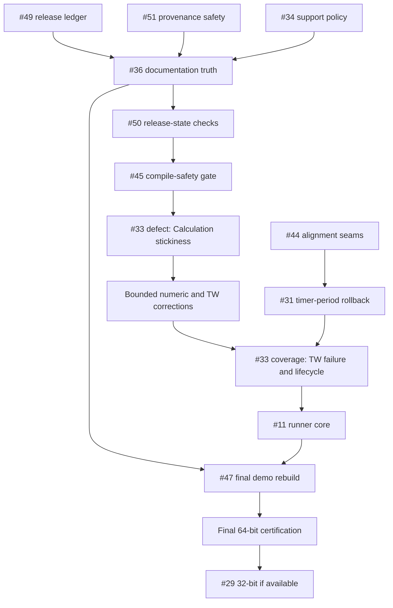

# v1.4.1 Implementation Plan

> **REVISION 6 — 3 September 2026**
>
> **Status:** Active planning baseline.
>
> **Source baseline:** `abee10b609339fddc7f8ef0ac3fcfca4f8dbfd42`
> on `main`, with `v1.4.1` fast-forwarded to the same commit.
>
> **Predecessor:** v1.4.0 is published at
> `a5390b4c6ca56ebbd87eca121b5167ee5dc09963`. Its final plan is archived
> under `docs/releases/v1.4.0/` and is not updated for ordinary v1.4.1 work.
>
> **Planning rule:** every v1.4.1 issue creation, closure, reopening, title,
> body, label, assignment or milestone change must update this plan in the same
> task.

## Milestone objective

Harden the released v1.4.0 runtime and assurance chain without starting the
v1.5.0 module-extraction program:

- add compile-safety controls before further VBA changes;
- repair the v1.4.0 release ledger without rewriting its tag;
- make release-provenance generation fail closed before it emits artifacts;
- reconcile current repository/wiki release truth before enforcing it;
- correct the live Calculation-exemption state defect before the bounded
  numeric work;
- correct bounded timing, statistics and TW edge cases;
- make defensive alignment and Application-state paths deterministic to test;
- establish a real-Excel executable gate;
- reconcile remaining live source/repository contradictions;
- rebuild the official demo workbook as a credible current product surface;
- retain the 32-bit evidence gap honestly when no real host is available.

v1.4.1 is a patch release. Public call shapes and supported behavior remain
compatible except where a documented defect correction necessarily changes an
invalid or misleading result. The v1.5.0 architecture and official add-in
artifact remain out of scope.

## Document control

| Field | Value |
|---|---|
| Repository | [danielep71/VBA-PERFORMANCE_MANAGER](https://github.com/danielep71/VBA-PERFORMANCE_MANAGER) |
| Milestone | v1.4.1 · GitHub milestone `#4` |
| Active issues | **15**: #11, #29–#36, #44–#47, #50–#51 |
| Full issue inventory | **47 total** · **23 open** · **24 closed** |
| Open portfolio distribution | v1.4.1: **15** · v1.5.0: **8** |
| Closed portfolio distribution | v1.2.0: **4** · v1.3.0: **11** · v1.4.0: **7** · v1.4.1: **1** (#49) · no milestone: **1** (#22, `not planned`) |
| Assignment | All 46 substantive issues assigned to `danielep71`; #22 intentionally unassigned |
| Label taxonomy | **14 active labels**; every label used by an issue has a non-empty description |
| Working branch | `v1.4.1`, fast-forwarded to `abee10b6`; no divergent commits |
| Open pull requests | none; #56 was closed unmerged |
| Current static gate | 12 checks; #50 adds release-state controls and #45 adds two compile-safety checks |
| Published regression baseline | v1.4.0 · 80 cases · 643 assertions · 0 failures |
| Published Excel host | Microsoft 365 Excel 64-bit Version 2607 Build 16.0.20228.20188 |
| Exact published tag | `v1.4.0` → `a5390b4c6ca56ebbd87eca121b5167ee5dc09963` |
| Deferred architecture | #37–#43 and #48 → v1.5.0 |
| Contributor-dependent evidence | #29; target milestone, not an unconditional release gate |

## Revision 4 full-issue audit

The 3 September 2026 audit read every open and closed issue body, title, label
set, milestone, assignee, checkbox state and comment thread against the live
repository and release history.

No issue required a state, state-reason, title, label, priority, assignment or
milestone change. In particular:

- all 24 open issues remain genuine and have incomplete work;
- all completed closures remain evidence-based;
- #26 correctly retains one visible, irreparable commit-atomicity process
  exception rather than marking it satisfied;
- #22 correctly remains `not planned`, without labels, assignment or milestone;
- #29 correctly remains open in v1.4.1, contributor-dependent and non-blocking
  when no real Office 32-bit host is available;
- #43 correctly remains open with its six already-delivered policy controls
  checked and its implementation controls unchecked.

Closure-record wording was corrected in #7, #9, #12, #13, #18, #21,
#23–#26 and #28. These edits replace stale development-line language, make
#24's original defect explicitly historical, record #28 as delivered, and stop
#12 from overstating the provenance generator's fail-closed behavior. The
existing closing comments on #12, #18 and #21 were corrected for the same
reasons. No delivered scope or closure evidence was weakened.

#50 gained an explicit cross-repository determinism contract. Wiki validation
must operate on a supplied, SHA-identified local wiki revision; it may not make
an unpinned live-wiki fetch part of a deterministic source-commit result.

## Revision 5 repository Markdown audit

The 3 September 2026 audit inspected all thirteen repository Markdown files,
preserving explicitly historical evidence and the archived v1.4.0 release
record. Commit `1ac36c9ebca114b41f44b5c2e8b5603d1b6ea94a`:

- promoted the frozen v1.4.0 changelog body to a dated release section and
  created a fresh v1.4.1 `[Unreleased]` section;
- added the sole v1.4.0 compatibility path to the released-section validator,
  with positive, drift-negative and later-release-negative inline fixtures;
- reconciled README, installation, security and releasing guidance with the
  published v1.4.0 state and active v1.4.1 milestone;
- corrected the bug-report measurement-evidence contract and strengthened the
  pull-request release checklist;
- removed a fixed historical assertion count from the generic conduct example;
- verified all repository-relative Markdown links, fenced blocks, stale
  current-state phrases, `git diff --check` and the 12-check static gate.

#49 is complete. #36 is only partially complete. #50 remains the prospective
enforcement phase and is not claimed by this audit.

**Superseded in part.** Revision 6 records that Revision 5's repository-document
findings no longer describe the files. See the re-verification note below.

## Revision 6 reconciliation

### Baseline advance

Revision 5 recorded a source baseline of `6134da02`. Thirteen commits have
landed on `main` since, all documentation, policy or repository-hygiene
standardization:

| Commit | Subject |
|---|---|
| `a223e2959f08` | chore: separate Markdown and text whitespace policies |
| `65ec12caa0d8` | chore: align Git attributes policy |
| `fe5df01c4a87` | fix: exclude GitHub metadata root from archives |
| `93b2f9e9033c` | chore: align repository ignore policy |
| `a6dba7d0a70a` | fix: align Windows script line endings |
| `142db3a49d65` | docs: standardize code of conduct |
| `3e9bf0e16868` | docs: standardize security policy |
| `75445ba49993` | docs: standardize contribution guide |
| `b3768ce034b4` | docs: fix contribution guide navigation |
| `dc1010fdb833` | docs: standardize changelog |
| `213b80867317` | chore: add repository version marker |
| `a66a5bfdfab9` | Standardize installation and release guidance |
| `abee10b60933` | Standardize pull request review contract |

The `v1.4.1` branch stood at `a66a5bf`, one commit behind `main` with no
divergent work, and was fast-forwarded to `abee10b6` before this revision.

### #36 re-verification, not satisfaction

Revision 5 recorded README, INSTALLATION, RELEASING and SECURITY as reconciled.
All four were subsequently rewritten by the standardization commits above.
Those #36 criteria are therefore **re-verification required**, not satisfied.
They may not be checked off, and #50 may not be treated as enforcing a verified
baseline, until they are re-read against `abee10b6`.

`RELEASING.md` at `abee10b6` no longer contains a flag-level invocation of the
provenance tool. It carries a single generic instruction to use the tool as the
provenance gate and reject incomplete or inconsistent output. #51's strict
command is therefore a **new addition**, not a correction of existing text.

### Register corrections

Three register rows did not match the live issue records:

- **#33** is live as *Make Calculation exemption sticky and add deterministic TW
  lifecycle coverage*, labelled `bug` `P1` `state-management` `testing`. The
  register carried it as `enhancement` `P2` coverage-only work. Corrected and
  re-sequenced; see below.
- **#46** is live as *Pin workflow actions immutably and harden label
  synchronization*, labelled `bug` `CI` `P2`. The register carried the narrower
  `github-script@v9` upgrade at `P3`.
- **#51**'s body was revised after Revision 5. Four changes: the defect table is
  revalidated on the `v1.4.1` branch at `abee10b6`; a paragraph names both
  free-prose escape hatches and the before-checks output ordering; Output safety
  now enumerates which validations must complete before Markdown construction or
  JSON serialization; the fixture matrix grew from thirteen to sixteen items and
  the sequencing section names this revision as its prerequisite.

### Workflow scope

The repository contains exactly two workflows, `static-checks.yml` and
`sync-label-colors.yml`. **Neither invokes `tools/release_provenance.py`.**
Making the tool strict therefore cannot break CI, and #51's prohibition on
touching workflow files creates no conflict.

`static-checks.yml` pins `actions/checkout@v4`, `actions/setup-python@v5` and
`actions/upload-artifact@v4` by mutable tag. Correcting those is **#46's scope,
not #51's**. Because `static-checks.yml` is the required status check under the
`protect-main` ruleset, #46 edits the gate that guards its own merge; sequence
accordingly.

### #33 re-sequencing

The live #33 body records a Codex review finding on PR #16: after the manager
marks Calculation exempt because Excel cannot safely read or write it, a later
`PM_TW_ApplyEffectiveState` call can re-enter the Calculation branch, because
the apply guard does not include `Not g_TW_CalcExempted`. Opening a workbook
during the same scope can therefore reactivate Calculation handling, capture a
later baseline, write Calculation, or attempt restoration despite the exemption.

That is a live P1 state-management defect in current code, not missing coverage.
Leaving it sequenced behind four P3 items would make this revision internally
false. #33 is split into two workstreams **within the single issue** — no new
GitHub issue is created:

| Workstream | Content | Placement |
|---|---|---|
| #33 defect | Apply-guard exemption, scope-wide stickiness invariant, teardown clearing without a stale restore, and the focused deterministic regression that fails before the fix and passes after | Phase 1A, before #30, #32 and #35 |
| #33 coverage | Apply/update rollback preserving the original error, end/restore failure with recoverable bookkeeping, `PM_TW_EndAllSessions` emergency recovery, zero-workbook begin, open-workbook-during-scope, close-all-before-final-restore | Phase 2 |

Only the coverage workstream feeds #11. The defect workstream does not depend on
the executable gate and must not wait for it.

**PR #56 may be cited only as evidence that the defect and its focused
regression are technically separable from the broader lifecycle coverage.** It
was closed without merging; `main` never moved. Commit
`948c77d85ebfbdfa3e50b98db0532d521291ae51` is **not delivered** and no plan,
issue or closing comment may describe it as such.

### #51 implementation decisions

Four decisions are locked before implementation:

1. **Exit codes are two-tier.** `0` is a successful validated release output.
   `1` is a parsed command that violates the release/provenance contract. `2` is
   a genuine argparse syntax error — unknown option, missing option value,
   non-integer token, invalid `choices` value. `required=True` is removed from
   `--version`; missing required flags are diagnosed together by the validator
   and return `1`. `type=int` and `choices=` are retained. Every fixture
   specified by #51 returns `1`; parser-only tests may separately assert `2`.
2. **No draft mode.** `--draft` is not added. The tool has one strict path. A
   valid invocation may emit Markdown without `--out`, but the documented
   release procedure requires `--out release-manifest.json`. Incomplete preview
   output is no longer supported.
3. **Exact `HEAD` identity.** `HEAD` must equal `<tag>^{commit}`. There is no
   alternative tag-target manifest design. Partial source-file equality may not
   substitute for an exact tagged checkout.
4. **Isolated subprocess fixture repositories.** `ROOT` derives from `__file__`,
   and `git()`/`git_raw()` pass `cwd=ROOT` explicitly, so changing the invoking
   directory redirects neither the file inventory nor any git call. The harness
   copies the production script to
   `<temporary-repository>/tools/release_provenance.py`, creates the minimal
   source inventory, asset, commits and tags there, and invokes that copy with
   the temporary repository as its working directory. Production code is
   unchanged; the real parser and entry point are exercised; dirty-tree, tag and
   `HEAD` mutations stay isolated from the real checkout.

### Milestone synchronization

The GitHub milestone description named eight of fifteen issues and described
#33 as coverage. It was replaced in this task with full-scope text that names
all fifteen and identifies Calculation stickiness as a failure-path defect.

## Issue register

| Order | Issue | Labels | Disposition and dependency |
|---:|---|---|---|
| Done | [#49 — Promote the v1.4.0 changelog and preserve release-history validation](https://github.com/danielep71/VBA-PERFORMANCE_MANAGER/issues/49) | `bug` `documentation` `CI` `P1` `release` `testing` | Completed in `1ac36c9`; canonical ledger and one-time v1.4.0 freeze compatibility repaired |
| 1 | [#51 — Reject incomplete or inconsistent release provenance manifests](https://github.com/danielep71/VBA-PERFORMANCE_MANAGER/issues/51) | `bug` `CI` `P1` `release` `testing` | First implementation task after this revision; fail-closed provenance generation, independent of #49 |
| 1 | [#34 — Define the minimum supported Office/VBA version](https://github.com/danielep71/VBA-PERFORMANCE_MANAGER/issues/34) | `documentation` `P3` `api` `release` | Early support-policy decision; does not remove VBA7 32-bit or close #29 |
| 2 | [#36 — Reconcile v1.4.0 post-release source, repository, and wiki contradictions](https://github.com/danielep71/VBA-PERFORMANCE_MANAGER/issues/36) | `bug` `documentation` `P1` `release` | Repository-document criteria require re-verification against `abee10b6`; live VBA comments, issue contact configuration and nine wiki pages remain open |
| 3 | [#50 — Add release-state consistency checks for changelog, README and wiki](https://github.com/danielep71/VBA-PERFORMANCE_MANAGER/issues/50) | `enhancement` `documentation` `CI` `P2` `release` `testing` | Follows #36; enforces the corrected baseline against a supplied, SHA-recorded wiki revision |
| 4 | [#45 — Add compile-safety checks for error labels and undeclared assignments](https://github.com/danielep71/VBA-PERFORMANCE_MANAGER/issues/45) | `enhancement` `CI` `P2` `testing` | Adds two separately reported compile-safety checks after release-truth correction |
| 4 | [#46 — Pin workflow actions immutably and harden label synchronization](https://github.com/danielep71/VBA-PERFORMANCE_MANAGER/issues/46) | `bug` `CI` `P2` | Independent workflow correction; edits the required status check, so sequence its merge deliberately |
| 5 | [#33 — Make Calculation exemption sticky](https://github.com/danielep71/VBA-PERFORMANCE_MANAGER/issues/33) *(defect workstream)* | `bug` `P1` `state-management` `testing` | First runtime correction after Phase 0; live apply-guard defect, precedes the bounded numeric work |
| 6 | [#30 — Make ElapsedTime robust for large finite durations](https://github.com/danielep71/VBA-PERFORMANCE_MANAGER/issues/30) | `bug` `P3` `timing` `api` | Independent formatter-domain correction |
| 6 | [#32 — Harden statistics arithmetic for extreme in-domain values](https://github.com/danielep71/VBA-PERFORMANCE_MANAGER/issues/32) | `bug` `statistics` `P3` `api` | Independent numeric-domain decision and implementation |
| 6 | [#35 — Harden TW instance-key issuance against Long overflow](https://github.com/danielep71/VBA-PERFORMANCE_MANAGER/issues/35) | `bug` `P3` `state-management` | Independent collision/overflow invariant |
| 6 | [#44 — Add deterministic alignment-loop failure and timeout coverage](https://github.com/danielep71/VBA-PERFORMANCE_MANAGER/issues/44) | `enhancement` `P3` `timing` `testing` | Precedes or co-lands with #31 |
| 7 | [#31 — Roll back timeBeginPeriod when aligned method-3 start fails](https://github.com/danielep71/VBA-PERFORMANCE_MANAGER/issues/31) | `bug` `P3` `timing` `state-management` | Reuses or coordinates with #44 alignment control |
| 8 | [#33 — TW failure and workbook-lifecycle coverage](https://github.com/danielep71/VBA-PERFORMANCE_MANAGER/issues/33) *(coverage workstream)* | `bug` `P1` `state-management` `testing` | Remaining rollback, restore-failure, emergency-recovery and lifecycle cases; the portion whose automation boundary feeds #11 |
| 9 | [#11 — Add an automated real-Excel regression gate](https://github.com/danielep71/VBA-PERFORMANCE_MANAGER/issues/11) | `enhancement` `CI` `P2` `release` `testing` | Non-interactive VBA runner in a real interactive Excel user session |
| 10 | [#47 — Rebuild and recertify the demo workbook against the current API](https://github.com/danielep71/VBA-PERFORMANCE_MANAGER/issues/47) | `bug` `documentation` `release` `P2` `testing` | Audit may start early; final rebuild follows runtime/contract changes |
| 11 | [#29 — Publish Office 32-bit execution certification](https://github.com/danielep71/VBA-PERFORMANCE_MANAGER/issues/29) | `enhancement` `release` `P2` `testing` | Exact-final-SHA evidence only; roll forward if no real host exists |

#33 appears twice by workstream. It is one issue and closes once, when both
workstreams and their Excel evidence are complete.

## Dependency map

#46 can proceed alongside the early phases.
#29 does not block release when no qualifying real 32-bit host is available.
Only #33's coverage workstream feeds #11; the defect correction does not.

## Phase 0 — establish the development gate

### 0A. Repair the canonical release ledger — #49 — completed

Promote the text frozen under the v1.4.0 tag's `[Unreleased]` heading to a
dated `[1.4.0]` section on `main`, add a fresh `[Unreleased]` section and repair
the comparison links. Preserve the tagged file and all v1.3.0-and-earlier
sections.

The existing frozen-history rule gains one narrowly scoped compatibility path:
current `[1.4.0]` is compared with tag `v1.4.0`'s `[Unreleased]`. Positive and
negative fixtures must prove that content drift still fails and no later
release can use the exception.

`RELEASING.md` must also require changelog promotion alongside version-stamp
advancement, before final certification and tagging.

Delivered in `1ac36c9ebca114b41f44b5c2e8b5603d1b6ea94a`. The promoted
body is byte-for-byte equal (after the validator's line-ending normalization)
to tag `v1.4.0`'s `[Unreleased]` body; v1.3.0 and earlier sections are unchanged.

### 0B. Make provenance generation fail closed — #51

Require complete, internally consistent release inputs before any publishable
Markdown or JSON is emitted. Release mode must reject:

- an omitted or missing asset, or an asset that is not a regular file;
- an omitted tag, a malformed version or tag, or version/tag disagreement;
- a `HEAD` that is not exactly `<tag>^{commit}`;
- a dirty working tree;
- omitted, negative or non-zero failures;
- missing or non-positive certification counts;
- missing Excel build or bitness evidence.

All of that validation completes before Markdown is constructed or printed and
before any JSON is serialized. Failed validation returns non-zero without
creating, truncating or replacing `--out`; an existing output file is left
unchanged. Successful JSON is written through a temporary file and atomically
replaced into place.

The four locked implementation decisions above govern exit codes, the absence of
a draft mode, `HEAD` identity and the fixture harness. Fixture coverage is the
complete sixteen-item negative matrix in the issue plus a positive
v1.4.0-equivalent invocation, with both text and JSON success output verified.

Two documentation corrections travel with the code. The module docstring
currently states that omitted values are emitted as TODO markers so an
incomplete block is visible in review; that claim is removed. Its example
invocation omits `--tag`, `--failures` and `--out` and is invalid under the
strict contract; it is replaced by the strict command, which must match the new
`RELEASING.md` text verbatim rather than drift from it.

### 0C. Settle support and reconcile current release truth — #34, #36

Settle the minimum Office/VBA support policy before the final documentation
pass. Then correct #36's source/template contradictions and its current-state
documentation surfaces:

- README, INSTALLATION, RELEASING and SECURITY, **re-verified against
  `abee10b6`** rather than relying on the Revision 5 audit;
- Core API, diagnostics, FAQ, Home, installation, limitations, statistics,
  testing and version-history wiki pages.

Preserve explicitly historical v1.3.0 evidence, archived plans and the exact
v1.4.0 80/643/0 and 12-check certification. The active gate remains 12 during
this correction pass.

### 0D. Enforce the corrected release-state baseline — #50

Add bounded, separately reported and fixture-backed controls for changelog
headings/comparison links, README current-release claims and wiki current
badges/status blocks. Historical evidence must remain valid; arbitrary global
version-string scans are forbidden.

The wiki checker receives an explicit local wiki root and records the exact wiki
commit in text and JSON output. Hosted integration must check out or otherwise
verify a pinned/paired read-only wiki revision. Missing or mismatched configured
wiki input fails instead of silently skipping, while fixtures remain local and
network-independent. Because the two repositories cannot be committed
atomically, document and test the paired-update sequence. Any workflow edit is
limited to this read-only acquisition/pin verification and invocation; triggers,
permissions, branch rules and unrelated steps remain unchanged.

Record the rule names and resulting static-check count only when #50's design
is implemented. Do not guess the final count in advance.

### 0E. Compile-safety linting — #45

Add two separately reported, fixture-backed checks:

1. every non-special `On Error GoTo <label>` resolves inside its procedure;
2. every supported unqualified assignment target resolves to a declaration.

Advance the active gate by two from the post-#50 count. Update current v1.4.1
documentation and machine-readable output, but do not rewrite:

- the v1.4.0 tag;
- exact-tag v1.4.0 evidence;
- released changelog history;
- the archived v1.4.0 implementation record.

### 0F. Workflow pinning and label synchronization — #46

Pin every workflow action to an immutable commit SHA, including
`actions/checkout`, `actions/setup-python` and `actions/upload-artifact` in
`static-checks.yml`. Audit every configured label before mutation, report the
complete sorted missing set and fail without partial updates. Review the
`github-script` migration boundaries and prove both missing-label and successful
hosted paths.

`static-checks.yml` is the required status check under `protect-main`, so this
issue modifies the gate that guards its own merge. Verify the pinned workflow
passes on its own commit before relying on it.

**Phase 0 exit gate**

- the final implemented static-check count passes on the exact Phase 0 SHA;
- #49 proves exact v1.4.0 promotion and rejects promoted-section drift;
- #51 rejects every unpublishable manifest case before output, preserves
  existing output on failure, and returns `1` for every contract violation;
- repository and wiki current-state wording agree with the published release,
  re-verified against the current baseline rather than Revision 5;
- #50 positive/negative fixtures distinguish current claims from history and
  bind wiki results to an explicit recorded wiki SHA;
- #45 positive/negative fixtures prove its two checks independently;
- the label workflow reports all missing labels before mutation, and every
  action is pinned by commit SHA;
- current support and contract documentation is internally consistent.

## Phase 1 — runtime and deterministic edge hardening

### 1A. Calculation exemption stickiness — #33 defect workstream

Include the exemption state in the Calculation apply guard. Once
`g_TW_CalcExempted = True` for a scope, no later begin, update,
workbook-lifecycle transition or teardown path in that scope may read, write,
capture or restore `Application.Calculation`.

Final teardown clears the exemption and related bookkeeping without treating an
unavailable or later-observed value as a valid baseline.

Add the focused deterministic regression that fails against the current
implementation and passes with the fix, including the open-workbook-during-an-
exempt-scope case. The supported public API is unchanged.

This workstream precedes 1B–1D. It does not depend on #11.

### 1B. Numeric public surfaces — #30, #32

- remove or validate `ElapsedTime`'s unnecessary `Long` narrowing;
- choose and document the statistics-domain strategy;
- use overflow-safe mean, midpoint and variance behavior, or an explicit
  coherent bound;
- add boundary regressions without changing ordinary timing output.

### 1C. Alignment transaction — #44 → #31

#44 introduces the narrow deterministic control for later alignment reads and
spin-guard exhaustion. It covers QPC and method 4 in strict/non-strict modes.

#31 then uses or coordinates with that control to prove that method 3 releases
only the timer-period request acquired by the failed start attempt. Previously
owned requests remain balanced.

### 1D. TW key issuance — #35

Make the `Long` boundary explicit and collision-safe without allocating
billions of objects. Preserve the normal key format unless a documented change
is necessary.

**Phase 1 exit gate**

- the #33 apply-guard regression fails on the pre-fix implementation and passes
  on the corrected one, with exact-SHA Excel evidence;
- all new deterministic seams self-clear on success and error;
- no public API incompatibility is introduced accidentally;
- boundary regressions cover each corrected path;
- the final implemented static-check count and the full integrated Excel suite
  pass.

#33 remains open at this gate. Only its defect workstream is complete.

## Phase 2 — TW failure and workbook lifecycle — #33 coverage workstream

Add deterministic Application-property failure control for begin/update and
end/restore. Prove rollback preserving the original error, recoverable
bookkeeping after a restore failure, and `PM_TW_EndAllSessions` as a valid
emergency recovery path.

Cover zero-workbook begin, open-workbook-during-scope and
close-all-before-final-restore, and document the automation boundary for each.

Keep evidence categories separate:

- ordinary in-workbook deterministic regression;
- external/second-instance lifecycle certification;
- any path later automated through #11.

The zero-workbook and open/close-during-scope scenarios must not be represented
as ordinary core-suite coverage if they require a distinct host lifecycle.

**#33 closes only here**, when both workstreams and their exact-SHA Excel
evidence are complete and every acceptance checkbox in the live issue body is
satisfied.

## Phase 3 — automated real-Excel gate — #11

Build a deterministic non-interactive VBA entry point that:

- imports or proves exact checked-out source;
- compiles the project;
- executes in real desktop Excel;
- publishes SHA/build/bitness/case/assertion/failure/cleanup evidence;
- times out and cleans orphaned Excel processes;
- does not depend on demo sheets, buttons, Shapes or status-bar presentation;
- does not execute unreviewed fork code on a persistent trusted runner.

"Non-interactive" describes the VBA entry point. It does not claim that Office
automation is reliable in Session 0 or a server/service context.

## Phase 4 — demo-workbook product review — #47

The workbook audit may begin in parallel with earlier phases, but the final
artifact is rebuilt only after runtime, support and contract changes stabilize.

The final pass covers:

- every sheet, table, name, control, Shape and assigned macro;
- current timing, measurement, failure/rejection and TW behavior;
- landing-page hierarchy and progressive disclosure;
- removal of stale/test-only/misleading presentation;
- exact-source import, compile and visible-action smoke matrix;
- README/wiki/help/screenshot reconciliation;
- clean-state, no-secret and release-hash checks.

The workbook smoke matrix validates presentation. It does not replace the
regression suite or #11's executable evidence.

## Phase 5 — final certification and release

1. Freeze the final candidate after all blocking issue/documentation changes.
2. Run the complete final static gate against that SHA and record its count.
3. Freshly import source, compile and run the full 64-bit Excel regression.
4. Validate and hash the rebuilt demo workbook against the same SHA.
5. Retain the #11 machine-readable artifact against that same final SHA.
6. If a controlled real Office 32-bit host is available, execute #29 against
   the same final SHA.
7. If no host is available, leave #29 open and move it forward before closing
   the milestone. Do not fabricate evidence, close it as completed or hold the
   release indefinitely.
8. Generate provenance through #51's strict path only after the tag, clean-tree,
   asset, certification and version/tag gates all pass, from a checkout whose
   `HEAD` is exactly the tag target.
9. Reconcile release notes, provenance and published-asset hashes.

## Changelog discipline

| Issue | Changelog expectation |
|---|---|
| #30 | Required if supported formatter behavior/domain changes |
| #31 | `Fixed` behavioral correction for timer-period rollback |
| #32 | Required for changed statistics domain/arithmetic behavior |
| #33 defect | `Fixed` behavioral correction: an exempt scope no longer reads, writes or restores Calculation |
| #33 coverage | No behavior entry if only deterministic test infrastructure changes |
| #34 | Required if minimum supported Office/VBA policy changes |
| #35 | `Fixed` for collision/overflow hardening if production changes |
| #44 | No behavior entry if only deterministic test infrastructure changes; reconsider if public behavior changes |
| #11, #45, #46, #50, #51 | No runtime/API entry; document assurance/release-tooling changes in release notes as appropriate |
| #49 | Required release-ledger repair; promote existing v1.4.0 content without inventing a second behavior entry |
| #36 | Documentation/repository correction only unless implementation expands |
| #47 | `Fixed` release-artifact/demo correction; do not present it as runtime behavior |
| #29 | No entry without real new certification evidence |

The content frozen under v1.4.0's tagged `[Unreleased]` heading remains
immutable. #49 corrects its heading/link structure on `main`; it does not
rewrite the tag or alter the released behavioral record.

## Definition of done

- [ ] #30–#36, #44–#47 and #49–#51 are closed with direct evidence
- [ ] #33 is closed only after both its defect and coverage workstreams carry
      exact-SHA Excel evidence
- [ ] #11 is closed with a real-Excel exact-SHA artifact and documented trust model
- [ ] #29 is either closed on real exact-SHA 32-bit evidence or moved forward still open
- [ ] The final active static-gate count is recorded and passes with stable JSON output
- [ ] Integrated 64-bit Excel regression passes on the final SHA
- [ ] Demo workbook is rebuilt, smoke-tested, hashed and reconciled with docs
- [x] #49's promoted v1.4.0 content matches the tag's `[Unreleased]` content
- [ ] Provenance generation fails before output on every #51 invalid-input case
- [ ] Final release provenance is generated atomically from a clean exact-tag checkout
- [ ] Release-state checks record and verify the paired source/wiki revisions
- [ ] Every workflow action is pinned by immutable commit SHA
- [ ] No tagged v1.4.0 history or archived evidence was rewritten
- [ ] README, installation, security, releasing and wiki describe the same v1.4.1 state
- [ ] Tag, source, workbook and retained evidence resolve to the intended final SHA

## Explicit exclusions

- v1.5.0 module extraction in #37–#40;
- full regression modularization in #41;
- generated architecture inventories beyond the controls required here in #42;
- signing/attestation implementation in #43;
- official add-in artifact in #48;
- inferred or simulated Office 32-bit certification;
- any claim that PR #56 or commit `948c77d` is delivered work.
