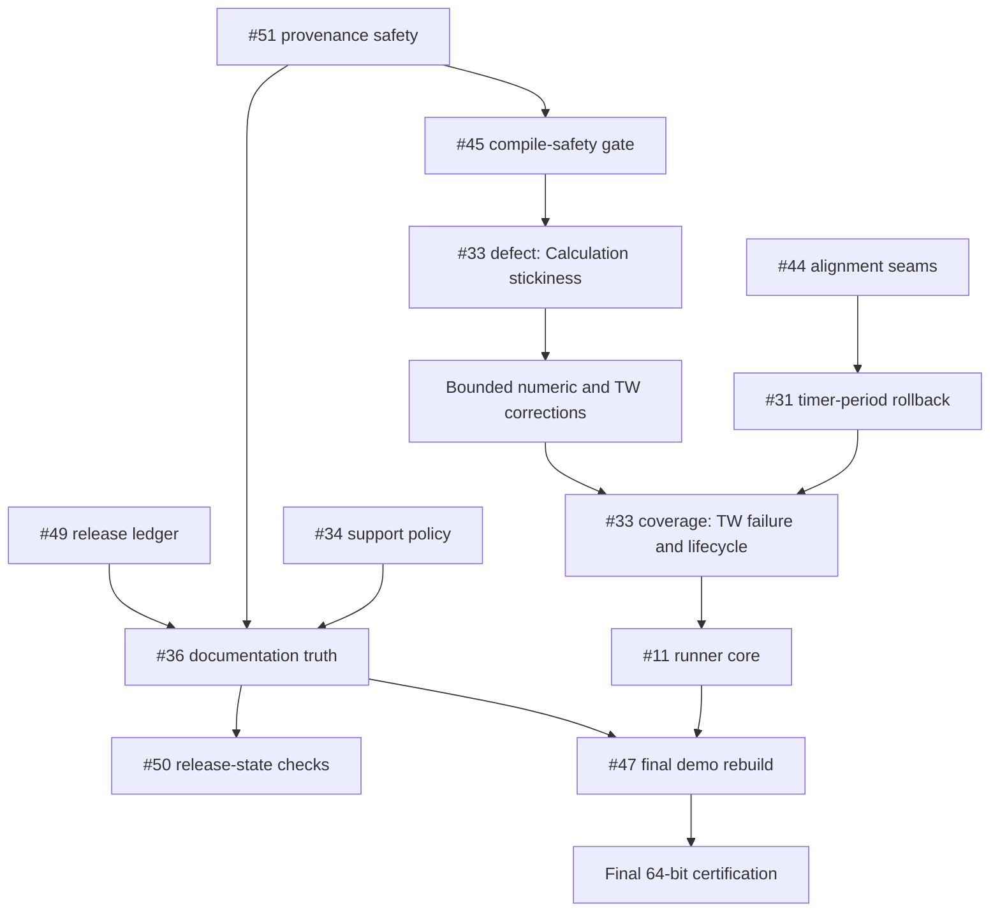

# v1.4.1 Implementation Plan

> [!IMPORTANT]
> During the active v1.4.1 milestone, the
> **[plan on `v1.4.1`](https://github.com/danielep71/VBA-PERFORMANCE_MANAGER/blob/v1.4.1/docs/V1.4.1_IMPLEMENTATION_PLAN.md)**
> is canonical. Any copy on `main` is a historical snapshot, not the live
> planning authority. This notice supersedes older location/publication rules
> in the revision history below. At release completion, merge the final plan
> to `main` and archive it under `docs/releases/v1.4.1/`.

> **REVISION 20 — 29 September 2026**
>
> **Open-issue audit:** all 21 open issues reviewed; 17 bodies and four
> existing comments corrected. All remain open with a milestone, one priority
> and assignment to `danielep71`.
>
> **Available host:** the maintainer cannot test Office 32-bit. #29 moves to
> v1.5.0 as contributor-dependent `P2` / `help wanted`; it does not block
> v1.4.1 or require a personal 32-bit environment.

> **REVISION 19 — 29 September 2026**
>
> **Metadata policy:** every issue, open or closed, must have a milestone,
> exactly one priority label and assignment to `danielep71`. No administrative
> exception applies. All 51 issues comply after classifying #22.

> **REVISION 18 — 29 September 2026**
>
> **Status:** Closed-issue record audit completed against `main` at `bb5c552`
> and `v1.4.1` at `9a0c469`. All 30 closed issues remain closed within their
> recorded scope. Titles and labels were reviewed and retained.
>
> **Record corrections:** 13 issue bodies and 10 existing comments updated;
> no production code, test source, workflow, tag or release asset changed.

> **REVISION 17 — 29 September 2026**
>
> **Status:** Active planning baseline.
>
> **Evidence:** #46's hosted missing-label run is recorded; every #46
> acceptance criterion now has evidence, and #46 is closed as completed.
> PR #67 carries it to `main`.
>
> **REVISION 16 — 29 September 2026**
>
> **Status:** Active planning baseline.
>
> **Integration:** milestone work now reaches `main` through incremental PRs
> from `v1.4.1` instead of one release PR at the end. The plan on `v1.4.1`
> stays canonical.
>
> **REVISION 15 — 29 September 2026**
>
> **Status:** Active planning baseline.
>
> **Implementation:** #46 workflow pins and label-sync hardening on
> `v1.4.1`; the static gate grows from 15 to 16 checks. #46 stays open until
> its hosted evidence exists.
>
> **REVISION 14 — 26 September 2026**
>
> **Status:** Active planning baseline.
>
> **Implementation baseline:** `073b5a348e3b4ffe1a07af3a82bb5ee0918ec98d`
> on `v1.4.1`, including completed #63 and #64. This revision synchronizes
> the plan with those closures and with newly opened #65 (v1.4.1) and #66
> (v1.5.0).
>
> **Predecessor:** v1.4.0 is published at
> `a5390b4c6ca56ebbd87eca121b5167ee5dc09963`. Its exact-tag evidence and
> archived plan remain immutable.
>
> **Planning rule:** every v1.4.1 issue creation, closure, reopening, title,
> body, label, assignment or milestone change must update and push this plan on
> `v1.4.1` in the same task.
>
> **REVISION 13 — 8 September 2026**
>
> **Status:** Active planning baseline.
>
> **Source baseline:** `abee10b609339fddc7f8ef0ac3fcfca4f8dbfd42`
> on `main`; review-cleanup baseline on `v1.4.1` is
> `81a8ecdcb0c4ddc05055e48be4530266fa8c58c7`, including completed #51.
>
> **Predecessor:** v1.4.0 is published at
> `a5390b4c6ca56ebbd87eca121b5167ee5dc09963`. Its final plan is archived
> under `docs/releases/v1.4.0/` and is not updated for ordinary v1.4.1 work.
>
> **Planning rule:** every v1.4.1 issue creation, closure, reopening, title,
> body, label, assignment or milestone change must update and push this plan on
> `v1.4.1` in the same task. This does not require merging implementation to `main`.

## Milestone objective

Harden the released v1.4.0 runtime and assurance chain without starting the
v1.5.0 module-extraction program:

- add compile-safety controls before further VBA changes;
- repair the v1.4.0 release ledger without rewriting its tag;
- make release-provenance generation fail closed before it emits artifacts;
- reconcile current repository/wiki release truth before enforcing it;
- correct the live Calculation-exemption state defect before the bounded
  numeric work;
- correct bounded timing, statistics and TW edge cases;
- make defensive alignment and Application-state paths deterministic to test;
- establish a real-Excel executable gate;
- reconcile remaining live source/repository contradictions;
- rebuild the official demo workbook as a credible current product surface;
- retain the 32-bit evidence gap honestly when no real host is available.

v1.4.1 is a patch release. Public call shapes and supported behavior remain
compatible except where a documented defect correction necessarily changes an
invalid or misleading result. The v1.5.0 architecture and official add-in
artifact remain out of scope.

## Document control

| Field | Value |
|---|---|
| Repository | [danielep71/VBA-PERFORMANCE_MANAGER](https://github.com/danielep71/VBA-PERFORMANCE_MANAGER) |
| Milestone | v1.4.1 · GitHub milestone `#4` |
| Active issues | **11**: #11, #30–#35, #44, #47, #50, #65 |
| Full issue inventory | **51 total** · **21 open** · **30 closed** |
| Open portfolio distribution | v1.4.1: **11** · v1.5.0: **10** |
| Closed portfolio distribution | v1.2.0: **4** · v1.3.0: **11** · v1.4.0: **8** (including administrative #22, `not planned`) · v1.4.1: **7** (#36, #45, #46, #49, #51, #63, #64) · no milestone: **0** |
| Assignment | All **51 issues**, open and closed, assigned to `danielep71`; no exceptions |
| Required issue metadata | Every issue must have a milestone, exactly one priority label (`P1`, `P2` or `P3`) and assignment to `danielep71`, including administrative and not-planned issues |
| Label taxonomy | **16 active labels** across issues, including `help wanted` on #29; every label used by an issue has a non-empty description |
| Plan location | Canonical on `v1.4.1` during the active milestone; any `main` copy is historical; final plan merged to `main` and archived under `docs/releases/v1.4.1/` at release completion |
| Working branch | `v1.4.1`, based on `abee10b6` |
| Pull-request publication | Incremental: `v1.4.1` merges into `main` through reviewed PRs of one or a few issues each (Revision 16); the working branch continues after each merge. Pointer PR #62 merged at `bb5c5528`; PR #61 closed unmerged |
| Current static gate | **16 checks** on `v1.4.1`: #63 hardens #51's provenance check, #64 expands #45's compile-safety fixtures from 41 to 47 without adding top-level rules, and #46 adds the workflow pin check; `main` reaches 16 when the first incremental PR merges; #50 adds later controls |
| Published regression baseline | v1.4.0 · 80 cases · 643 assertions · 0 failures |
| Published Excel host | Microsoft 365 Excel 64-bit Version 2607 Build 16.0.20228.20188 |
| Exact published tag | `v1.4.0` → `a5390b4c6ca56ebbd87eca121b5167ee5dc09963` |
| Deferred v1.5.0 scope | #29, #37–#43, #48 and #66; #29 is contributor-dependent certification and #66 is an additive read-status API correction |
| Contributor-dependent evidence | #29 in v1.5.0, `P2` / `help wanted`, assigned to `danielep71` for tracking; no maintainer 32-bit host is available or required; not a release blocker while contributor evidence is unavailable |

## Revision 20 — open-issue audit and available-host constraint

Reviewed all 21 open issues and all seven existing comments against the
current source and tests, tooling, published wiki and prior delivery evidence.
All 21 remain open: partial documentation or historical controls do not
complete the remaining implementation/acceptance scope.

- Bodies updated: #11, #29, #30, #32, #33, #34, #35, #37, #38, #40,
  #43, #44, #47, #48, #50, #65 and #66.
- Existing comments updated: #29's current disposition, #33's abandoned
  proposal warning, and the partial wiki completion records for #65/#66.
- #31, #39, #41 and #42 were reviewed and retained without changes.
- #29 moves to v1.5.0 and is retitled "Obtain contributor-provided Office
  32-bit execution certification". Priority remains P2; `help wanted` is
  added; tracking ownership remains `danielep71`. It must stay open without
  real evidence, but cannot block an otherwise complete release while a
  qualified contributor host is unavailable.
- #11 requires a 64-bit real-Excel gate, not an unavailable 32-bit matrix leg.
  #47/#48 likewise require explicit 64-bit demo/add-in execution evidence.
  Retained Win32 source compatibility is not Win32 execution certification.
- #30/#35's VBA Long boundary is testable on 64-bit Office. Method-3/4
  32-bit counter representations in #31/#44 do not require a 32-bit Office
  process. The ordinary exact-candidate 64-bit regression requirements remain.
- #32's summary now states the actual `1E+300` validator cap and directly
  reachable squared-deviation overflow. The current cap prevents the alleged
  two-value median overflow; expanding the cap still requires safe arithmetic.
- #33 describes the confirmed apply-guard/re-entry defect without asserting
  unproven later baseline recapture. Its full lifecycle matrix remains open.
- #34 separates compatibility intent from executed-host evidence and prohibits
  silently removing supported branches in a patch just because no host exists.
- #38 credits the already-delivered #24 delegation but keeps actual module
  extraction/shared-loop work open. #40 removes conflicting v1.5.0 breaking
  change language and uses #42's future core inventory rather than "two files".
- #43 distinguishes a release trust chain from individual commit signatures.
  #44 now correctly refers to #2 as closed; #47 records #45/#64 as delivered.
- #50 starts from the 16-check gate and requires a refreshed source/wiki pair,
  including current count and #29 planning-reference reconciliation.
- At wiki `f48c475c232ef6e3f1554c6d613180250fa3a4a9`, #65's four
  wiki pages and #66's Known-Limitations section are already corrected;
  those checkboxes are checked. Root README/class changes for #65 and the
  interim README plus runtime changes for #66 remain open.

The README's live #29 planning references now point to contributor-dependent
v1.5.0 work and explicitly state the v1.4.1 non-blocking boundary. No runtime,
test implementation, workflow, tag or release evidence was changed. No new
Excel execution or 32-bit certification is claimed.

Portfolio: 51 total issues, 21 open, 30 closed; open milestones now contain
11 in v1.4.1 and 10 in v1.5.0. Every issue retains one priority, a milestone
and assignment to `danielep71`. Historical revision counts below are dated
records; this revision and Document control are the current planning state.

## Revision 19 — mandatory metadata for every issue

The owner requires every issue to have a milestone, a priority label and
assignment to them, regardless of state or administrative purpose. This
supersedes all earlier exceptions for #22.

A complete inventory of all 51 issues (21 open, 30 closed; pull requests
excluded) found one exception: #22. It is now assigned to `danielep71`,
labeled `P3` and placed in v1.4.0, matching its creation on 27 August 2026.
It remains closed as `not planned`: the milestone classification is
administrative and does not claim a shipped implementation.

The issue body and previous closing comment now reflect this policy.
All other 50 issues already had a milestone, exactly one priority and the
correct assignee, so their metadata is unchanged. Open-issue distribution
and runtime/release evidence are unchanged. The v1.4.0 closed count is now
eight, including #22; no issue remains outside a milestone.

## Revision 18 — full closed-issue audit

Reviewed all 30 closed issues, their complete 40-comment history, titles,
labels, bodies and checkboxes against the source, tests, release records,
wiki and applicable hosted evidence. All 35 distinct source commits linked
in the reviewed records resolve in repository history.

- Updated issue bodies: #2, #3, #4, #5, #10, #12, #15, #27, #36, #45,
  #46, #51 and #64.
- Updated existing comments: one each on #4, #5, #10, #12, #15, #27,
  #45 and #51, plus the two superseded PR #56 proposal comments on #46.
- #46: all 16 outstanding acceptance/transfer checkboxes now reflect the
  delivered implementation and hosted evidence. The normal label job logs
  17 updates; the controlled probe reports `zz-probe-a, zz-probe-b` in
  sorted order and exits before the update loop.
- #4: removed the false scope-wide Calculation-exemption guarantee;
  #33 owns both the residual sticky-exemption defect and lifecycle tests.
- #5: qualified the historical backward-clock and status claims; #65 and
  #66 remain the explicit follow-ups.
- #2/#3: clarified valid fallback capture and the delivered status-bearing
  reader signature. #15 now describes the removed coarse-tick mechanism
  without promising a hard scheduling deadline.
- #27: call signatures remain compatible, but callers inherit the deliberate
  v1.4.0 fallback-rejection behavior. Its premature original wiki claim is
  annotated with the later `3a76948` correction.
- #10/#36/#45/#64: historical 12/13/15-check evidence is preserved and the
  current 16-check working-branch gate is distinguished explicitly.
- #12/#51: original provenance evidence is preserved; #63's stronger 2.1.0
  contract is identified, including the annotated-tag requirement.
- #26 remains closed with its genuinely unmet commit-atomicity process
  criterion unchecked. It was not falsely marked complete or repaired by
  rewriting public history. #22 remains closed as not planned.

Validation: `main` passes 12/12 static checks; `v1.4.1` at `9a0c469`
passes 16/16, including the strict provenance fixtures, 47 compile-safety
fixtures and 50 workflow-pin fixtures. The #46 hosted run identities and
normal/missing-label logs were independently re-read. No new Excel run is
claimed; published 64-bit evidence and the #29 32-bit gap are unchanged.

The current wiki is `f48c475c232ef6e3f1554c6d613180250fa3a4a9`.
Home, Testing-and-Validation and Version-History still report 15 development
checks. This later count synchronization remains outstanding; #50 must use
a refreshed verified wiki revision for its prospective consistency gate.
The historical #36 closure/link evidence is not represented as verification
of today's entire wiki state.

The portfolio remains 51 issues: 21 open and 30 closed. No title, label,
assignment, milestone or closure-state change was required. Incremental
integration remains PR #67; the plan on `v1.4.1` remains canonical.

## Revision 17 — #46 hosted evidence complete

The hosted evidence Revision 15 listed as owed now exists:

| Path | Commit | Run | Result |
| --- | --- | --- | --- |
| Static checks, pinned actions | `dd9baef`, `0eb80cf` | [36606235366](https://github.com/danielep71/VBA-PERFORMANCE_MANAGER/actions/runs/36606235366), [36606815786](https://github.com/danielep71/VBA-PERFORMANCE_MANAGER/actions/runs/36606815786) | Pass, 16/16, `ubuntu-latest` |
| Label sync, normal | `dd9baef` | [36606235490](https://github.com/danielep71/VBA-PERFORMANCE_MANAGER/actions/runs/36606235490) | Pass; 17/17 declared labels found and updated with github-script v9.0.0 |
| Label sync, two missing labels | `07d4bf6` (temporary probe branch) | [36607118494](https://github.com/danielep71/VBA-PERFORMANCE_MANAGER/actions/runs/36607118494) | Fails as designed with `2 declared label(s) missing … zz-probe-a, zz-probe-b`; no update was logged |

The probe commit declared `zz-probe-b` then `zz-probe-a`, so the report's
order shows sorting rather than declaration order. Both labels returned 404
before the run. Afterwards the repository still has exactly the 17 policy
labels with their policy colors, and no label was created. The probe branch
`test/46-missing-label-probe` is not part of `v1.4.1` and is deleted after
the run.

Every #46 acceptance criterion, including the three findings transferred from
PR #56, now has evidence. #46 is closed as completed with an exact-SHA
comment; merging PR #67 carries the implementation to `main`.

After the closure, the portfolio has 51 issues: 21 open and 30 closed.
v1.4.1 has 12 open and seven closed (#36, #45, #46, #49, #51, #63, #64);
v1.5.0 has nine open.

## Revision 16 — incremental integration into `main`

To keep reviews bounded, `v1.4.1` merges into `main` through a series of
pull requests of one or a few issues each, instead of one release PR at the
end. `main` was merged into `v1.4.1` first (pointer PR #62, plan conflict
resolved in favour of the canonical `v1.4.1` copy); the working branch
continues after each merge.

The first increment carries #45, #51, #63, #64, the #36 reconciliation and
#46 (plan Revisions 6–15; #49 is already on `main`), none of which changes production VBA. Each
later increment that changes production or test VBA needs Excel execution
evidence on its exact head before merge.

The following rules are unchanged:

- The plan on `v1.4.1` stays canonical until release completion.
- `VERSION` stays `1.4.0`, and changes stay under `CHANGELOG.md` Unreleased,
  until the deliberate release stamp.
- An increment merged to `main` is not a release and adds no certification;
  the published v1.4.0 evidence remains 12/12 static checks and 80 cases.
- Statements in earlier revisions that implementation reaches `main` only
  through one release PR are superseded here.

## Revision 15 — #46 implementation on `v1.4.1`

All four workflow actions are pinned to peeled release commits with version
comments: `actions/checkout` v4.4.0 (`11d5960a`), `actions/setup-python`
v5.6.0 (`a26af69b`), `actions/upload-artifact` v4.6.2 (`ea165f8d`) and
`actions/github-script` v9.0.0 (`3a2844b7`). Major versions of the first three
are unchanged; github-script moves v7 → v9 (Node 24). The label script uses
only `github.paginate`, `github.rest.issues.*` and `core`, none of which the v9
`@actions/github` ESM change affects.

`tools/workflow_pins.py` adds the 16th check. It implements the three PR #56
findings transferred to #46: quoted keys and flow mappings (single- and
multi-line), recursive local composite actions (`action.yml` and
`action.yaml`) with cycle protection, and Docker references that require a
complete 64-hex `@sha256:` digest. Local actions, local reusable workflows,
remote reusable workflows and local Dockerfile images are classified
separately. Unsupported YAML (explicit `?` keys, escaped quoted keys, aliases,
tags, block scalars and values starting on a later line) fails the check.
`tools/test_workflow_pins.py` holds 50 accepted/rejected fixtures, run by the
gate itself. Workflow `container:` and `services:` images and Dockerfile base
images are outside this check.

Label synchronization now reads the full paginated inventory, reports every
missing declared label once in sorted order, and fails before any color update.
It does not create labels and does not catch API errors. Before push, all 17
declared labels exist in the repository.

Validation at this revision: 16/16 static checks; 50/50 pin fixtures; the
restored pre-#46 workflows fail the new check on all four mutable references;
the label script passes five mocked scenarios locally (normal, multi-missing,
case-differing name, inventory failure, update failure). The hosted evidence
still owed for #46 is below; #46 stays open until it exists.

- Static checks pass on `ubuntu-latest` with the pinned actions.
- The hosted label-sync normal path succeeds with github-script v9.
- A hosted controlled multi-missing-label run fails with the sorted report
  and changes no color.

The wiki's current-state check count (15) needs a matching update to 16.

## Revision 14 — post-review assurance hardening and contract findings

#63 is closed after hardening release provenance against five residual edge
cases from the closed-unmerged PR #61 review. `release_provenance.py` 2.1.0
writes a requested manifest before publishable Markdown, accepts documented
SemVer pre-release identifiers, requires annotated tags, prevents output/input
path aliasing, and binds the requested identity to the tagged `VERSION`.
The exact implementation commit is `459e2a394dc9928ad9c31e8d11cdacf9e775a163`;
the active top-level static count remains 15.

#64 is closed at `073b5a348e3b4ffe1a07af3a82bb5ee0918ec98d`.
Compile-safety analysis now treats `.cls` and `.frm` exports as object modules
by path and retains Property Let/Set names as module-scoped assignable symbols.
The deterministic compile-safety matrix is 47 fixtures, up from 41; the active
top-level static count remains 15. Static checks #208 passed 15/15 on that exact
SHA. Neither #63 nor #64 changed production VBA behavior or published v1.4.0
evidence.

#65 is newly open in v1.4.1. It corrects an overbroad backward-step detection
claim: after rollover correction, a naturally negative elapsed value can reach
`Elapsed_Validate` only for Win64 backend 2 and backend 6. Backend 1 and the
32-bit millisecond-counter paths cannot distinguish a backward step from their
documented rollover correction. #65 is documentation/source-comment scope only;
no runtime change or Excel execution is required.

#66 is newly open in v1.5.0. In v1.4.x a non-strict elapsed read before the
first `StartTimer` returns zero while leaving `LastReadStatus = cPM_ReadOK`.
The interim v1.4.1 action is documentation of that limitation; the clean fix is
an additive public read-status value in v1.5.0, with regression and exact-SHA
Excel evidence there.

The supplied standalone `wikilinks.py` is useful as an exploratory corpus
checker but is not adopted as an authoritative repository gate in this revision.
Its regex Markdown parser and hand-rolled GitHub slug emulation need fixture-backed
hardening before #50 can rely on it, especially for Unicode case mapping,
zero-width joiners, alternative code fences and non-trivial link targets.

The portfolio now has 51 issues: 22 open and 29 closed. v1.4.1 has 13 open and
six closed; v1.5.0 has nine open. The working-branch plan remains canonical.

## Revision 13 — #36 closed; published wiki baseline verified

The owner published the 15 heading-link corrections across ten files at wiki
`1039253ca541f5b8948563496ae666691dfbc9f9`. Every replacement file is byte-identical
to the supplied anchor-fix bundle. The preceding content reconciliation is
`f18fd82fa440c41a7f1b0584cba9954519dc5188`; repository corrections are in
`d2794d6ae34f72592f6ec49ce66df5d02f014a53`, followed by temporary-patch removal
in `ee7aea95ecdfb5ea810c1f07396aefa189cea97c`.

All 215 wiki links checked across 20 rendered content pages resolve, including
the formerly missing U+FE0F fragments. All 72 relative links checked in the
four repository documents and this plan also resolve. The complete published wiki tree preserves the reviewed
release content and historical evidence; the final change is exactly 15 link
replacements. The repository's relative links and historical patch link are
valid. All 15 source checks and diff-whitespace checks pass; no runtime or
workflow changes and no new Excel execution are claimed.

#36 is closed as completed with every acceptance criterion checked and an
exact-SHA verification comment. #45 remains closed. The content prerequisite
for #50 is now met; its initial pinned wiki baseline is the full `1039253` SHA
above. #34 remains a separate support-policy decision, not a reason to leave
completed factual reconciliation open. Later policy changes require their own
corresponding documentation refresh.

The portfolio now has 47 issues: 20 open and 27 closed. v1.4.1 has 12 open and
four closed (#36, #45, #49, #51). The working-branch plan remains canonical;
main integration is deferred to the eventual release PR. Earlier open/blocker
statements in Revisions 11 and 12 are historical and superseded here.

## Revision 12 — wiki published; #45 closed; #36 rendered-link gate

The owner published the complete wiki replacement files at
`f18fd82fa440c41a7f1b0584cba9954519dc5188`. Its Git tree is byte-identical
to prepared `b417bca`: all ten content corrections and two badge-anchor repairs
are now live. Source cleanup `ee7aea95ecdfb5ea810c1f07396aefa189cea97c`
deletes only the temporary patch; the historical link below now pins its
retained version at `d2794d6` rather than pointing to a deleted working file.

#45 is closed as completed: the published wiki now explicitly distinguishes
15 active v1.4.1 checks from 12 on main and the immutable release evidence.
At clean source `ee7aea9`, the JSON gate reports 15 checks, zero failures,
`dirty: false`; 41 compile-safety fixtures and three isolated real-CLI/JSON
scenarios pass. The implementation is unchanged. PR #61 was closed unmerged;
implementation reaches main through the eventual release PR, not as a condition
for issue closure. No new Excel execution is claimed.

#36 remains open for its existing relative-link criterion. Reading GitHub's
rendered HTML found 15 heading-link occurrences across ten wiki pages that
omit U+FE0F, an invisible variation selector retained in the actual heading
anchors. The checked-in Markdown headings look correct, but the links miss
them. The affected pages are Architecture-and-Internal-Design,
Diagnostics-and-Benchmark-Helpers, Error-Handling-and-Strict-Mode,
Examples-and-Usage-Patterns, Execution-Control-and-Environment, Home,
Installation-and-Import, Known-Limitations, Strict-Mode-and-Error-Behavior,
and Testing-and-Validation. Complete replacement files with only the 15 URL
fragments corrected were supplied for manual wiki publication. There is no
new runtime scope and the source repository does not recreate the removed patch.

All source/template, repository-document and wiki content criteria are now
satisfied. Full rendered-link verification and the final closure-SHA gate
remain open. #50 still follows #36. Earlier publication-blocker statements in
Revision 11 are historical and superseded by this record. Portfolio totals
are now 47 issues, 21 open and 26 closed; v1.4.1 has 13 open and three closed.

## Revision 11 — #36 reconciliation; wiki publication remains open

The audit baseline is `9fa0d738ebba3c601afb2bd512f64d8fbceeda56` on
`v1.4.1`. README now names the working branch as development authority;
INSTALLATION identifies the released two-file package, official assets and
64-bit-only certification; RELEASING restores the explicit bitness rule and
records the dated v1.4.0 deferral. SECURITY's neutral matrix was re-verified
without modification. T2/ET, LastReadStatus and overhead source headers are
corrected; all non-comment class lines and CRLF encoding are unchanged.
The unavailable Discussions contact now links to the usage FAQ. Bug-report
output/sentinel guidance and the earlier review-follow-up fixes remain valid.

The live wiki is still `9dffa3f78136dbc9ab6f0debf25a32bf8b812a2b`.
The complete correction is retained in
[historical issue-36-reconciliation.patch](https://github.com/danielep71/VBA-PERFORMANCE_MANAGER/blob/d2794d6ae34f72592f6ec49ce66df5d02f014a53/docs/wiki-pending/issue-36-reconciliation.patch),
from that base to local wiki commit `b417bca` (including predecessor `5dea355`).
It reconciles ten content pages, including the repeated #33 limitation in
Time-Waster Suppression, and fixes two additional badge anchors in Benchmarking
Guidance and Timer Methods. FAQ's alleged duplicate hard-End sentence was
already absent; its release badge and upgrade guidance still required edits.

Wiki push cannot authenticate in this environment. The patch is prepared and
validated, **not published**. From an authenticated, clean wiki checkout at the
recorded base, apply the retained patch with `git apply --check <patch-path>`,
then `git apply <patch-path>`, review, commit and push. If the wiki has moved,
reconcile against its new head first. Re-fetch the published SHA and validate
it before checking any wiki delivery criterion or closing #36. #45's remaining
wiki-count criterion also stays open; #50 cannot use the old published wiki as
a corrected baseline.

Validation: all 15 static checks pass; source and wiki diffs pass
`git diff --check`; relative file/page targets across the four repository
documents and all 22 prepared wiki pages exist, and two stale badge anchors
were corrected. Full rendered-anchor verification remains part of the
published-wiki gate. The patch applies to
its recorded base and reproduces the prepared wiki tree. No Excel execution,
workflow change, tagged-evidence rewrite or issue closure is claimed. Issue
counts and assignments are unchanged. Final checks at #36's eventual closure
SHA and published wiki verification remain required.

Revision 11 supersedes earlier live-status statements below; those revision
sections are history, including their then-current check counts and policies.

## Revision 10 — pointer publication and obsolete PR retirement

PR #62 was already open; no duplicate was created. Its eight-line authority
notice in one Markdown file passed the hosted checks and merged through the
normal protected PR route at `bb5c5528c14c8f9e8fd834f5502c67b781c8ecac`.
`main` now honestly identifies its Revision 5 copy as historical and links to
the canonical plan on `v1.4.1`. No #51/#45 implementation was merged.

PR #61 was closed unmerged, not kept as an ambiguously scoped release PR. Its
body now records that disposition and corrects the false claim that `main`
held Revision 6. All implementation remains on `v1.4.1`; existing issue states
and exact-commit evidence are unchanged. A new release PR can be opened when
the release scope and candidate are ready. Branches were not deleted.

Revision 6's publication narrative below is explicitly historical; the old
future-tense main-publication expectation is removed. #36 is the next planned
reconciliation task. Its wiki publication blocker and #45's remaining wiki-count
criterion are not resolved by this planning cleanup.

## Revision 9 — active-milestone planning authority

The owner approved replacing Revision 6's main-canonical policy. During an
active milestone, its plan is canonical on the designated working branch.
Every issue change must update and push that plan in the same task. A copy on
`main`, if present, is a historical snapshot, not the live planning authority.
At release completion, the final plan is merged to `main` and archived under
`docs/releases/<version>/`.

For this milestone, the designated branch is `v1.4.1` and the active path is
`docs/V1.4.1_IMPLEMENTATION_PLAN.md`. The working implementation baseline is
`fbaf3a477c45e4adf4a080655d675e5b44f533e5`; `main` at `abee10b6` still holds
Revision 5. Its three-revision lag under the former policy is recorded openly,
not described as prior compliance. A documentation-only pointer is proposed
from `main` without bringing across #51/#45 implementation.

Revision 6's location policy and the main-publication obligations stated in
Revisions 7–8 are superseded. Historical revision narratives remain below for
traceability. PR #61 need not merge merely to synchronize the plan. Issue
acceptance criteria, closure evidence, certification and protected-branch
controls are unchanged. #45's wiki-count criterion remains open; this policy
does not make an unpublished wiki patch satisfy it.

## Revision 8 — #45 compile-safety implementation

The user explicitly selected #45 next, ahead of #36/#50. This overrides the
earlier sequencing, not either issue's scope: compile-safety fixtures do not
depend on the wiki or release-state checker. The active count is **13 → 15**,
not the stale 12 → 14 in #45's original body. #50's eventual contribution remains
unspecified until implemented.

- `tools/vba_compile_safety.py` checks same-procedure handler labels and declared
  assignment targets across every VBA export in `src/`, `test/` and `demo/`.
- Pre-VBA7, VBA7 Win32 and VBA7 Win64 profiles are analysed separately; inactive
  labels/declarations cannot satisfy active references. Unknown conditional
  syntax fails rather than silently bypassing checks.
- 41 positive/negative fixtures run inside the two ordinary gate results;
  three isolated real-CLI scenarios verify exit codes and independent JSON
  failure results. The full static result is **15/15**.
- [Scanner contract](COMPILE_SAFETY_CHECKS.md) defines supported grammar,
  explicit ReDim declarations, source-line diagnostics and compiler limitations.
- README current-branch counts and the Unreleased tooling entry are updated.
  Published v1.4.0 12/12 evidence and archived plans remain unchanged.
- No VBA, workbook or workflow file is changed; no new Excel execution is
  claimed. The issue comment carries the independently reverified published
  SHA and test results. #45 remains open for the current-count documentation
  criterion: repository counts are updated, but the live wiki is not.

At Revision 8, the working branch was proposed through PR #61 (since closed
unmerged in Revision 10). Revision 8 required
canonical-main synchronization through its protected merge; Revision 9
supersedes that planning requirement, not the merge controls. The wiki correction
prepared earlier remains unpublished because wiki Git authentication is blocked;
#36, #45 and #50 remain open. The earlier wiki patch must also be adjusted for
the now-15-check branch before publication. No wiki completion is inferred from
#45 and no acceptance criterion is weakened to enable closure.

## Revision 7 notification and review reconciliation

The audit inspected review threads across all thirteen existing pull requests;
it did not have access to the maintainer's personal notification inbox.

- #51 is closed on implementation/evidence through `e92cfb46780e7a8c8e55efeb0697f09924bbbbdf`:
  33 provenance fixtures and 13 static checks. This code is on `v1.4.1`, not yet
  on `main`. The historical Revision 6 implementation instructions below remain
  design history, not an assertion that #51 is still pending.
- PR #56 was abandoned without merging. Three unresolved pin-gate findings are
  explicitly transferred to open #46: parsed YAML coverage (quoted keys and flow
  mappings), recursive local composite-action coverage, and complete 64-hex
  Docker digest validation. They are not implemented by this documentation pass.
  The old line-ending finding is obsolete on that abandoned diff; a fresh
  checkout of `81a8ecd` is clean. Revalidate normalization when reviving the code.
- PR #59's artifact-lineage finding is corrected in `RELEASING.md`: a changed
  post-merge SHA requires new static/Excel validation, workbook rebuild,
  packaged test and hash before tagging. Pre-merge evidence remains historical.
  This is a procedure correction, not new Excel or workbook certification.
- #36 records the PR #60 template corrections (ordinary-Markdown closing
  references and absolute documentation links) and PR #57's missing changelog
  maintenance-policy entry, implemented in this revision's change set.
  Previously checked repository-document criteria require the full
  re-verification already mandated by Revision 6; #36 remains open.
- #50 explicitly retains PR #57's historical comparison-link-chain finding.
  Correction and fixtures must respect the existing released-section freeze;
  this pass does not rewrite historical release bodies or add linter rules.

Issue states, labels, assignees and milestones are unchanged by this audit.
Only #36, #46 and #50 receive review-follow-up/body corrections. No runtime,
workflow, published tag, binary or archived plan was changed. Under the policy
then in force, Revision 7 required a protected-main merge for canonical plan
publication. Revision 9 supersedes that planning requirement.

## Revision 4 full-issue audit

The 3 September 2026 audit read every open and closed issue body, title, label
set, milestone, assignee, checkbox state and comment thread against the live
repository and release history.

No issue required a state, state-reason, title, label, priority, assignment or
milestone change. In particular:

- all 24 open issues remain genuine and have incomplete work;
- all completed closures remain evidence-based;
- #26 correctly retains one visible, irreparable commit-atomicity process
  exception rather than marking it satisfied;
- At Revision 7, #22 remained `not planned`, without labels, assignment or milestone; this historical exception is superseded by Revision 19;
- #29 correctly remains open in v1.4.1, contributor-dependent and non-blocking
  when no real Office 32-bit host is available;
- #43 correctly remains open with its six already-delivered policy controls
  checked and its implementation controls unchecked.

Closure-record wording was corrected in #7, #9, #12, #13, #18, #21,
#23–#26 and #28. These edits replace stale development-line language, make
#24's original defect explicitly historical, record #28 as delivered, and stop
#12 from overstating the provenance generator's fail-closed behavior. The
existing closing comments on #12, #18 and #21 were corrected for the same
reasons. No delivered scope or closure evidence was weakened.

#50 gained an explicit cross-repository determinism contract. Wiki validation
must operate on a supplied, SHA-identified local wiki revision; it may not make
an unpinned live-wiki fetch part of a deterministic source-commit result.

## Revision 5 repository Markdown audit

The 3 September 2026 audit inspected all thirteen repository Markdown files,
preserving explicitly historical evidence and the archived v1.4.0 release
record. Commit `1ac36c9ebca114b41f44b5c2e8b5603d1b6ea94a`:

- promoted the frozen v1.4.0 changelog body to a dated release section and
  created a fresh v1.4.1 `[Unreleased]` section;
- added the sole v1.4.0 compatibility path to the released-section validator,
  with positive, drift-negative and later-release-negative inline fixtures;
- reconciled README, installation, security and releasing guidance with the
  published v1.4.0 state and active v1.4.1 milestone;
- corrected the bug-report measurement-evidence contract and strengthened the
  pull-request release checklist;
- removed a fixed historical assertion count from the generic conduct example;
- verified all repository-relative Markdown links, fenced blocks, stale
  current-state phrases, `git diff --check` and the 12-check static gate.

#49 is complete. #36 is only partially complete. #50 remains the prospective
enforcement phase and is not claimed by this audit.

**Superseded in part.** Revision 6 records that Revision 5's repository-document
findings no longer describe the files. See the re-verification note below.

## Revision 6 reconciliation

### Baseline advance

Revision 5 recorded a source baseline of `6134da02`. Thirteen commits have
landed on `main` since, all documentation, policy or repository-hygiene
standardization:

| Commit | Subject |
|---|---|
| `a223e2959f08` | chore: separate Markdown and text whitespace policies |
| `65ec12caa0d8` | chore: align Git attributes policy |
| `fe5df01c4a87` | fix: exclude GitHub metadata root from archives |
| `93b2f9e9033c` | chore: align repository ignore policy |
| `a6dba7d0a70a` | fix: align Windows script line endings |
| `142db3a49d65` | docs: standardize code of conduct |
| `3e9bf0e16868` | docs: standardize security policy |
| `75445ba49993` | docs: standardize contribution guide |
| `b3768ce034b4` | docs: fix contribution guide navigation |
| `dc1010fdb833` | docs: standardize changelog |
| `213b80867317` | chore: add repository version marker |
| `a66a5bfdfab9` | Standardize installation and release guidance |
| `abee10b60933` | Standardize pull request review contract |

The `v1.4.1` branch stood at `a66a5bf`, one commit behind `main` with no
divergent work, and was fast-forwarded to `abee10b6` before this revision.

### #36 re-verification, not satisfaction

Revision 5 recorded README, INSTALLATION, RELEASING and SECURITY as reconciled.
All four were subsequently rewritten by the standardization commits above.
Those #36 criteria are therefore **re-verification required**, not satisfied.
They may not be checked off, and #50 may not be treated as enforcing a verified
baseline, until they are re-read against `abee10b6`.

`RELEASING.md` at `abee10b6` no longer contains a flag-level invocation of the
provenance tool. It carries a single generic instruction to use the tool as the
provenance gate and reject incomplete or inconsistent output. #51's strict
command is therefore a **new addition**, not a correction of existing text.

### Register corrections

Three register rows did not match the live issue records:

- **#33** is live as *Make Calculation exemption sticky and add deterministic TW
  lifecycle coverage*, labelled `bug` `P1` `state-management` `testing`. The
  register carried it as `enhancement` `P2` coverage-only work. Corrected and
  re-sequenced; see below.
- **#46** is live as *Pin workflow actions immutably and harden label
  synchronization*, labelled `bug` `CI` `P2`. The register carried the narrower
  `github-script@v9` upgrade at `P3`.
- **#51**'s body was revised after Revision 5. Four changes: the defect table is
  revalidated on the `v1.4.1` branch at `abee10b6`; a paragraph names both
  free-prose escape hatches and the before-checks output ordering; Output safety
  now enumerates which validations must complete before Markdown construction or
  JSON serialization; the fixture matrix grew from thirteen to sixteen items and
  the sequencing section names this revision as its prerequisite.

### Workflow scope

The repository contains exactly two workflows, `static-checks.yml` and
`sync-label-colors.yml`. **Neither invokes `tools/release_provenance.py`.**
Making the tool strict therefore cannot break CI, and #51's prohibition on
touching workflow files creates no conflict.

`static-checks.yml` pins `actions/checkout@v4`, `actions/setup-python@v5` and
`actions/upload-artifact@v4` by mutable tag. Correcting those is **#46's scope,
not #51's**. Because `static-checks.yml` is the required status check under the
`protect-main` ruleset, #46 edits the gate that guards its own merge; sequence
accordingly.

### #33 re-sequencing

The live #33 body records a Codex review finding on PR #16: after the manager
marks Calculation exempt because Excel cannot safely read or write it, a later
`PM_TW_ApplyEffectiveState` call can re-enter the Calculation branch, because
the apply guard does not include `Not g_TW_CalcExempted`. Opening a workbook
during the same scope can therefore reactivate Calculation handling, capture a
later baseline, write Calculation, or attempt restoration despite the exemption.

That is a live P1 state-management defect in current code, not missing coverage.
Leaving it sequenced behind four P3 items would make this revision internally
false. #33 is split into two workstreams **within the single issue** — no new
GitHub issue is created:

| Workstream | Content | Placement |
|---|---|---|
| #33 defect | Apply-guard exemption, scope-wide stickiness invariant, teardown clearing without a stale restore, and the focused deterministic regression that fails before the fix and passes after | Phase 1A, before #30, #32 and #35 |
| #33 coverage | Apply/update rollback preserving the original error, end/restore failure with recoverable bookkeeping, `PM_TW_EndAllSessions` emergency recovery, zero-workbook begin, open-workbook-during-scope, close-all-before-final-restore | Phase 2 |

Only the coverage workstream feeds #11. The defect workstream does not depend on
the executable gate and must not wait for it.

**PR #56 may be cited only as evidence that the defect and its focused
regression are technically separable from the broader lifecycle coverage.** It
was closed without merging; `main` never moved. Commit
`948c77d85ebfbdfa3e50b98db0532d521291ae51` is **not delivered** and no plan,
issue or closing comment may describe it as such.

### #51 implementation decisions

Four decisions are locked before implementation:

1. **Exit codes are two-tier.** `0` is a successful validated release output.
   `1` is a parsed command that violates the release/provenance contract. `2` is
   a genuine argparse syntax error — unknown option, missing option value,
   non-integer token, invalid `choices` value. `required=True` is removed from
   `--version`; missing required flags are diagnosed together by the validator
   and return `1`. `type=int` and `choices=` are retained. Every fixture
   specified by #51 returns `1`; parser-only tests may separately assert `2`.
2. **No draft mode.** `--draft` is not added. The tool has one strict path. A
   valid invocation may emit Markdown without `--out`, but the documented
   release procedure requires `--out release-manifest.json`. Incomplete preview
   output is no longer supported.
3. **Exact `HEAD` identity.** `HEAD` must equal `<tag>^{commit}`. There is no
   alternative tag-target manifest design. Partial source-file equality may not
   substitute for an exact tagged checkout.
4. **Isolated subprocess fixture repositories.** `ROOT` derives from `__file__`,
   and `git()`/`git_raw()` pass `cwd=ROOT` explicitly, so changing the invoking
   directory redirects neither the file inventory nor any git call. The harness
   copies the production script to
   `<temporary-repository>/tools/release_provenance.py`, creates the minimal
   source inventory, asset, commits and tags there, and invokes that copy with
   the temporary repository as its working directory. Production code is
   unchanged; the real parser and entry point are exercised; dirty-tree, tag and
   `HEAD` mutations stay isolated from the real checkout.
5. **Harness placement and gate wiring.** The matrix lives in
   `tools/test_release_provenance.py` and is invoked by `vba_lint.py` as one
   separately reported check named `release provenance strict fixtures`, per the
   invocation arrangement recorded above. The module is also runnable standalone
   to produce the closure matrix. `static-checks.yml` is not modified.

### Former plan location policy — superseded by Revision 9

The following records Revision 6's policy, not the active rule. Revision 9
makes the designated working branch canonical during the active milestone.

The active implementation plan is the repository-wide planning authority, not a
branch-local working note. Issues and milestones are repository-wide, so the
same-task synchronization rule is not satisfied when only the working branch
holds the truthful plan.

| State | Location |
|---|---|
| Active implementation plan | Canonical on `main` |
| Working branch | Carries the same plan plus implementation in progress |
| Completed release plan | Frozen under `docs/releases/` |

The ruleset protecting `main` requires all changes to arrive through a pull
request, with no documentation exemption. Plan updates are committed on the
working branch and merged to `main` by pull request like any other change.

### Publication of Revision 6 — historical record only

Revision 6 was published in two commits. `243f2985c46bd19d1046d2c6b2245eeb893cb4db`
landed the reconciliation and the #33 re-sequencing on `v1.4.1`. A second commit
added the then-applicable plan-location policy and the #51 fixture-harness
invocation arrangement below. It superseded the first Revision 6 snapshot on
that branch. Revision 6 did not reach `main`; its anticipated publication there
was an expectation under the former policy, not a current instruction.
Revision 9 superseded that policy and Revision 10 records the merged main pointer.

### #51 fixture-harness invocation

The repository has no Python test tree, and `vba_lint.py` carries its fixtures
inline. #51's matrix cannot be inline: it asserts process exit codes against a
copied script in throwaway repositories. The arrangement is therefore delegated
rather than inlined:

```text
static-checks.yml
    → vba_lint.py
        → tools/test_release_provenance.py
            → copied release_provenance.py in temporary repositories
```

Consequences:

- production release code gains no `--selftest` path, preserving the single
  strict entry point and the two-tier exit-code contract;
- the full fixture matrix stays cleanly separated in its own module, and the
  standalone command also produces the detailed closure matrix;
- `static-checks.yml` is unchanged, so #51's workflow boundary holds;
- the matrix is gate-enforced from the moment #51 closes, rather than resting
  on procedural care;
- a non-zero harness result is an ordinary static-gate failure;
- the check is reported separately as `release provenance strict fixtures`, and
  raises the active gate from 12 to 13.

`vba_lint.py` already validates changelog and workflow policy, so one delegated
repository-tooling check is consistent with its current role despite its
historical name.

### Milestone synchronization

The GitHub milestone description named eight of fifteen issues and described
#33 as coverage. It was replaced in this task with full-scope text that names
all fifteen and identifies Calculation stickiness as a failure-path defect.

## Issue register

| Order | Issue | Labels | Disposition and dependency |
|---:|---|---|---|
| Done | [#49 — Promote the v1.4.0 changelog and preserve release-history validation](https://github.com/danielep71/VBA-PERFORMANCE_MANAGER/issues/49) | `bug` `documentation` `CI` `P1` `release` `testing` | Completed in `1ac36c9`; canonical ledger and one-time v1.4.0 freeze compatibility repaired |
| Done | [#51 — Reject incomplete or inconsistent release provenance manifests](https://github.com/danielep71/VBA-PERFORMANCE_MANAGER/issues/51) | `bug` `CI` `P1` `release` `testing` | Closed with 33 fixtures and 13 static checks through `e92cfb4`; subsequently hardened by #63 |
| Done | [#63 — Harden release provenance against output, tag, and version identity edge cases](https://github.com/danielep71/VBA-PERFORMANCE_MANAGER/issues/63) | `bug` `CI` `P1` `release` `testing` | Closed at `459e2a3`; provenance tool 2.1.0; top-level static count remains 15 |
| 1 | [#34 — Define the minimum supported Office/VBA version](https://github.com/danielep71/VBA-PERFORMANCE_MANAGER/issues/34) | `documentation` `P3` `api` `release` | Early support-policy decision; does not remove VBA7 32-bit or close #29 |
| Done | [#36 — Reconcile v1.4.0 post-release source, repository, and wiki contradictions](https://github.com/danielep71/VBA-PERFORMANCE_MANAGER/issues/36) | `bug` `documentation` `P1` `release` | Closed after repository reconciliation in `d2794d6`, wiki content publication at `f18fd82`, and all 15 heading-link corrections at `1039253`; rendered wiki links verified |
| 2 | [#65 — Correct backward-step detection claims for wrap-corrected backends](https://github.com/danielep71/VBA-PERFORMANCE_MANAGER/issues/65) | `documentation` `timing` `P3` | Comment/README/wiki contract correction only; no runtime change or Excel execution |
| 3 | [#50 — Add release-state consistency checks for changelog, README and wiki](https://github.com/danielep71/VBA-PERFORMANCE_MANAGER/issues/50) | `enhancement` `documentation` `CI` `P2` `release` `testing` | Documentation prerequisite #36 is complete; use verified wiki `1039253ca541f5b8948563496ae666691dfbc9f9` as the initial pinned baseline |
| Closed | [#45 — Add compile-safety checks for error labels and undeclared assignments](https://github.com/danielep71/VBA-PERFORMANCE_MANAGER/issues/45) | `enhancement` `CI` `P2` `testing` | Closed after published wiki count verification at `f18fd82`; original 41 fixtures and all 15 checks passed; subsequently hardened by #64 |
| Done | [#64 — Close compile-safety parser gaps for properties and UserForms](https://github.com/danielep71/VBA-PERFORMANCE_MANAGER/issues/64) | `bug` `CI` `P2` `testing` | Closed at `073b5a3`; 47 compile-safety fixtures and Static checks #208 15/15 |
| Done | [#46 — Pin workflow actions immutably and harden label synchronization](https://github.com/danielep71/VBA-PERFORMANCE_MANAGER/issues/46) | `bug` `CI` `P2` | Closed as completed after Revision 17 evidence; implementation `dd9baef`; reaches `main` via PR #67 |
| 5 | [#33 — Make Calculation exemption sticky](https://github.com/danielep71/VBA-PERFORMANCE_MANAGER/issues/33) *(defect workstream)* | `bug` `P1` `state-management` `testing` | First runtime correction after Phase 0; live apply-guard defect, precedes the bounded numeric work |
| 6 | [#30 — Make ElapsedTime robust for large finite durations](https://github.com/danielep71/VBA-PERFORMANCE_MANAGER/issues/30) | `bug` `P3` `timing` `api` | Independent formatter-domain correction |
| 6 | [#32 — Harden statistics arithmetic for extreme in-domain values](https://github.com/danielep71/VBA-PERFORMANCE_MANAGER/issues/32) | `bug` `statistics` `P3` `api` | Independent numeric-domain decision and implementation |
| 6 | [#35 — Harden TW instance-key issuance against Long overflow](https://github.com/danielep71/VBA-PERFORMANCE_MANAGER/issues/35) | `bug` `P3` `state-management` | Independent collision/overflow invariant |
| 6 | [#44 — Add deterministic alignment-loop failure and timeout coverage](https://github.com/danielep71/VBA-PERFORMANCE_MANAGER/issues/44) | `enhancement` `P3` `timing` `testing` | Precedes or co-lands with #31 |
| 7 | [#31 — Roll back timeBeginPeriod when aligned method-3 start fails](https://github.com/danielep71/VBA-PERFORMANCE_MANAGER/issues/31) | `bug` `P3` `timing` `state-management` | Reuses or coordinates with #44 alignment control |
| 8 | [#33 — TW failure and workbook-lifecycle coverage](https://github.com/danielep71/VBA-PERFORMANCE_MANAGER/issues/33) *(coverage workstream)* | `bug` `P1` `state-management` `testing` | Remaining rollback, restore-failure, emergency-recovery and lifecycle cases; the portion whose automation boundary feeds #11 |
| 9 | [#11 — Add an automated real-Excel regression gate](https://github.com/danielep71/VBA-PERFORMANCE_MANAGER/issues/11) | `enhancement` `CI` `P2` `release` `testing` | Non-interactive VBA runner in a real interactive Excel user session |
| 10 | [#47 — Rebuild and recertify the demo workbook against the current API](https://github.com/danielep71/VBA-PERFORMANCE_MANAGER/issues/47) | `bug` `documentation` `release` `P2` `testing` | Audit may start early; final rebuild follows runtime/contract changes |
| Deferred to v1.5.0 | [#29 — Obtain contributor-provided Office 32-bit execution certification](https://github.com/danielep71/VBA-PERFORMANCE_MANAGER/issues/29) | `enhancement` `release` `P2` `testing` `help wanted` | External host required; tracking owner remains danielep71; not a v1.4.1 gate |

#33 appears twice by workstream. It is one issue and closes once, when both
workstreams and their Excel evidence are complete.

## Dependency map


```mermaid
flowchart TD
    A["#49 release ledger"] --> C["#36 documentation truth"]
    B["#51 provenance safety"] --> C
    J["#34 support policy"] --> C
    C --> D["#50 release-state checks"]
    B --> E["#45 compile-safety gate"]
    E --> N["#33 defect: Calculation stickiness"]
    N --> F["Bounded numeric and TW corrections"]
    G["#44 alignment seams"] --> H["#31 timer-period rollback"]
    F --> P["#33 coverage: TW failure and lifecycle"]
    H --> P
    P --> I["#11 runner core"]
    C --> K["#47 final demo rebuild"]
    I --> K
    K --> L["Final 64-bit certification"]
```

#46 can proceed alongside the early phases.
#29 is outside the v1.4.1 dependency chain, deferred to v1.5.0 and contributor-dependent. The maintainer cannot test Office 32-bit; unavailable contributor evidence does not block an otherwise complete release.
Only #33's coverage workstream feeds #11; the defect correction does not.

## Phase 0 — establish the development gate

### 0A. Repair the canonical release ledger — #49 — completed

Promote the text frozen under the v1.4.0 tag's `[Unreleased]` heading to a
dated `[1.4.0]` section on `main`, add a fresh `[Unreleased]` section and repair
the comparison links. Preserve the tagged file and all v1.3.0-and-earlier
sections.

The existing frozen-history rule gains one narrowly scoped compatibility path:
current `[1.4.0]` is compared with tag `v1.4.0`'s `[Unreleased]`. Positive and
negative fixtures must prove that content drift still fails and no later
release can use the exception.

`RELEASING.md` must also require changelog promotion alongside version-stamp
advancement, before final certification and tagging.

Delivered in `1ac36c9ebca114b41f44b5c2e8b5603d1b6ea94a`. The promoted
body is byte-for-byte equal (after the validator's line-ending normalization)
to tag `v1.4.0`'s `[Unreleased]` body; v1.3.0 and earlier sections are unchanged.

### 0B. Make provenance generation fail closed — #51

Require complete, internally consistent release inputs before any publishable
Markdown or JSON is emitted. Release mode must reject:

- an omitted or missing asset, or an asset that is not a regular file;
- an omitted tag, a malformed version or tag, or version/tag disagreement;
- a `HEAD` that is not exactly `<tag>^{commit}`;
- a dirty working tree;
- omitted, negative or non-zero failures;
- missing or non-positive certification counts;
- missing Excel build or bitness evidence.

All of that validation completes before Markdown is constructed or printed and
before any JSON is serialized. Failed validation returns non-zero without
creating, truncating or replacing `--out`; an existing output file is left
unchanged. Successful JSON is written through a temporary file and atomically
replaced into place.

The five locked implementation decisions above govern exit codes, the absence of
a draft mode, `HEAD` identity, the fixture harness and its gate wiring. Fixture
coverage is the complete sixteen-item negative matrix in the issue plus a
positive v1.4.0-equivalent invocation, with both text and JSON success output
verified.

The matrix lives in `tools/test_release_provenance.py` and is delegated from
`vba_lint.py` as `release provenance strict fixtures`, raising the active gate
from **12 to 13**. A non-zero harness result is an ordinary static-gate failure.
`static-checks.yml` is not modified, so the issue's workflow boundary holds.

Two documentation corrections travel with the code. The module docstring
currently states that omitted values are emitted as TODO markers so an
incomplete block is visible in review; that claim is removed. Its example
invocation omits `--tag`, `--failures` and `--out` and is invalid under the
strict contract; it is replaced by the strict command, which must match the new
`RELEASING.md` text verbatim rather than drift from it.

### 0C. Settle support and reconcile current release truth — #34, #36

Settle the minimum Office/VBA support policy before the final documentation
pass. Then correct #36's source/template contradictions and its current-state
documentation surfaces:

- README, INSTALLATION, RELEASING and SECURITY: audited together at
  `9fa0d738`, corrected/re-verified in Revision 11; SECURITY needed no edit;
- Core API, diagnostics, FAQ, Home, installation, limitations, statistics,
  testing, version history and Time-Waster Suppression: reconciled in the
  published wiki at `f18fd82`, with two additional badge-anchor repairs.
  Content publication and all 15 emoji heading-link repairs are verified
  at `1039253`; #36 is complete. #34 remains a separate support-policy decision
  and must trigger any later documentation changes its outcome requires.

Preserve explicitly historical v1.3.0 evidence, archived plans and the exact
v1.4.0 80/643/0 and 12-check certification. Documentation-only reconciliation
does not itself add checks; the active branch now has 16 after #51, #45 and #46.

### 0D. Enforce the corrected release-state baseline — #50

Add bounded, separately reported and fixture-backed controls for changelog
headings/comparison links, README current-release claims and wiki current
badges/status blocks. Historical evidence must remain valid; arbitrary global
version-string scans are forbidden.

The wiki checker receives an explicit local wiki root and records the exact wiki
commit in text and JSON output. Hosted integration must check out or otherwise
verify a pinned/paired read-only wiki revision. Missing or mismatched configured
wiki input fails instead of silently skipping, while fixtures remain local and
network-independent. Because the two repositories cannot be committed
atomically, document and test the paired-update sequence. Any workflow edit is
limited to this read-only acquisition/pin verification and invocation; triggers,
permissions, branch rules and unrelated steps remain unchanged.

Record the rule names and resulting static-check count only when #50's design
is implemented. Do not guess the final count in advance.

### 0E. Compile-safety linting — #45

Add two separately reported, fixture-backed checks:

1. every non-special `On Error GoTo <label>` resolves inside its procedure;
2. every supported unqualified assignment target resolves to a declaration.

Revision 8 implements this before #50, at the user's request. The chain is
12 → 13 after #51 → 15 after #45 → 16 after #46. #50's contribution is recorded only when
implemented and is never guessed in advance.

Update current v1.4.1
documentation and machine-readable output, but do not rewrite:

- the v1.4.0 tag;
- exact-tag v1.4.0 evidence;
- released changelog history;
- the archived v1.4.0 implementation record.

### 0F. Post-review assurance hardening — #63, #64 — completed

#63 and #64 close review-discovered gaps inside existing Phase 0 controls without
adding new top-level static rules. #63 hardens the existing provenance check;
#64 hardens the existing assignment-declaration check. The active static count
therefore remains 15.

### 0G. Correct backward-step documentation — #65

Reconcile README, wiki and source comments with the actual rollover arithmetic.
Natural negative-elapsed detection after correction is reachable only for
Win64 backend 2 and backend 6. Keep backend 1 and the 32-bit counter ambiguity
explicit. This is a documentation/comment-only correction and requires no Excel
execution.

### 0H. Workflow pinning and label synchronization — #46

Pin every workflow action to an immutable commit SHA, including
`actions/checkout`, `actions/setup-python` and `actions/upload-artifact` in
`static-checks.yml`. Audit every configured label before mutation, report the
complete sorted missing set and fail without partial updates. Review the
`github-script` migration boundaries and prove both missing-label and successful
hosted paths.

`static-checks.yml` is the required status check under `protect-main`, so this
issue modifies the gate that guards its own merge. Verify the pinned workflow
passes on its own commit before relying on it.

**Phase 0 exit gate**

- the final implemented static-check count passes on the exact Phase 0 SHA;
- #49 proves exact v1.4.0 promotion and rejects promoted-section drift;
- #51 rejects every unpublishable manifest case before output, preserves
  existing output on failure, and returns `1` for every contract violation;
- the `release provenance strict fixtures` check runs from `vba_lint.py`, fails
  the gate on a non-zero harness result, and the active count is 13;
- repository and wiki current-state wording agree with the published release,
  re-verified against the current baseline rather than Revision 5;
- #50 positive/negative fixtures distinguish current claims from history and
  bind wiki results to an explicit recorded wiki SHA;
- #45 positive/negative fixtures prove its two checks independently;
- the label workflow reports all missing labels before mutation, and every
  action is pinned by commit SHA;
- current support and contract documentation is internally consistent.

## Phase 1 — runtime and deterministic edge hardening

### 1A. Calculation exemption stickiness — #33 defect workstream

Include the exemption state in the Calculation apply guard. Once
`g_TW_CalcExempted = True` for a scope, no later begin, update,
workbook-lifecycle transition or teardown path in that scope may read, write,
capture or restore `Application.Calculation`.

Final teardown clears the exemption and related bookkeeping without treating an
unavailable or later-observed value as a valid baseline.

Add the focused deterministic regression that fails against the current
implementation and passes with the fix, including the open-workbook-during-an-
exempt-scope case. The supported public API is unchanged.

This workstream precedes 1B–1D. It does not depend on #11.

### 1B. Numeric public surfaces — #30, #32

- remove or validate `ElapsedTime`'s unnecessary `Long` narrowing;
- choose and document the statistics-domain strategy;
- use overflow-safe mean, midpoint and variance behavior, or an explicit
  coherent bound;
- add boundary regressions without changing ordinary timing output.

### 1C. Alignment transaction — #44 → #31

#44 introduces the narrow deterministic control for later alignment reads and
spin-guard exhaustion. It covers QPC and method 4 in strict/non-strict modes.

#31 then uses or coordinates with that control to prove that method 3 releases
only the timer-period request acquired by the failed start attempt. Previously
owned requests remain balanced.

### 1D. TW key issuance — #35

Make the `Long` boundary explicit and collision-safe without allocating
billions of objects. Preserve the normal key format unless a documented change
is necessary.

**Phase 1 exit gate**

- the #33 apply-guard regression fails on the pre-fix implementation and passes
  on the corrected one, with exact-SHA Excel evidence;
- all new deterministic seams self-clear on success and error;
- no public API incompatibility is introduced accidentally;
- boundary regressions cover each corrected path;
- the final implemented static-check count and the full integrated Excel suite
  pass.

#33 remains open at this gate. Only its defect workstream is complete.

## Phase 2 — TW failure and workbook lifecycle — #33 coverage workstream

Add deterministic Application-property failure control for begin/update and
end/restore. Prove rollback preserving the original error, recoverable
bookkeeping after a restore failure, and `PM_TW_EndAllSessions` as a valid
emergency recovery path.

Cover zero-workbook begin, open-workbook-during-scope and
close-all-before-final-restore, and document the automation boundary for each.

Keep evidence categories separate:

- ordinary in-workbook deterministic regression;
- external/second-instance lifecycle certification;
- any path later automated through #11.

The zero-workbook and open/close-during-scope scenarios must not be represented
as ordinary core-suite coverage if they require a distinct host lifecycle.

**#33 closes only here**, when both workstreams and their exact-SHA Excel
evidence are complete and every acceptance checkbox in the live issue body is
satisfied.

## Phase 3 — automated real-Excel gate — #11

Build a deterministic non-interactive VBA entry point that:

- imports or proves exact checked-out source;
- compiles the project;
- executes in real desktop Excel;
- publishes SHA/build/bitness/case/assertion/failure/cleanup evidence;
- times out and cleans orphaned Excel processes;
- does not depend on demo sheets, buttons, Shapes or status-bar presentation;
- does not execute unreviewed fork code on a persistent trusted runner.

"Non-interactive" describes the VBA entry point. It does not claim that Office
automation is reliable in Session 0 or a server/service context.

## Phase 4 — demo-workbook product review — #47

The workbook audit may begin in parallel with earlier phases, but the final
artifact is rebuilt only after runtime, support and contract changes stabilize.

The final pass covers:

- every sheet, table, name, control, Shape and assigned macro;
- current timing, measurement, failure/rejection and TW behavior;
- landing-page hierarchy and progressive disclosure;
- removal of stale/test-only/misleading presentation;
- exact-source import, compile and visible-action smoke matrix;
- README/wiki/help/screenshot reconciliation;
- clean-state, no-secret and release-hash checks.

The workbook smoke matrix validates presentation. It does not replace the
regression suite or #11's executable evidence.

## Phase 5 — final certification and release

1. Freeze the final candidate after all blocking issue/documentation changes.
2. Run the complete final static gate against that SHA and record its count.
3. Freshly import source, compile and run the full 64-bit Excel regression.
4. Validate and hash the rebuilt demo workbook against the same SHA.
5. Retain the #11 machine-readable artifact against that same final SHA.
6. Keep the release's 64-bit-only execution-certification boundary explicit.
   #29 has already moved to v1.5.0; no 32-bit host is required from the maintainer.
7. If a qualified contributor independently supplies 32-bit evidence, assess it
   under #29 against the exact SHA claimed. Otherwise leave #29 open without
   blocking this release or inferring certification.
8. Generate provenance through #51's strict path only after the tag, clean-tree,
   asset, certification and version/tag gates all pass, from a checkout whose
   `HEAD` is exactly the tag target.
9. Reconcile release notes, provenance and published-asset hashes.

## Changelog discipline

| Issue | Changelog expectation |
|---|---|
| #30 | Required if supported formatter behavior/domain changes |
| #31 | `Fixed` behavioral correction for timer-period rollback |
| #32 | Required for changed statistics domain/arithmetic behavior |
| #33 defect | `Fixed` behavioral correction: an exempt scope no longer reads, writes or restores Calculation |
| #33 coverage | No behavior entry if only deterministic test infrastructure changes |
| #34 | Required if minimum supported Office/VBA policy changes |
| #35 | `Fixed` for collision/overflow hardening if production changes |
| #44 | No behavior entry if only deterministic test infrastructure changes; reconsider if public behavior changes |
| #11, #45, #46, #50, #51, #63, #64 | No runtime/API entry; document assurance/release-tooling changes in release notes as appropriate |
| #65 | Documentation correction only; no behavioral entry unless implementation scope expands |
| #66 | v1.5.0 additive public read-status/API correction; record when implemented, not in v1.4.1 |
| #49 | Required release-ledger repair; promote existing v1.4.0 content without inventing a second behavior entry |
| #36 | Documentation/repository correction only unless implementation expands |
| #47 | `Fixed` release-artifact/demo correction; do not present it as runtime behavior |
| #29 | No entry without real new certification evidence |

The content frozen under v1.4.0's tagged `[Unreleased]` heading remains
immutable. #49 corrects its heading/link structure on `main`; it does not
rewrite the tag or alter the released behavioral record.

## Definition of done

- [ ] #30–#36, #44–#47, #49–#51 and #63–#65 are closed with direct evidence
- [ ] #33 is closed only after both its defect and coverage workstreams carry
      exact-SHA Excel evidence
- [ ] #11 is closed with a real-Excel exact-SHA artifact and documented trust model
- [x] #29 is deferred still open to v1.5.0, contributor-dependent and non-blocking; no 32-bit certification is claimed
- [ ] The final active static-gate count is recorded and passes with stable JSON output
- [ ] Integrated 64-bit Excel regression passes on the final SHA
- [ ] Demo workbook is rebuilt, smoke-tested, hashed and reconciled with docs
- [x] #49's promoted v1.4.0 content matches the tag's `[Unreleased]` content
- [x] Provenance generation fails before output on every #51 invalid-input case
- [ ] Final release provenance is generated atomically from a clean exact-tag checkout
- [ ] Release-state checks record and verify the paired source/wiki revisions
- [x] Every workflow action is pinned by immutable commit SHA (#46); final release reruns the enforcing gate
- [ ] No tagged v1.4.0 history or archived evidence was rewritten
- [ ] README, installation, security, releasing and wiki describe the same v1.4.1 state
- [ ] Tag, source, workbook and retained evidence resolve to the intended final SHA

## Explicit exclusions

- v1.5.0 module extraction in #37–#40;
- full regression modularization in #41;
- generated architecture inventories beyond the controls required here in #42;
- signing/attestation implementation in #43;
- official add-in artifact in #48;
- #66's additive `cPM_ReadStatus` extension, which is v1.5.0 scope; v1.4.1 may only document the known limitation;
- inferred or simulated Office 32-bit certification;
- any claim that PR #56 or commit `948c77d` is delivered work.
